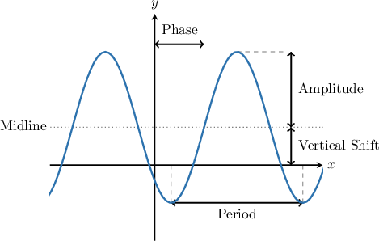

# Properties of Transformed Sine and Cosine Functions

Source: https://www.mathacademy.com/topics/2062?courseId=134
Topic ID: 2062

## Prerequisites

- [Graphing Reflections of Trigonometric Functions](../../../traditional/lessons/algebra-ii/259-graphing-reflections-of-trigonometric-functions.md)
- [Solving Compound Inequalities](../../../traditional/lessons/algebra-i/388-solving-compound-inequalities.md)

## Lesson

### Introduction

Suppose we have a transformed *sine* function whose graph is shown below.

A transformed sine function in its most general form can be expressed as

$$

y={\color{red}A}\sin\left( {\color{blue}B} x + C\right) +{\color{green}D},

$$

where ${\color{red}A}, {\color{blue}B}, C,$ and ${\color{green}D}$ are all constants.

We can determine its properties from this general form as follows:

- The amplitude is $\vert {\color{red}A}\vert.$

- The period is $\dfrac{2\pi}{\color{blue}B}.$

- The vertical shift is ${\color{green}{D}}.$

The phase shift (horizontal shift) is slightly trickier to work out. First, we must factor the constant $\color{blue}B$ in the argument of the function as follows:

$$

y={\color{red}A}\sin\left( {\color{blue}B}\left[ x + \dfrac {C}{ \color{blue}B}\right]\right) +{\color{green}D}

$$

From here, we can see that the phase shift (or **phase**) is $-\dfrac{C}{\color{blue}B}.$

The **midline** is the horizontal line that lies halfway between the horizontal lines $y = y_{\text{max}}$ and $y = y_{\text{min}},$ where $y_{\text{max}}$ and $y_{\text{min}}$ are the maximum and minimum values of our trigonometric function, respectively. Its equation is given by

$$

y = {\color{green}{D}}.

$$

We can also think of the midline as representing the average of the maximum and minimum values. Thus, an alternative form for the midline equation is

$$

y = \dfrac{ y_{\text{max}} + y_{\text{min}}}{2}.

$$

Finally, we can apply the same methods to determine the properties of a transformed cosine function of the form

$$

y={\color{red}A}\cos\left( {\color{blue}B} x + C\right) +{\color{green}D}.

$$

### Example: Determining the Amplitude of a Transformed Sinusoidal Function

#### Question

What is the amplitude of the function $f(x) = -2\sin\left(x-\dfrac\pi 3\right) + 1?$

#### Explanation

Given a function in the form $f(x)= A\sin(Bx +C) + D,$ the amplitude is $|A|.$

In our case, we have that $A=-2.$ Therefore, the amplitude is $|A|=2.$

### Example: Calculating the Period of a Transformed Sinusoidal Function

#### Question

Calculate the period of the function $y=\cos(2x).$

#### Explanation

Given a function in the form $y = A\cos(Bx +C) + D,$ the period is $\dfrac{2\pi}{B}.$

In our case, we have that $B=2.$ Therefore, the period is $\dfrac{2\pi}{\left(2\right)}=\pi.$

### Example: Finding the Midline of a Transformed Sinusoidal Function

#### Question

Find the equation of the midline for a transformed sine function with a minimum value of $-6$ and a maximum value of $8.$

#### Explanation

A sinusoidal graph's midline (or vertical shift) is the horizontal line that divides it vertically in half.

The equation of the midline is given by

$$

y = \dfrac{y_{\text{min}}+y_{\text{max}}}{2},

$$

where $y_{\text{min}}$ and $y_{\text{max}}$ are the minimum and maximum values of the function. The midline equals the average of the maximum and minimum values.

In our case, we have

$$

\begin{aligned}\frac{𝑦_{min}+𝑦_{max}}{2} & =\frac{−6+8}{2} \\ & =\frac{2}{2} \\ & =1.\end{aligned}

$$

Therefore, the midline is $y=1.$

### The Range of a Transformed Sine or Cosine Function

We can determine the range of a transformed sine or cosine function by observing the effect of each transformation on the maximum and minimum values.

For example, let's determine the range of the following function:

$$

f(x)={\color{red}2}\sin\left( {\color{blue}3}x - \dfrac{\pi}{2}\right)+{\color{green}1}

$$

We start by writing down the range of $\sin x{:}$

$$

-1 \leq \sin x \leq 1

$$

The idea is to transform this inequality using addition, multiplication, and other operations until we arrive at the following:

$$

y_{\text{min}} \leq f(x) \leq y_{\text{max}}

$$

First, we note that *horizontal* shifts and *horizontal* stretches do not affect the range. Therefore, we can immediately state that

$$

-1 \leq \sin \left( {\color{blue}3}x - \dfrac{\pi}{2}\right) \leq 1.

$$

Notice that the middle part is starting to look like $f(x).$ However, we must also consider the effects of the amplitude $({\color{red}2})$ and vertical shift $({\color{green}1}).$

To take care of the amplitude effects, we multiply our inequality by ${\color{red}2}{:}$

$$

\begin{aligned}−1≤sin⁡(3𝑥−\frac{𝜋}{2})≤1 \\ 2⋅(−1)≤2⋅sin⁡(3𝑥−\frac{𝜋}{2})≤2⋅1 \\ −2≤2sin⁡(3𝑥−\frac{𝜋}{2})≤2\end{aligned}

$$

Finally, to deal with the vertical shift, we increase all the quantities in our inequality by $+{\color{green}1}{:}$

$$

\begin{aligned}−2≤2sin⁡(3𝑥−\frac{𝜋}{2})≤2 \\ −2+1≤2sin⁡(3𝑥−\frac{𝜋}{2})+1≤2+1 \\ −1≤2sin⁡(3𝑥−\frac{𝜋}{2})+1≤3\end{aligned}

$$

Since the middle part of the inequality is now identical to $f(x),$ we can write

$$

-1 \leq f(x) \leq 3

$$

Therefore, the range is $f(x)\in [-1,3].$

### Example: Finding the Range of a Transformed Sinusoidal Function

#### Question

What is the range of the function $f(x) = -4\cos(3x)-2?$

#### Explanation

The range of $\cos x$ is

$$

-1 \leq \cos x \leq 1.

$$

Horizontal shifts and stretches have no effect on the range. Therefore,

$$

-1\leq\cos\left(3x \right) \leq 1.

$$

Multiplying the above inequality by $-4$ and then subtracting $2,$ we get

$$

\begin{aligned}−1 & ≤cos⁡(3𝑥)≤1 \\ 4 & ≥−4cos⁡(3𝑥)≥−4 \\ 2 & ≥−4cos⁡(3𝑥)−2≥−6 \\ −6 & ≤𝑓(𝑥)≤2.\end{aligned}

$$

Therefore, the range is $f(x)\in [-6,2].$
