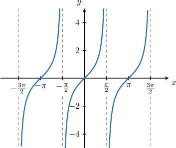
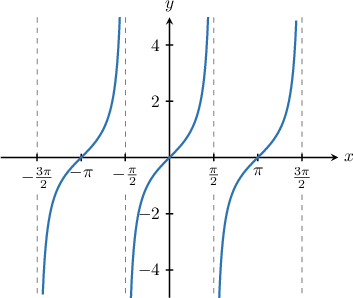
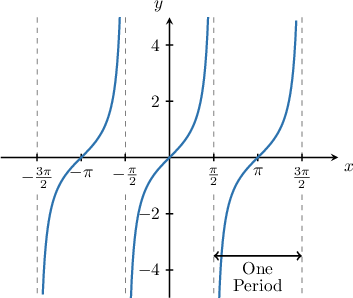
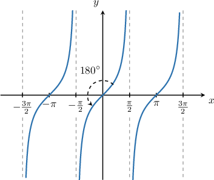
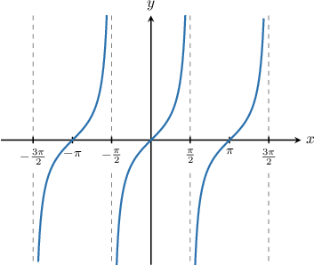

# Describing Properties of the Tangent Function

Source: https://www.mathacademy.com/topics/3558?courseId=134
Topic ID: 3558

## Prerequisites

- [Even and Odd Functions](../../../traditional/lessons/algebra-ii/725-even-and-odd-functions.md)
- [Graphing Tangent and Cotangent](../../../traditional/lessons/algebra-ii/1493-graphing-tangent-and-cotangent.md)

## Lesson

### Introduction

Let's look at the graph of $y=\tan x.$

This graph also has infinitely many zeros, and there is an infinite number of asymptotes of the function. We can write down general expressions for these properties, assuming $n$ represents an integer.

**The Zeros of the Function**

From the graph, we see that the zeros of the function are $x=0,\pm\pi,\dots.$

We write down a general expression for the zeros as follows:

$$

x = n\pi.

$$

**The Asymptotes of the Function**

The function has an asymptote when $x=\dfrac\pi 2$ and the function is periodic with period $\pi.$ Therefore, a general equation for the asymptotes of the graph is

$$

x = \dfrac{\pi}{2} + n\pi.

$$

### Example: Describing Properties of the Tangent Function

#### Question

Which of the following statements are true regarding the function $y=\tan x?$ Assume that $n$ is an integer.

1. The zeros of the function are at $x = \pi n.$

2. The function has asymptotes at $x = 2\pi n.$

3. The range of the function is $y\in [-1,1].$

#### Explanation

Let's plot the graph of $y=\tan x.$

Let's go through each statement.

- Statement I is true. The zeros occur at $x=0, \pm \pi, \pm2\pi,\ldots,$ which can be written as $x=n\pi.$

- Statement II is false. The function has an asymptote at $x = \dfrac \pi 2$ and the period is $\pi.$ Therefore, the asymptotes occur at $x = \dfrac \pi 2 + \pi n.$

- Statement III is false. The function takes values on all the real numbers, hence the range is $y\in (-\infty, \infty).$

So, the correct answer is "I only".

### The Periodicity Property of the Tangent Function

Recall again the graph of the function $y=\tan x\mathbin{:}$

We've seen that the function $y=\tan x$ is periodic, where the period is $\pi.$

The periodicity of $y=\tan x$ means that $\tan\left(x+n\pi\right) = \tan\left(x\right)$ for any number $x$ and any integer $n.$

### Example: Utilizing the Periodicity Property of the Tangent Function

#### Question

If $\tan\left(x\right) = -2$ for some value of $x,$ then find the value of $\tan\left(x-2\pi\right).$

#### Explanation

The period of $y=\tan x$ is $\pi.$ Therefore, for any integer $n,$ we have

$$

\tan x = \tan (x+n\pi).

$$

Substituting $n=-2$ into the above gives

$$

\begin{aligned}tan⁡𝑥 & =tan⁡(𝑥+(−2)⋅𝜋)=tan⁡(𝑥−2𝜋).\end{aligned}

$$

Since $\tan\left(x\right) = -2,$ we get that $\tan\left(x-2\pi\right) = -2.$

### The Oddness Property of the Tangent Function

Recall that a function $f(x)$ is *odd* if it satisfies the property

$$

f(-x) = -f(x).

$$

As it turns out, tangent is an odd function! So, for any value of $x,$ we have

$$

\tan(-x) = -\tan(x).

$$

Odd functions always have rotational symmetry of order $2$ about the origin. This is indeed true of the tangent function, as we can see from the diagram below.

We can use the oddness property of tangent in conjunction with its periodicity property to simplify trigonometric expressions. Let's see an example.

### Example: Utilizing the Oddness Property of the Tangent Function

#### Question

If $\tan x = -\dfrac{2}{3},$ find the value of $\tan (-x+7\pi).$

#### Explanation

First, let's recall the graph of $y=\tan{x}.$

From the graph, we note the following:

- The period of $\tan{x}$ is $\pi.$

- Our graph has rotational symmetry of order $2$ about the origin. This means that $\tan{x}$ is an ** function, and we have

Let's now evaluate our expression:

- Firstly, using the periodicity of $\tan{x},$ we have

- Secondly, using the oddness of $\tan{x},$ we have

Therefore, $\tan (-x+7\pi)=\dfrac{2}{3}.$
