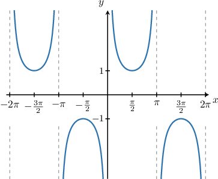
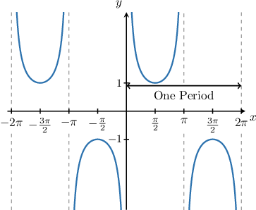
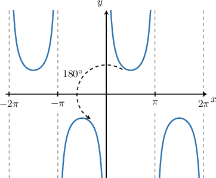
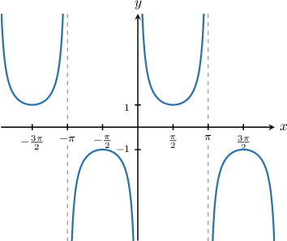

# Describing Properties of the Cosecant Function

Source: https://www.mathacademy.com/topics/3567?courseId=134
Topic ID: 3567

## Prerequisites

- [Graphing Secant and Cosecant](../../../traditional/lessons/algebra-ii/1573-graphing-secant-and-cosecant.md)
- [Describing Properties of the Sine Function](../../../traditional/lessons/algebra-ii/3540-describing-properties-of-the-sine-function.md)

## Lesson

### Introduction

Let's look at the graph of the cosecant function again.

The graph of the cosecant function has infinitely many asymptotes, and there is an infinite number of points where the function takes values of $-1$ and $1.$

Let's write general expressions for these properties, by assuming $n$ represents an integer.

**The Asymptotes of the Function**

The function has asymptotes when $x=0,\pm \pi, \pm 2\pi,\ldots,$ etc. Therefore, a general equation for the asymptotes of the graph is

$$

x = n\pi.

$$

**The Points Where the Function Takes a Value of $\mathbf{1}$**

From the graph, we see that the function takes a value of $1$ when $x=\dfrac{\pi}{2}.$ Since the function has a period of $2\pi,$ a general expression for the values of $x$ for which $\csc x = 1$ is

$$

x = \dfrac{\pi}{2} + 2n\pi.

$$

**The Points Where the Function Takes a Value of $\mathbf{-1}$**

From the graph, we see that the function takes a value of $-1$ when $x=-\dfrac{\pi}{2}.$ Since the function has a period $2\pi,$ a general expression for the values of $x$ for which $\csc x = -1$ is

$$

x = -\dfrac{\pi}{2} +2n\pi.

$$

### Example: Describing the General Properties of the Cosecant Function

#### Question

Which of the following statements are true regarding the graph of $y=\csc x?$

1. The function takes the value $1$ at $x = -\dfrac {\pi} 2 + 2 \pi n,$ where $n$ is an integer

2. The range of the function is $(-\infty,+\infty)$

3. The function has zeroes at $x = 0, \pm \pi, \pm 2 \pi,\dots$

#### Explanation

Let's have a look at the graph of $y=\csc x.$

Now, let's go through each statement.

- The cosecant takes the value $1$ at $x = \dfrac {\pi} 2 + 2 \pi n.$ Therefore, statement I is false.

- The range of $y = \csc x$ is $(-\infty,-1] \cup [1, \infty).$ Therefore, statement II is false.

- The cosecant graph does not intersect the $x$-axis. Therefore, statement III is false.

In conclusion, none of the statements are true.

### The Periodicity Property of the Cosecant Function

Let's recall the graph of the function $y=\csc x$ once more.

As previously mentioned, the cosecant function inherits its periodicity from the sine function, so the period is $2\pi.$

The periodicity of $y=\csc x$ means that $\csc (x+2n\pi) = \csc x$ for any number $x$ in the domain of $\csc x$ and any integer $n.$

### Example: Utilizing the Periodicity Property of the Cosecant Function

#### Question

If $\csc x = 8,$ then what is $\csc(x-8\pi)?$

#### Explanation

The period of $y = \csc x$ is $2\pi.$ Therefore, for integer $n$ we have

$$

\csc{x} = \csc{(x+2n\pi)} .

$$

Substituting $n=-4$ into the right-hand-side of the above gives

$$

\begin{aligned}csc⁡𝑥 & =csc⁡(𝑥+2⋅(−4)⋅𝜋) \\ & =csc⁡(𝑥−8𝜋).\end{aligned}

$$

Therefore, if $\csc{x} = 8,$ then $\csc{(x-8\pi)} = 8.$

### The Oddness Property of the Cosecant Function

Recall that a function $f(x)$ is *odd* if it satisfies the property

$$

f(-x) = -f(x).

$$

As it turns out, cosecant is an odd function! So, for any value of $x,$ we have

$$

\csc(-x) = -\csc(x).

$$

Odd functions always have rotational symmetry of order $2$ about the origin. This is indeed true of the cosecant function, as we can see from the diagram below.

We can use the oddness property of cosecant in conjunction with its periodicity property to simplify trigonometric expressions. Let's see an example.

### Example: Utilizing the Oddness Property of the Cosecant Function

#### Question

If $\csc{x} = \dfrac{7}{2},$ then find the value of $\csc(-x - 20\pi).$

#### Explanation

First, let's recall the graph of $y = \csc{x}.$

From the graph, we note the following:

- The period of $\csc{x}$ is $2\pi.$

- Our graph has rotational symmetry of order $2$ about the origin. This means that $\csc{x}$ is an ** function, and we have

Let's now evaluate our expression:

- Firstly, using the periodicity of $\csc{x},$ we have

- Secondly, using the oddness of $\csc{x},$ we have

Therefore, $\csc(-x - 20\pi) = -\dfrac{7}{2}.$
