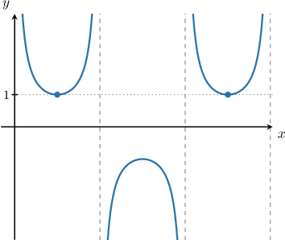
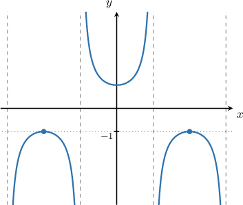

# Properties of Transformed Secant and Cosecant Functions

Source: https://www.mathacademy.com/topics/778?courseId=134
Topic ID: 778

## Prerequisites

- [Finding Points on Transformed Curves](../../../traditional/lessons/algebra-ii/141-finding-points-on-transformed-curves.md)
- [Combining Graph Transformations of Secant and Cosecant](../../../traditional/lessons/algebra-ii/776-combining-graph-transformations-of-secant-and-cosecant.md)
- [Describing Properties of the Secant Function](../../../traditional/lessons/algebra-ii/3563-describing-properties-of-the-secant-function.md)
- [Describing Properties of the Cosecant Function](../../../traditional/lessons/algebra-ii/3567-describing-properties-of-the-cosecant-function.md)
- [Finding Zeros and Extrema of Transformed Sine and Cosine Functions](../../../traditional/lessons/algebra-ii/5088-finding-zeros-and-extrema-of-transformed-sine-and-cosine-functions.md)

## Lesson

### Introduction

Given the equation of a general transformed secant function

$$

y={\color{red}A}\sec\left( {\color{blue}B} x + C\right) +{\color{green}D},

$$

some properties of the graph of the function are as follows:

- the period is $\dfrac{2\pi}{\color{blue}B}$

- the vertical shift is ${\color{green}D}$

We obtain the horizontal shift by factoring the argument of the function.

$$

y={\color{red}A}\sec \left( {\color{blue}B}\left[ x + \dfrac{C}{{\color{blue}B}} \right]\right) +{\color{green}D}

$$

From here, we can see that the phase (horizontal shift) is $-\dfrac{C}{{\color{blue}B}}.$

We can apply the same ideas to work out the properties of a transformed cosecant function of the form

$$

y={\color{red}A}\csc\left( {\color{blue}B} x + C\right) +{\color{green}D}.

$$

### Example: The Period of a Transformed Function

#### Question

What is the period of the function $y = 4\sec\left(2x-1\right)-5?$

#### Explanation

Given a function of the form $y = A\sec(Bx +C) + D,$ the period is $\dfrac{2\pi}{B}.$

In our case, we have that $B=2.$ Therefore, the period is $\dfrac{2\pi}{2}=\pi.$

### The Range of a Transformed Secant or Cosecant Function

Remember that the range of the secant and cosecant functions is $f(x) \in (-\infty, -1] \cup [1,\infty).$

To determine the range of a transformed secant or cosecant function, we need to check each transformation's effect on both of these intervals.

For example, to find the range of

$$

f(x)={\color{red}2}\sec\left( {\color{blue}3}x + \dfrac{\pi}{2}\right)+{\color{green}1},

$$

we start with the range of the secant function:

$$

\sec x \in (-\infty, -1] \cup [1, \infty)

$$

Note that horizontal shifts and stretches have no effect on the range. Therefore,

$$

\sec\left({\color{blue}3}x + \dfrac{\pi}{2} \right) \in (-\infty, -1] \cup [1, \infty)

$$

We can split this into two inequalities:

$$

\sec\left({\color{blue}3}x + \dfrac{\pi}{2} \right)\leq -1, \qquad \sec\left({\color{blue}3}x + \dfrac{\pi}{2} \right)\geq 1

$$

To find the range of $f(x),$ we consider both intervals separately.

- Multiplying the first inequality by ${\color{red}2}$ and adding ${\color{green}1},$ we get

- Multiplying the second inequality by ${\color{red}2}$ and adding ${\color{green}1},$ we get

Combining both inequalities, we get

$$

f(x) \leq -1, \qquad f(x) \geq 3.

$$

Therefore, we conclude that the range is $f(x)\in (-\infty, -1] \cup [3, \infty).$

### Example: Finding the Range of a Transformed Function

#### Question

Find the range of the function $y = -2\csc(3x+5)-1.$

#### Explanation

The range of $\csc x$ consists of two intervals:

$$

\csc x \in (-\infty, -1] \cup [1, \infty)

$$

Horizontal shifts and stretches have no effect on the range. Therefore,

$$

\csc\left(3x+5 \right) \in (-\infty, -1] \cup [1, \infty).

$$

We can split this into two inequalities:

$$

\csc\left(3x+5 \right)\leq -1, \qquad \csc\left(3x+5 \right)\geq 1

$$

To find the range of $f(x),$ we consider both intervals separately.

- Multiplying the first interval by $-2$ and subtracting $1,$ we get

- Multiplying the second interval by $-2$ and subtracting $1,$ we get

Combining both inequalities, we get

$$

f(x) \geq 1, \qquad f(x) \leq -3.

$$

Therefore, we conclude that the range is $f(x)\in (-\infty, -3] \cup [1, \infty).$

### Local Maxima and Minima of a Transformed Function

The secant and cosecant functions have a local minimum on each of the positive branches when the function value is equal to $1,$ as shown below:

Similarly, the functions have a local maximum on each of the negative branches when the function value is equal to $-1\mathbin{:}$

However, the values at the local minimum and maximum points of a transformed secant or cosecant function change according to the applied transformations.

For instance, let's find the value of $f(x)={\color{red}2}\sec\left({\color{blue}3}x + \dfrac{\pi}{2}\right)+{\color{green}1}$ at its local minimum points.

On a positive branch of the graph of $y=\sec x,$ we have

$$

\sec x \geq 1.

$$

The points where $\sec x = 1$ are local minima of the graph of $y=\sec x.$

Horizontal shifts and stretches have no effect on the range. Therefore,

$$

\sec\left({\color{blue}3}x + \dfrac{\pi}{2} \right) \geq 1.

$$

Multiplying the above inequality by ${\color{red}2}$ and adding ${\color{green}1},$ we get

$$

\begin{aligned} & sec⁡(3𝑥+\frac{𝜋}{2})≥1 \\ & 2sec⁡(3𝑥+\frac{𝜋}{2})≥2 \\ & 2sec⁡(3𝑥+\frac{𝜋}{2})+1≥2+1 \\ & 𝑓(𝑥)≥3.\end{aligned}

$$

Therefore, $f(x) = 3$ at the local minimum points.

### Example: Finding Local Extrema of a Transformed Function

#### Question

What is the value of $f(x) = 2\csc\left(x+\dfrac{3\pi}{4} \right)$ at its local maximum points?

#### Explanation

On a negative branch of the graph of $y=\csc x,$ we have

$$

\csc x \leq -1.

$$

The points where $\csc x = -1$ are local maximums of the graph of $y=\csc x.$

Horizontal shifts and stretches have no effect on the range. Therefore,

$$

\csc\left(x+\dfrac{3\pi}{4} \right) \leq -1.

$$

Multiplying the above inequality by $2,$ we get

$$

\begin{aligned}2csc⁡(𝑥+\frac{3𝜋}{4}) & ≤−2 \\ 𝑓(𝑥) & ≤−2.\end{aligned}

$$

Therefore, $f(x) = -2$ at the local maximum points.

### The Domain and Asymptotes of a Transformed Function

If we are given the equation of a transformed secant or cosecant function,

$$

y={\color{red}A}\sec\left( {\color{blue}B} x + C\right) +{\color{green}D} \quad \text{or} \quad y={\color{red}A}\csc\left( {\color{blue}B} x + C\right) +{\color{green}D},

$$

we can find a general expression for some of its properties, such as the asymptotes, local maxima and minima, and the domain.

To do this, we set the argument of the function $({\color{blue}B} x + C)$ equal to an expression that represents the desired property.

Let's see this idea in action.

### Example: Finding the Domain and Asymptotes of a Transformed Function

#### Question

Find an expression for the vertical asymptotes of the function $f(x) = 2\csc\left(x - \dfrac{\pi}{4}\right)-1.$

#### Explanation

The asymptotes of $y=\csc x$ coincide with the zeros of $y=\sin x,$ and are given by the expression

$$

x = n\pi,

$$

where $n$ is an integer.

To find the asymptotes of $2\csc\left(x - \dfrac{\pi}{4}\right)-1,$ we replace the $x$ on the left-hand side of the above with $\left(x - \dfrac{\pi}{4}\right).$ This gives

$$

x - \dfrac{\pi}{4} =n\pi .

$$

Solving for $x,$ we get

$$

\begin{aligned}𝑥−\frac{𝜋}{4} & =𝑛𝜋 \\ 𝑥 & =\frac{𝜋}{4}+𝑛𝜋.\end{aligned}

$$

We conclude that the expression giving all the vertical asymptotes is $x =\dfrac{\pi}{4} + n\pi,$ where $n$ is an integer.
