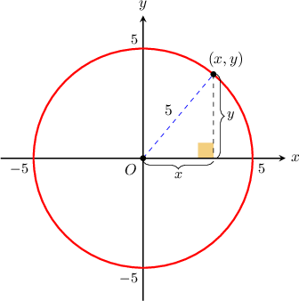
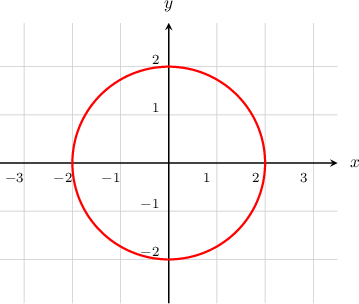
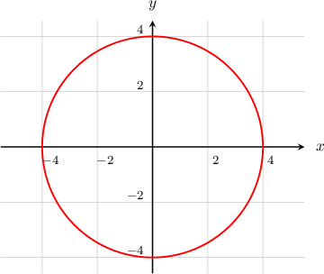
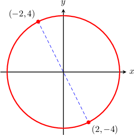

# Equations of Circles Centered at the Origin

Source: https://www.mathacademy.com/topics/842?courseId=134
Topic ID: 842

## Prerequisites

- [Circles in the Coordinate Plane](../../../traditional/lessons/geometry/1183-circles-in-the-coordinate-plane.md)

## Lesson

### Introduction

What equation represents the circle of radius $5$ centered at the origin?

Let's take a generic point $(x,y)$ on the circumference. Notice that we naturally obtain a right triangle with base $x$ and height $y$, as shown above. Therefore, by applying the Pythagorean theorem, we get

$$

\begin{aligned}𝑥^{2}+𝑦^{2} & =5^{2} \\ 𝑥^{2}+𝑦^{2} & =25.\end{aligned}

$$

This straightforward result gives us the **equation of the circle** of radius $5$ centered at the origin.

Similarly, given a circle of radius $r$ centered at the origin, the general equation will be

$$

x^2 + y^2 = r^2.

$$

### Example: Finding the Center and Radius of a Circle Given Its Equation

#### Question

What is the center and radius of the circle with equation $x^2 + y^2 = 9?$

#### Explanation

The general equation of a circle with radius $r$ centered at the origin is

$$

x^2 + y^2 = r^2.

$$

So, the equation $x^2+y^2=9$ represents a circle that is centered at the origin, with radius

$$

\begin{aligned}𝑟^{2} & =9 \\ 𝑟 & =\sqrt{√9} \\ 𝑟 & =3.\end{aligned}

$$

Note that we disregarded the negative solution for the radius since the radius of a circle must be positive.

In conclusion, the circle is centered at the origin and its radius is $3.$

### Example: Finding the Equation of a Circle Given a Graph

#### Question

What is the equation of the circle given below?

#### Explanation

The general equation of a circle with radius $r$ centered at the origin is

$$

x^2 + y^2 = r^2.

$$

From the picture, we see that our circle is centered at $(0,0)$ and has radius $r = 2.$ So, the equation is

$$

\begin{aligned}𝑥^{2}+𝑦^{2} & =𝑟^{2} \\ 𝑥^{2}+𝑦^{2} & =2^{2} \\ 𝑥^{2}+𝑦^{2} & =4.\end{aligned}

$$

### Example: Finding the Equation of a Circle Given a Description

#### Question

Which equation describes the set of all points $(x,y)$ in the coordinate plane that are a distance of $4$ from the origin?

#### Explanation

The set of all points $(x,y)$ that are a distance $4$ from the origin defines a circle with radius $r=4$ centered at the origin, as shown below.

So, the required equation is

$$

\begin{aligned}𝑥^{2}+𝑦^{2} & =𝑟^{2} \\ 𝑥^{2}+𝑦^{2} & =4^{2} \\ 𝑥^{2}+𝑦^{2} & =16.\end{aligned}

$$

### Example: Finding the Equation of a Circle Given Endpoints of a Diameter

#### Question

Given that the points $A$ and $B$ with coordinates $(-2,4)$ and $(2,-4),$ respectively, lie on a diameter of a circle centered at the origin, what is the equation of the circle?

#### Explanation

The equation of a circle with radius $r,$ centered at the origin, is

$$

x^2 + y^2 = r^2.

$$

Now, we first calculate the diameter $AB\mathbin{:}$

$$

\begin{aligned}𝐴𝐵 & =\sqrt{√(−2−2)^{2}+(4−(−4))^{2}} \\ & =\sqrt{√4^{2}+8^{2}} \\ & =\sqrt{√16+64} \\ & =\sqrt{√80} \\ & =4\sqrt{√5}\end{aligned}

$$

Since $\overline{AB}$ is a diameter, the radius is

$$

r=\dfrac{AB}{2} = \dfrac {4\sqrt{5}}{2}=2\sqrt5.

$$

So, the equation of the circle is

$$

\begin{aligned}𝑥^{2}+𝑦^{2} & =𝑟^{2} \\ 𝑥^{2}+𝑦^{2} & =(2\sqrt{√5})^{2} \\ 𝑥^{2}+𝑦^{2} & =20.\end{aligned}

$$
