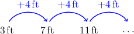

# Modeling With Arithmetic Sequences

Source: https://www.mathacademy.com/topics/2223?courseId=44
Topic ID: 2223

## Prerequisites

- [Determining Indexes of Terms in Arithmetic Sequences](./672-determining-indexes-of-terms-in-arithmetic-sequences.md)
- [Further Modeling With Linear Equations in Two Variables](./3765-further-modeling-with-linear-equations-in-two-variables.md)

## Lesson

### Introduction

Arithmetic sequences are used to model quantities that increase or decrease by a fixed amount over a specified interval.

For example, suppose we drop a small metal ball into a lake. We observe that the ball's depth is $3\,\textrm{ft}$ after $1$ second, $7\,\textrm{ft}$ after $2$ seconds, $11\,\textrm{ft}$ after $3$ seconds, and so on. What will be the ball's depth after $12$ seconds if this trend continues?

Let's start by drawing a diagram.

Notice that the ball's depth increases by a *fixed* amount of $4\,\textrm{ft}$ every second. Therefore, the ball's depth after $n$ seconds can be modeled as an arithmetic sequence.

For this arithmetic sequence, the first term and common difference respectively are given by

$$

a_1 = 3, \qquad d = 4.

$$

Therefore, the formula for the $n$th term of this sequence is

$$

\begin{aligned}𝑎_{𝑛} & =𝑎_{1}+(𝑛−1)𝑑 \\ & =3+(𝑛−1)⋅4 \\ & =3+4𝑛−4 \\ & =4𝑛−1.\end{aligned}

$$

To find the depth of the ball after $12$ seconds, we compute $a_{12},$ as follows:

$$

\begin{aligned}𝑎_{12} & =4(12)−1 \\ & =47\end{aligned}

$$

Therefore, the ball's depth will be $47\, \mathrm{ft}$ after $12$ seconds.

### Example: Finding the Value of a Term in Context

#### Question

An opera house has $92$ seats in the first row, $87$ in the second row, $82$ in the third row, and so on. If this trend continues, how many seats are in the $15$th row?

#### Explanation

The number of seats ** by a fixed amount of $5$ seats per row. Therefore, the number of seats in the $n$th row can be modeled as an arithmetic sequence:

$$

92, \: 87, \: 82, \: \dots

$$

The first term of the sequence is $a_1=92,$ and the common difference is $d=-5$. So, the $n$th term of this arithmetic sequence can be calculated using the following formula:

$$

\begin{aligned}𝑎_{𝑛} & =𝑎_{1}+(𝑛−1)𝑑 \\ & =92+(𝑛−1)(−5) \\ & =92−5𝑛+5 \\ & =97−5𝑛\end{aligned}

$$

To find the number of seats in the $15$th row, we compute $a_{15},$ as follows:

$$

\begin{aligned}𝑎_{15} & =97−5(15) \\ & =97−75 \\ & =22\end{aligned}

$$

Therefore, the $15$th row has $22$ seats.

### Example: Finding a Common Difference in Context

#### Question

Matt competes in a go-karting race. The amount of fuel in his car decreases by a fixed amount on each lap. There are $23$ liters of fuel remaining after the third lap and $11$ liters remaining after the seventh lap. How much fuel does Matt's car consume per lap?

#### Explanation

Since the amount of fuel in the car ** at the same rate each lap, the amount of fuel remaining in Matt's car can be modeled as an arithmetic sequence.

We are given the following values:

$$

\begin{aligned}𝑎_{3}=23,\,𝑎_{7}=11\end{aligned}

$$

To compute the common difference, we divide the total decrease by the number of jumps between the $3$rd and $7$th laps:

$$

\begin{aligned}𝑑 & =\frac{𝑎_{𝑛}−𝑎_{𝑚}}{𝑛−𝑚} \\ & =\frac{𝑎_{3}−𝑎_{7}}{3−7} \\ & =\frac{23−11}{3−7} \\ & =\frac{12}{−4} \\ & =−3\end{aligned}

$$

Therefore, Matt's car consumes $3$ liters of fuel per lap.

### Example: Finding the Index of Term in Context

#### Question

John decides to start a cycling training plan. On the first day, he rides $2\,\textrm{km},$ on the second day he rides $5\,\textrm{km},$ and on the third day, he rides $8\,\textrm{km}.$ If this trend continues, on which day will he ride $29\,\textrm{km}?$

#### Explanation

John's cycling distance increases by a fixed amount of $3$ kilometers per day. Therefore, the number of kilometers John rides on the $n$th day can be modeled as an arithmetic sequence.

We are told that the first term is $a_1 = 2,$ and the common diference is $d=3.$ So, we can write the formula for the $n$th term of the sequence:

$$

\begin{aligned}𝑎_{𝑛} & =𝑎_{1}+(𝑛−1)𝑑 \\ & =2+(𝑛−1)(3) \\ & =2+3𝑛−3 \\ & =3𝑛−1\end{aligned}

$$

To find the day that John will ride $29\,\textrm{km},$ we calculate the value of $n$ such that $a_n=29\mathbin{:}$

$$

\begin{aligned}𝑎_{𝑛} & =3𝑛−1 \\ 29 & =3𝑛−1 \\ 30 & =3𝑛 \\ 10 & =𝑛\end{aligned}

$$

Therefore, John will ride $29\,\textrm{km}$ on the $10$th day.
