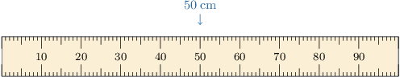
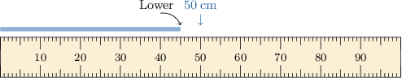
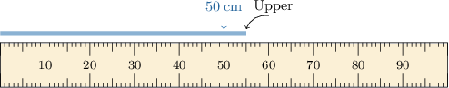
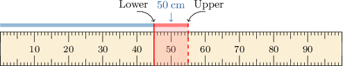

# Degrees of Accuracy

Source: https://www.mathacademy.com/topics/2234?courseId=44
Topic ID: 2234

## Prerequisites

- [Dividing Decimals Using the Standard Algorithm](../../../../elementary-school/lessons/grade-5/549-dividing-decimals-using-the-standard-algorithm.md)
- [Compound Inequalities](../../../../middle-school/lessons/prealgebra/2310-compound-inequalities.md)
- [Subtraction With Unequal Numbers of Decimals](../../../../elementary-school/lessons/grade-5/2340-subtraction-with-unequal-numbers-of-decimals.md)
- [Multiplying Three-Digit Decimals](../../../../elementary-school/lessons/grade-5/2355-multiplying-three-digit-decimals.md)
- [Units of Area and Volume](../../../../elementary-school/lessons/grade-5/3872-units-of-area-and-volume.md)

## Lesson

### Introduction

We always introduce **errors** in our measurements whenever we round or approximate numbers. In this lesson, we will explore how to quantify and describe measurement errors.

Suppose that a particular rope measures precisely $48.9\,\text{cm}.$ Now, imagine we take a meterstick and record a measurement of $50\,\text{cm}$ *to the nearest $10$ centimeters*. Let's mark this approximation on our meterstick.

The error of a measurement equals the difference between the rounded estimate and the "true" value. So, in this example, the error of our approximation equals

$$

50\,\text{cm} - 48.9\,\text{cm} = 1.1\text{cm}.

$$

We often don't know the "true" measurement in practical problems. So, the next best thing is to determine a **lower bound** and an **upper bound** for our measurement:

- The *lower* bound of a measurement is its *smallest* possible value.

- The *upper* bound of a measurement is its *largest* possible value.

Let's figure out the lower and upper bounds of our $50\,\text{cm}$ approximation:

- The *lower bound* is $45 \, \text{cm}$ because this is the *smallest* value that gives $50 \, \text{cm}$ when rounded to the nearest $10\,\text{cm}.$

- The *upper bound* is $55 \, \text{cm}$ because this is (almost) the *largest* value that gives $50 \, \text{cm}$ when rounded to the nearest $10\,\text{cm}.$

Let's use the letter $l$ to denote the "true" length of the rope. Then, we can combine our lower and upper bound measurements into a single statement, as follows:

$$

45\,\text{cm} \leq l \lt 55\,\text{cm}

$$

Notice that we used a *strict* "<" inequality for the upper bound. We cannot include $55\text{cm}$ in our set of values because this number rounds to $60\,\text{cm},$ not $50\,\text{cm}$.

We can visualize the lower and upper bounds on our diagram as follows:

### The Greatest Possible Error

So, we've seen how to calculate lower and upper bounds. Before we consider another example, note the following:

- The lower and upper bound depend on our approximation's **degree of accuracy**.

- In the last example, the degree of accuracy was $10\,\text{cm}$ because the rope was measured to the nearest $10$ centimeters.

- If we change the degree of accuracy, the lower and upper bounds will also change. So, for example, if we measured the rope to the nearest $1\,\text{cm},$ the lower and upper bounds would be different.

- The **greatest possible error** is the largest amount the "true" value can be from the approximation.

- This greatest possible error is always one-half of the degree of accuracy. So, in the last example, the greatest possible error in our measurement was

$$

\dfrac{10\,\text{cm}}{2} = {\color{blue}{5\,\text{cm}}}.

$$

We can use the greatest possible error to compute the lower and upper bounds quickly:

- To compute the lower bound of an approximation, we *subtract* the greatest possible error from the approximation. So, for the previous example, we have

- To compute the upper bound of an approximation, we *add* the greatest possible error to the approximation. So, for the previous example, we have

Let's see another example.

### Example: Finding Bounds When Rounding to a Whole Number

#### Question

The height $h$ of a lamppost is $30\,\text{ft}$ to the nearest $1\,\text{ft}.$ Determine the upper and lower bounds of this measurement.

#### Explanation

Our measurement is given to the nearest $1\,\text{ft}.$ So, the greatest possible error of this measurement is

$$

\dfrac{1\,\text{ft}}{2} = 0.5\,\text{ft}.

$$

Therefore, we can calculate the lower and upper bounds of this measurement as follows:

$$

\begin{aligned}lower bound & =30\,ft−0.5\,ft \\ & =29.5\,ft \\ upper bound & =30\,ft+0.5\,ft \\ & =30.5\,ft\end{aligned}

$$

Since the exact value of $h$ lies between the lower and upper bound, we conclude that

$$

29.5\,\text{ft} \leq h < 30.5\,\text{ft}.

$$

### Example: Finding Bounds When Rounding to a Decimal Place

#### Question

The area $a$ of a golf course measures $0.6\,\text{km}^2$ to the nearest tenth of a square kilometer. Determine the upper and lower bounds of this measurement.

#### Explanation

Our measurement is given to the nearest $0.1\,\text{km}^2.$ So, the greatest possible error of this measurement is

$$

\dfrac{0.1\,\text{km}^2}{2} = 0.05\,\text{km}^2.

$$

Therefore, we can calculate the lower and upper bounds of this measurement as follows:

$$

\begin{aligned}lower bound & =0.6\,km^{2}−0.05\,km^{2} \\ & =0.55\,km^{2} \\ upper bound & =0.6\,km^{2}+0.05\,km^{2} \\ & =0.65\,km^{2}\end{aligned}

$$

Since the exact value of $a$ lies between the lower and upper bound, we conclude that

$$

0.55\,\text{km}^2 \leq a < 0.65\,\text{km}^2.

$$

### Example: Bounding Areas and Volumes

#### Question

The dimensions of a parking lot are $90\, \text{m} \times 50\, \text{m}$, where each dimension is measured to the nearest $10\, \text{m}.$ Rounded to the nearest ten square meters, what is the upper bound for the area of the parking lot?

#### Explanation

Each dimension is given to the nearest $10\,\text{m}.$ So, the greatest possible error of these measurements is

$$

\dfrac{10\,\text{m}}{2} = 5\,\text{m}.

$$

We wish to find the ** for the area of the parking lot. Therefore, we require the ** of each dimension.

The upper bounds for each dimension are as follows:

$$

\begin{aligned} & 90\,m+5\,m=95\,m \\ & 50\,m+5\,m=55\,m\end{aligned}

$$

So, the upper bound for the area of the parking lot is

$$

\begin{aligned}𝐴 & =95\,m×55\,m \\ & =5\,225 \\ & ≈5\,230\,m^{2},\end{aligned}

$$

rounded to the nearest ten square meters.
