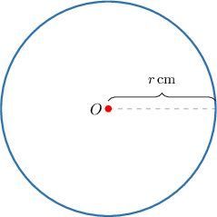

# Modeling with Direct Variation

Source: https://www.mathacademy.com/topics/2274?courseId=44
Topic ID: 2274

## Prerequisites

- [Selecting Units for Rates of Change](./2231-selecting-units-for-rates-of-change.md)
- [Understanding Proportional Relationships Using Graphs](../../../../middle-school/lessons/prealgebra/2552-understanding-proportional-relationships-using-graphs.md)
- [Understanding Proportional Relationships From Descriptions](../../../../middle-school/lessons/prealgebra/2554-understanding-proportional-relationships-from-descriptions.md)

## Lesson

### Introduction

A good example of a direct variation model is the distance an object travels when moving at a constant rate. In this case, the corresponding direct variation equation is

$$

d=vt,

$$

where

- $d$ is the total distance traveled by the object,

- $t$ is the total time that the object has been traveling, and,

- $v$ is the constant of proportionality, called the **speed** of the object.

For instance, if an object travels a distance of $24\,\textrm m$ in $4$ seconds, then we can substitute $d=24\,\textrm m$ and $t=4\,\textrm s$ into the above equation and solve for $v,$ as follows:

$$

\begin{aligned}24 & =𝑣⋅4 \\ \frac{24}{4} & =𝑣 \\ 6 & =𝑣\end{aligned}

$$

So, the equation that relates $d$ and $t$ is

$$

d=6t.

$$

One thing to note is that the constant of proportionality $v = 6$ also has units. So let's work out what these units are.

Since we have

$$

d = vt,

$$

it follows that

$$

v = \dfrac{d}{t}.

$$

So, the units of $v$ are

$$

\dfrac{\textrm m}{\textrm s} = \textrm m / \textrm s.

$$

Therefore, the constant of proportionality (including its unit) is $v = 6\, \textrm m / \textrm s.$

### Example: Calculating a Constant of Variation

#### Question

The force $F,$ measured in $\text{kg}\, \text m / \text s^2$, applied to a motorcycle varies directly with its acceleration $a,$ measured in $\text{m}/\text{s}^2.$ When the acceleration of the motorcycle is $a=5\,\text{m}/\text{s}^2,$ the force is $F=2\,000\,\text{kg}\, \text m / \text s^2.$ What is the constant of variation?

#### Explanation

The force $F$ is directly proportional to the acceleration $a,$ so we have

$$

F = k{a},

$$

where $k$ is the constant of variation.

We are told that when the acceleration is $a=5\, \text{m}/\,\text{s}^2,$ the force is $F=2\,000\,\text{kg}\, \text m / \text s^2.$ We can use this information to solve for $k,$ as follows:

$$

\begin{aligned}2\,000 & =𝑘⋅(5) \\ 2\,000 & =5𝑘 \\ \frac{2\,000}{5} & =𝑘 \\ 400 & =𝑘\end{aligned}

$$

Finally, since $k = \dfrac{F}{a},$ we have that the units of $k$ are

$$

\begin{aligned}\frac{kg m/s^{2}}{m/s^{2}} & =\frac{kgm/s^{2}}{m/s^{2}} \\ & =kg.\end{aligned}

$$

Therefore, our final answer is $k = 400\,\text{kg}.$

### Example: Modeling With Direct Variation

#### Question

The stretch $s,$ measured in centimeters $(\text{cm}),$ of a loaded spring varies directly with the load $l,$ measured in grams $(\mathrm{g}).$ When the load is $l=8\,\mathrm{g},$ the stretch is $s=9.6\,\mathrm{cm}.$ Find the load when the stretch is $s=7.2\,\mathrm{cm}.$

#### Explanation

The stretch $s$ is directly proportional to the load $l,$ so we have

$$

s = k{l},

$$

where $k$ is the constant of variation.

We are told that when $l=8\,\mathrm{g},$ we have $s=9.6\,\mathrm{cm}.$ We can use this information to solve for $k,$ as follows:

$$

\begin{aligned}9.6 & =𝑘⋅(8) \\ 9.6 & =8𝑘 \\ \frac{9.6}{8} & =𝑘 \\ 1.2 & =𝑘\end{aligned}

$$

We now have the equation

$$

s = 1.2l.

$$

We can use this equation to find the load when the stretch is $s=7.2\,\mathrm{cm},$ as follows:

$$

\begin{aligned}𝑙 & =\frac{𝑠}{1.2} \\ & =\frac{7.2}{1.2} \\ & =6\end{aligned}

$$

Therefore, the load when $s=7.2\,\mathrm{cm}$ is $l=6 \,\text{g}.$

### Variations With Second Powers

When modeling proportional relationships, we sometimes find that a quantity $y$ varies directly with the *square* of a second quantity $x.$ In such cases, we write

$$

y = kx^2.

$$

For example, consider a circle of radius $r,$ measured in centimeters.

It can be shown that the area $A,$ measured in square meters, of a circle varies directly with the *square* of the radius $r.$ Therefore, we have the equation

$$

A = k r^2.

$$

### Example: Modeling Direct Variations With Second Powers

#### Question

The force $F$, in newtons ($\mathrm N$), that an elastic spring exerts on an object varies directly with the **** of the extension of the spring $L,$ measured in meters. If the force is $F = 4\,\mathrm N$ when $L=0.1\,\mathrm m,$ then what equation models this situation?

#### Explanation

The force $F$ is directly proportional to the square of the spring extension $L$, so we have

$$

F = kL^2,

$$

where $k$ is the constant of variation.

We are told that $F=4\,\text{N}$ when $L=0.1\,\textrm m.$ We can use this information to solve for $k,$ as follows:

$$

\begin{aligned}4 & =𝑘⋅(0.1)^{2} \\ 4 & =𝑘⋅0.01 \\ \frac{4}{0.01} & =𝑘 \\ 400 & =𝑘\end{aligned}

$$

Therefore, our direct variation equation is

$$

F = 400L^2.

$$
