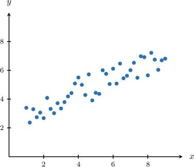
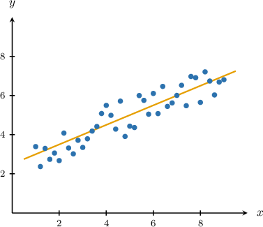
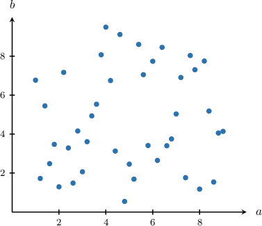
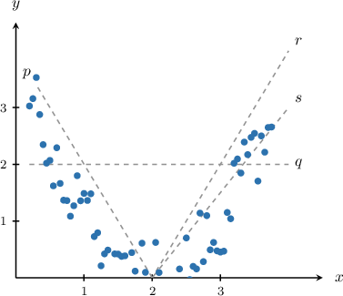
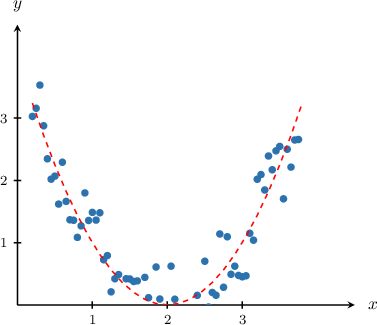
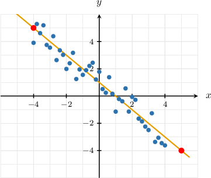
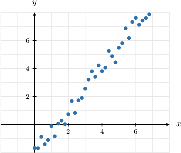
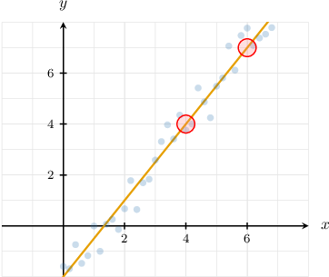

# Trend Lines

Source: https://www.mathacademy.com/topics/2609?courseId=44
Topic ID: 2609

## Prerequisites

- [Properties of Lines Given in Slope-Intercept Form](./398-properties-of-lines-given-in-slope-intercept-form.md)
- [Scatter Plots](./2585-scatter-plots.md)

## Lesson

### Introduction

Suppose we want to determine if the relationship between two variables is *linear*. How would we do this? One way is to draw a scatter plot and try to find a straight line that fits the data.

Consider the scatter plot below that shows the correspondence between the variables $x$ and $y.$

Notice that the data points are scattered along a straight line, as shown below. This line is called the **trend line**, **regression line,** or **line of best fit.** We also say that the data has a **linear trend**.

On the other hand, some data sets do *not* show a linear trend. For example, consider the following scatter plot that shows the correspondence between the variables $a$ and $b.$

From the plot, it seems that the data points are scattered randomly. Therefore, there is no linear trend.

### Example: Identifying the Trendline of a Given Scatter Plot

#### Question

Which of the lines $p,q,r,$ or $s$ is the trend line of the scatter plot above?

#### Explanation

The plot shows that the data points are scattered along a curve, not a straight line.

Therefore, there is no linear trend in the data.

### Example: Determining the Equation of a Trendline

#### Question

Determine the equation of the trend line shown above.

#### Explanation

Notice that the trend line passes through the points $(x_1,y_1)=(-4,5)$ and $(x_2,y_2)=(5,-4).$

We will write the equation of the line in the slope-intercept form

$$

y=mx+b.

$$

First, we compute the slope $m$ of the line, as follows:

$$

\begin{aligned}𝑚 & =\frac{𝑦_{2}−𝑦_{1}}{𝑥_{2}−𝑥_{1}} \\ & =\frac{−4−5}{5−(−4)} \\ & =\frac{−9}{9} \\ & =−1\end{aligned}

$$

Substituting $m=-1$ into the slope-intercept form above, we get

$$

y = - x + b.

$$

We now need to find the $y$-intercept $b.$ We can find this by substituting the coordinates of a point on the line. Any point will do, so let's substitute $(5,-4)\mathbin{:}$

$$

\begin{aligned}𝑦 & =−𝑥+𝑏 \\ −4 & =−5+𝑏 \\ 1 & =𝑏 \\ 𝑏 & =1\end{aligned}

$$

Therefore, the equation of the line is

$$

y = - x + 1.

$$

### Example: Estimating the Equation of a Trendline

#### Question

Estimate the equation of the trend line for the scatter plot above. Round both the slope and the $y$-intercept to the nearest $0.5.$

#### Explanation

First, let's draw an approximate trend line for our scatter plot:

It seems that the trend line passes through $(x_1,y_1)\approx(4,4)$ and $(x_2,y_2)\approx(6,7).$

We will write the equation of the line in the slope-intercept form

$$

y=mx+b.

$$

First, we estimate the slope $m$ of the line as follows:

$$

\begin{aligned}𝑚 & ≈\frac{𝑦_{2}−𝑦_{1}}{𝑥_{2}−𝑥_{1}} \\ & =\frac{7−4}{6−4} \\ & =\frac{3}{2} \\ & =1.5\end{aligned}

$$

Substituting $m=1.5$ into the slope-intercept form above, we get

$$

y = 1.5 x + b.

$$

We now need to estimate the $y$-intercept $b.$ We can do this by substituting the coordinates of a point on the line. Any point will do, so let's substitute $(4,4)\mathbin{:}$

$$

\begin{aligned}𝑦 & =1.5𝑥+𝑏 \\ 4 & =1.5(4)+𝑏 \\ 4 & =6+𝑏 \\ −2 & =𝑏 \\ 𝑏 & =−2\end{aligned}

$$

Therefore, the equation of the line is

$$

y = 1.5x - 2.

$$
