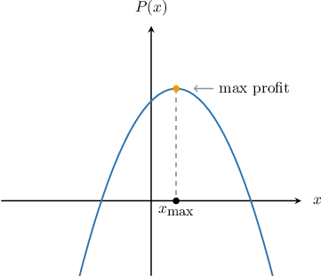
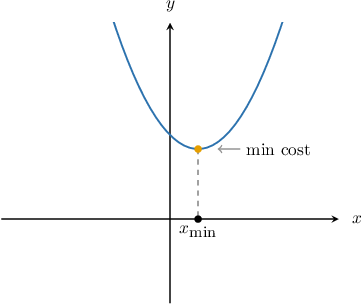
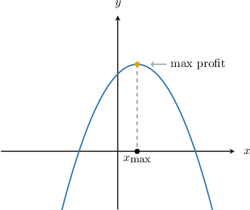
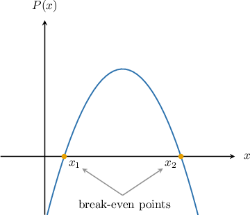

# Maximizing Profit and Break-Even Points

Source: https://www.mathacademy.com/topics/3665?courseId=44
Topic ID: 3665

## Prerequisites

- [Revenue, Cost, and Profit Functions](./701-revenue-cost-and-profit-functions.md)
- [The Axis of Symmetry of a Parabola](./704-the-axis-of-symmetry-of-a-parabola.md)

## Lesson

### Introduction

We can use our knowledge of quadratic functions to maximize a profit function. A profit function $P(x)$ often takes the form of a downward-opening parabola, and the maximum profit corresponds to the vertex of the parabola.

For example, suppose that the daily profit $P,$ in dollars, of a small business is given by the function

$$

P(x) = -3x^2 + 120x - 42,

$$

where $x$ is the number of units of a particular product sold by the company per day. How many units should the company sell per day to maximize its profit?

The profit function is a parabola that opens downward (since the leading coefficient is negative). Therefore, the highest point on the graph of $P(x)$ is the vertex of the parabola.

The $x$-coordinate of the vertex can be found using the formula

$$

x_\text{max}= -\dfrac{b}{2a}.

$$

For the function $P(x) = -3x^2 + 120x - 42,$ we have $a = -3$ and $b=120,$ which gives

$$

x_\text{max}=-\dfrac{120}{2(-3)}=20.

$$

Therefore, to maximize its daily profit, the business should sell $20$ units per day. The maximum daily profit of this company is

$$

\begin{aligned}𝑃(20)=−3(20)^{2}+120(20)−42=1\,158.\end{aligned}

$$

As well as maximizing profit functions, we can also maximize revenue functions and minimize cost functions. Let's see an example.

### Example: Maximizing Profit and Revenue Functions, and Minimizing Cost Functions

#### Question

The cost function, in hundreds of dollars, of a small business is given by $C(x)=0.4x^2-24x+520,$ where $x$ is the number of units produced per week. What is the smallest possible cost that the business can expend per week?

#### Explanation

In general, the minimum cost corresponds to the lowest point on the graph of $C(x).$

In this case, the cost function $C(x)=0.4x^2-24x+520$ is a parabola that opens upward (since the leading coefficient is positive). The lowest point on the graph of $C(x)$ is the vertex of the parabola.

The $x$-coordinate of the vertex can be found using the formula

$$

x_{\text{min}}= -\dfrac{b}{2a}.

$$

For the function $C(x) =0.4x^2-24x+520,$ we have $a = 0.4$ and $b=-24,$ which gives

$$

x_{\text{min}}=-\dfrac{-24}{2(0.4)}=30.

$$

Next, we substitute $x=30$ into the cost function, and we get

$$

\begin{aligned}𝐶(30) & =0.4(30)^{2}−24(30)+520 \\ & =360−720+520 \\ & =160.\end{aligned}

$$

Therefore, the minimum possible weekly cost is $160 \cdot100 = 16\,000.$

### Example: Maximizing a Profit Function Given Revenue and Cost Functions

#### Question

A factory manufactures and sells cars. The cost, $C(x),$ and revenue, $R(x),$ functions, in millions of dollars, of this company are

$$

C(x)=610+45x \,, \qquad R(x)=55x-0.04x^2,

$$

where $x$ denotes the number of units sold per year. What is the maximum profit that the company can make per year?

#### Explanation

The profit is equal to the revenue minus the cost:

$$

\begin{aligned}𝑃(𝑥) & =𝑅(𝑥)−𝐶(𝑥) \\ & =(55𝑥−0.04𝑥^{2})−(610+45𝑥) \\ & =55𝑥−0.04𝑥^{2}−610−45𝑥 \\ & =−0.04𝑥^{2}+10𝑥−610.\end{aligned}

$$

In general, the maximum profit corresponds to the highest point on the graph of the profit function $P(x).$

In this case, the profit function $P(x) = -0.04x^2+10x-610$ is a parabola that opens downward (since the leading coefficient is negative). The highest point on the graph of $P(x)$ is the vertex of the parabola.

The $x$-coordinate of the vertex can be found using the formula

$$

x_\text{max}= -\dfrac{b}{2a}.

$$

For the function $P(x) = -0.04x^2+10x-610,$ we have $a = -0.04$ and $b=10,$ which gives

$$

x_\text{max}=-\dfrac{10}{2(-0.04)}=125.

$$

Next, we substitute $x=125$ into the profit function, and we get

$$

\begin{aligned}𝑃(125) & =−0.04(125)^{2}+10(125)−610 \\ & =−625+1\,250−610 \\ & =15.\end{aligned}

$$

Therefore, the maximum profit is $15 \cdot 1\,000\,000 = 15\,000\,000.$

### Break-Even Points

A **break-even point** is a value of $x$ such that the profit function $P(x)$ equals zero.

In the diagram above, $x_1$ and $x_2$ are the break-even points, and we have

$$

P(x_1) = P(x_2) = 0.

$$

When a company is at break-even, the revenue must be equal to the cost. To see this, recall that the profit function is the difference between the revenue and cost functions:

$$

P(x) = R(x)-C(x).

$$

If $x_1$ is a break-even point, then $P(x_1) = 0,$ and we have

$$

R(x_1)-C(x_1) = 0\qquad\Longrightarrow\qquad R(x_1) = C(x_1).

$$

Therefore, the break-even point can be interpreted as the number of units a company should produce for its revenue to (just about) cover all its costs.

### Example: Finding Break-Even Points

#### Question

A publishing company prints magazines. The profit function, in thousands of dollars, of the company is given by $P(x)=-0.01 x^2 + 9 x - 2\,000,$ where $x$ is the number of units produced per year. How many units should the company produce per year to break even?

#### Explanation

The company breaks even when $P(x) = 0.$ So, we have

$$

\begin{aligned}𝑃(𝑥) & =−0.01𝑥^{2}+9𝑥−2\,000 \\ 0 & =−0.01𝑥^{2}+9𝑥−2\,000 \\ (−100)⋅0 & =(−100)⋅(−0.01𝑥^{2}+9𝑥−2\,000) \\ 0 & =𝑥^{2}−900𝑥+200\,000 \\ 𝑥^{2}−900𝑥+200\,000 & =0\end{aligned}

$$

Now, to solve for $x,$ we apply the quadratic formula:

$$

\begin{aligned}𝑥 & =\frac{−(−900)±\sqrt{(−900)^{2}−4(1)(200\,000)}}{2} \\ & =\frac{900±\sqrt{10\,000}}{2} \\ & =\frac{900±100}{2} \\ & =450±50\end{aligned}

$$

So, the solutions are $x=400$ and $x=500.$

Therefore, the company should publish $400$ or $500$ units per year to break even.
