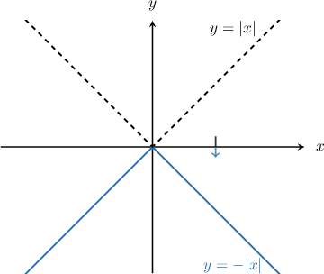
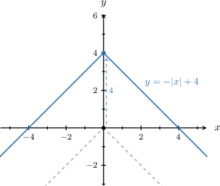
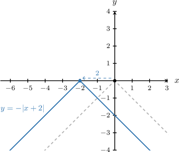
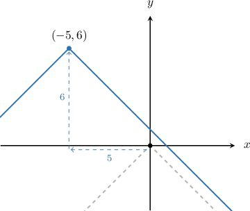

# Vertical Reflections of Absolute Value Graphs

Source: https://www.mathacademy.com/topics/452?courseId=44
Topic ID: 452

## Prerequisites

- [Absolute Value Graphs](./790-absolute-value-graphs.md)

## Lesson

### Introduction

If we want to plot the graph of $y=-|x|$, we reflect the curve $y=|x|$ in the $x$-axis, as shown below:

This transformation is called a **reflection in the $x$-axis**, and it occurs because the output $y$-values of the function $y=|x|$ are made negative by the transformation.

If we combine vertical and horizontal translations with reflection, we get a general form

$$

y=-|x-h|+k.

$$

This is the equation of a reflected absolute value graph $y=-|x|$ that is translated

- $h$ units right and

- $k$ units up.

### Example: Vertical Translation

#### Question

Plot the graph of $y=-|x|+4$.

#### Explanation

Remember that $y=-|x|+k$ is a reflected absolute value graph $y=-|x|$ that is translated $k$ units up.

The given function $y=-|x|+4$ has $k=4.$ Therefore, it is a reflected absolute value graph $y=-|x|$ that is translated $4$ units up.

### Example: Horizontal Translations

#### Question

Plot the graph of $y=-|x+2|.$

#### Explanation

Remember that $y=-|x-h|$ is a reflected absolute value graph $y=-|x|$ that is translated $h$ units right.

The given function $y=-|x+2|$ has $h=-2.$ To see this clearly, we can write the curve as follows:

$$

\begin{aligned}𝑦 & =−|𝑥+2| \\ 𝑦 & =−|𝑥−(−2)|\end{aligned}

$$

Therefore, the given curve is a reflected absolute value graph $y=-|x|$ that is translated $2$ units **.

### Example: Combining Horizontal and Vertical Translations

#### Question

Plot the graph of $y=-|x+5|+6$.

#### Explanation

Remember that $y=-|x-h|+k$ is a reflected absolute value graph $y=-|x|$ that is translated $h$ units right and $k$ units up.

The given function $y=-|x+5|+6$ has $h=-5$ and $k=6.$ Therefore, it is a reflected absolute value graph $y=-|x|$ that is translated $5$ units ** and $6$ units up.

