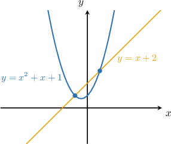
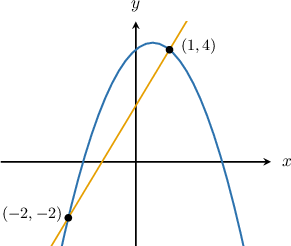
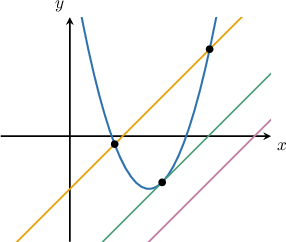
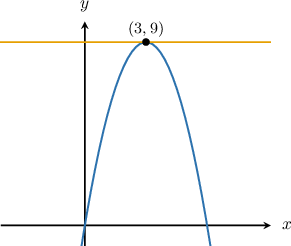

# Finding Intersections of Lines and Quadratic Functions

Source: https://www.mathacademy.com/topics/6341?courseId=44
Topic ID: 6341

## Prerequisites

- [Graphs of General Quadratic Functions](./84-graphs-of-general-quadratic-functions.md)
- [Calculating the Intersection of Two Lines](./408-calculating-the-intersection-of-two-lines.md)
- [Solving Systems of Nonlinear Equations](./410-solving-systems-of-nonlinear-equations.md)

## Lesson

### Introduction

Consider the line $y = x + 2$ and the parabola $y = x^2 + x + 1,$ shown in the graph below.

We can see from the diagram that there are two points of intersection. So let's calculate the coordinates of these intersection points.

An intersection point is a common solution of the equations $y = x + 2$ and $y = x^2 + x + 1.$ In other words, to get the coordinates of the intersection points, we have to solve the following system of equations:

$$

\begin{aligned}𝑦=𝑥^{2}+𝑥+1 \\ 𝑦=𝑥+2\end{aligned}

$$

Setting the equations equal to one another and then solving for $x$ using our knowledge of quadratic equations, we get

$$

\begin{aligned}𝑥^{2}+𝑥+1 & =𝑥+2 \\ 𝑥^{2}+𝑥+1 & =𝑥+2 \\ 𝑥^{2}+1 & =2 \\ 𝑥^{2}−1 & =0 \\ (𝑥+1)(𝑥−1) & =0 \\ 𝑥 & =−1,1.\end{aligned}

$$

So, the $x$-coordinates of the intersection points are $x=-1$ and $x=1.$

To find the $y$-coordinates of the intersection points, we plug these values into either curve. Let's choose the line since it's simpler.

- Substituting $x=−1,$ we get so one point of intersection is $(-1,1).$

- Substituting $x=1,$ we get so the other point of intersection is $(1,3).$

Therefore, we conclude that the points of intersection are $\left(-1,\,1 \right)$ and $\left(1,\,3 \right).$

### Example: Finding the X-Coordinates of the Intersection Points of a Parabola and a Line

#### Question

The parabola $y = x^2 + 2$ and the line $y = 3x$ intersect at the points $(x_1, y_1)$ and $(x_2, y_2),$ where $x_1 < x_2.$ What is the value of $x_1 + x_2?$

#### Explanation

We need to solve the following system consisting of the equations of the curves:

$$

\begin{aligned}𝑦=𝑥^{2}+2 \\ 𝑦=3𝑥\end{aligned}

$$

Setting the equations equal to one another and solving, we get

$$

\begin{aligned}𝑥^{2}+2 & =3𝑥 \\ 𝑥^{2}−3𝑥+2 & =0 \\ (𝑥−1)(𝑥−2) & =0 \\ 𝑥 & =1,2.\end{aligned}

$$

So, the $x$-coordinates of the intersection points are $x_1 = 1$ and $x_2 = 2.$ Therefore,

$$

x_1 + x_2 = 1 + 2 = 3.

$$

### Example: Finding the Y-Coordinates of the Intersection Points of a Parabola and a Line

#### Question

The parabola $y = -x^2 + x + 4$ and the line $y = 2x + 2$ intersect at the points $(x_1, y_1)$ and $(x_2, y_2),$ where $x_1 < x_2.$ What is the value of $y_1 + y_2?$

#### Explanation

We need to solve the following system consisting of the equations of the curves:

$$

\begin{aligned}𝑦=−𝑥^{2}+𝑥+4 \\ 𝑦=2𝑥+2\end{aligned}

$$

Setting the equations equal to one another and solving, we get

$$

\begin{aligned}−𝑥^{2}+𝑥+4 & =2𝑥+2 \\ −𝑥^{2}−𝑥+2 & =0 \\ −(𝑥^{2}+𝑥−2) & =0 \\ −(𝑥+2)(𝑥−1) & =0 \\ 𝑥 & =−2,1.\end{aligned}

$$

So, the $x$-coordinates of the intersection points are $x_1 = -2$ and $x_2 = 1.$

To find the $y$-coordinates of the intersection points, we plug these values into either the curve or the line. Let's choose the line since it's simpler.

- Substituting $x=−2,$ we get so one point of intersection is $(-2,-2).$

- Substituting $x=1,$ we get so the other point of intersection is $(1,4).$

The points of intersection are $(-2,-2)$ and $(1,4).$ Therefore, $y_1 = -2,\; y_2 = 4,$ and

$$

y_1 + y_2 = -2 + 4 = 2.

$$

A sketch of the situation is shown below.

### The Number of Intersection Points

A line and a parabola may have **two**, **one**, or **no** points of intersection.

This is similar to how a quadratic equation may have **two**, **one**, or **no** solutions.

With that in mind, let's look at another example.

### Example: Finding the Intersection Point of a Parabola and a Line

#### Question

The parabola $y=-x^2+6x$ and the line $y=9$ intersect at a single point with coordinates $(p,q).$ What is $p+q?$

#### Explanation

We need to solve the following system consisting of the equations of the curves:

$$

\begin{aligned}𝑦=−𝑥^{2}+6𝑥 \\ 𝑦=9\end{aligned}

$$

Setting the equations equal to one another and solving, we get

$$

\begin{aligned}−𝑥^{2}+6𝑥 & =9 \\ −𝑥^{2}+6𝑥−9 & =0 \\ −(𝑥^{2}−6𝑥+9) & =0 \\ −(𝑥−3)(𝑥−3) & =0 \\ 𝑥 & =3.\end{aligned}

$$

So, the $x$-coordinate of the intersection point is $x=3.$

We know the $y$-coordinate of the intersection point from the equation of the line. So, the only point of intersection is $(3, 9).$ Therefore, $p=3,\; q=9,$ and

$$

p+q = 3+9 = 12.

$$

A sketch of the situation is shown below.

### Example: Finding the Range of an Unknown Parameter Given That There Are No Intersection Points

#### Question

Given that the line $y=x +2k$ does **** intersect the parabola $y=x^2-x+3,$ what is the range of possible values of $k?$

#### Explanation

To determine whether the line $y=x +2k$ intersects the parabola $y=x^2-x+3,$ we need to solve the following system of equations for the two curves:

$$

\begin{aligned}𝑦=𝑥^{2}−𝑥+3 \\ 𝑦=𝑥+2𝑘\end{aligned}

$$

Setting the equations equal to one another and writing in standard form, we get

$$

\begin{aligned}𝑥^{2}−𝑥+3 & =𝑥+2𝑘 \\ 𝑥^{2}−2𝑥+3−2𝑘 & =0.\end{aligned}

$$

Now, we solve this equation using the quadratic formula with $a=1,\, b=-2,$ and $c=3-2k{:}$

$$

\begin{aligned}𝑥 & =\frac{−(−2)±\sqrt{(−2)^{2}−4(1)(3−2𝑘)}}{2(1)} \\ & =\frac{2±\sqrt{4−12+8𝑘}}{2} \\ & =\frac{2±\sqrt{8𝑘−8}}{2}\end{aligned}

$$

Since the line and parabola do not intersect, our quadratic equation must have no real solutions; hence, the expression inside the square root must be negative. Setting up and solving this inequality, we get

$$

\begin{aligned}8𝑘−8 & <0 \\ 8𝑘 & <8 \\ 𝑘 & <1.\end{aligned}

$$

Therefore, the range of possible values of $k$ is $k \lt 1.$
