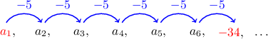

# The Nth Term of an Arithmetic Sequence

Source: https://www.mathacademy.com/topics/668?courseId=44
Topic ID: 668

## Prerequisites

- [Simplifying Linear Expressions Using the Distributive Law](../../../../middle-school/lessons/prealgebra/138-simplifying-linear-expressions-using-the-distributive-law.md)
- [Arithmetic Sequences](./667-arithmetic-sequences.md)

## Lesson

### Introduction

The explicit formula for the $n$th term of an arithmetic sequence is given by

$$

a_n = a_1 + (n-1)d,

$$

where $a_1$ is the first term and $d$ is a common difference.

To illustrate how this works, suppose we want to find the $20$th term of the following arithmetic sequence:

$$

{\color{blue}2}, \: 5, \: 8, \: 11, \: 14, \: \ldots

$$

The first term is $a_1={\color{blue}2},$ and the common difference is

$$

d=5-2={\color{red}3}.

$$

So, we can write the formula for the $n$th term of the sequence as follows:

$$

\begin{aligned}𝑎_{𝑛} & =𝑎_{1}+(𝑛−1)𝑑 \\ & =2+(𝑛−1)(3) \\ & =2+3𝑛−3 \\ & =3𝑛−1\end{aligned}

$$

To find the $20$th term, we can use this formula with $n=20\mathbin{:}$

$$

\begin{aligned}𝑎_{𝑛} & =3𝑛−1 \\ 𝑎_{20} & =3(20)−1 \\ & =60−1 \\ & =59\end{aligned}

$$

Therefore, the $20$th term is $a_{20}=59.$ Using the formula was much quicker than writing out all $20$ terms of the sequence!

### Example: Finding the Formula for the Nth Term of an Arithmetic Sequence

#### Question

Find the formula for the $n$th term of an arithmetic sequence if the first term is $3$ and the common difference is $2.$

#### Explanation

The formula for the $n$th term of an arithmetic sequence is

$$

a_n= a_{1}+(n-1)d.

$$

We are told that the first term is $a_1={\color{blue}3}$ and the common difference is $d={\color{red}2}.$ So, we substitute into the formula and simplify:

$$

\begin{aligned} a_n &= a_{1}+(n-1)d \\[3pt] &= {\color{blue}3} + (n - 1)({\color{red}2}) \\[3pt] &= 3 + 2n -2 \\[3pt] & =2n+1 \end{aligned}

$$

Therefore the formula for the $n$th term is $a_n = 2n+1.$

### Example: Finding the Formula for the Nth Term of an Arithmetic Sequence in Function Notation

#### Question

Find the formula for the $n$th term of an arithmetic sequence if the first term is $0$ and the second term is $-2.$ Express your answer in function notation.

#### Explanation

The formula for the $n$th term of an arithmetic sequence (in function notation) is

$$

f(n)= f(1)+(n-1)d.

$$

We are given the first term $f(1)={\color{blue}0}.$ Also, the common difference of the sequence can be found as

$$

d=-2 - 0 = {\color{red}-2}.

$$

So, we substitute into the formula and simplify:

$$

\begin{aligned} f(n)&= f(1)+(n-1)d \\[3pt] &= {\color{blue}0} + (n - 1)({\color{red}-2}) \\[3pt] &= 0 - 2n + 2 \\[3pt] &= 2 - 2n \end{aligned}

$$

Therefore, the formula for the $n$th term is $f(n) = 2 - 2n.$

### Example: Finding a Particular Term of an Arithmetic Sequence

#### Question

Find the $50$th term of the following arithmetic sequence.

$$

-5, \: -8, \: -11, \: \ldots

$$

#### Explanation

The formula for the $n$th term of an arithmetic sequence is

$$

a_n= a_{1}+(n-1)d.

$$

First, we will write the formula for the $n$th term of this sequence. From the first few terms

$$

{\color{blue}-5}, \: -8, \: -11, \ldots,

$$

we see that the first term is $a_1={\color{blue}-5}$ and the common difference is

$$

d=-8-(-5)={\color{red}-3}.

$$

So, we substitute into the formula and simplify:

$$

\begin{aligned} a_n&= a_{1}+(n-1)d \\[3pt] &= {\color{blue}-5} + (n - 1)({\color{red}-3}) \\[3pt] & =-5 -3n + 3 \\[3pt] &=-3n-2 \end{aligned}

$$

Now, we can use our formula to find the $50$th term. All we have to do is substitute $n=50\mathbin{:}$

$$

\begin{aligned} a_n &=-3n-2 \\[7pt] a_{50} &= -3(50)-2 \\[3pt] &= -150-2 \\[3pt] &= -152 \end{aligned}

$$

Therefore, the $50$th term of the sequence is $a_{50}=-152.$

### Example: Finding the Formula for the Nth Term Given Another Term and the Common Difference

#### Question

Find the formula for the $n$th term of the arithmetic sequence that has a $7$th term equal to $-34$ and a common difference of $-5.$

#### Explanation

First, notice that $a_{7}=-34$ is $6$ jumps after $a_1$.

Hence, we can write

$$

a_{7} = a_1 + 6d,

$$

and solve for $a_1$ as follows:

$$

\begin{aligned}𝑎_{7} & =𝑎_{1}+6𝑑 \\ −34 & =𝑎_{1}+6(−5) \\ −34 & =𝑎_{1}−30 \\ −4 & =𝑎_{1}\end{aligned}

$$

So, the formula for the $n$th term is

$$

\begin{aligned}𝑎_{𝑛} & =𝑎_{1}+(𝑛−1)𝑑 \\ & =−4+(𝑛−1)(−5) \\ & =−4−5𝑛+5 \\ & =1−5𝑛.\end{aligned}

$$
