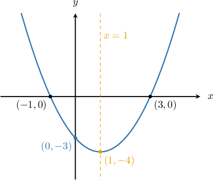
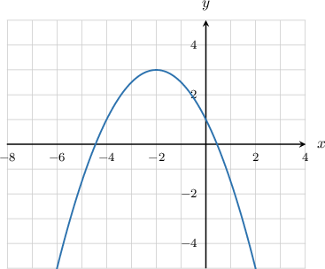
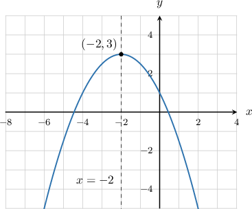
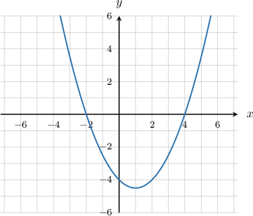
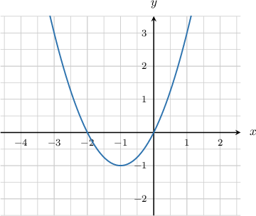
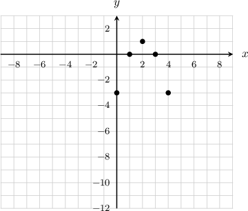
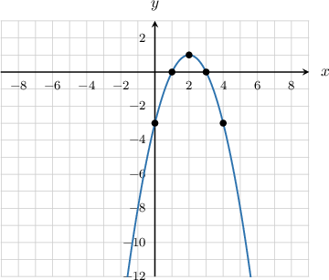

# Graphs of General Quadratic Functions

Source: https://www.mathacademy.com/topics/84?courseId=44
Topic ID: 84

## Prerequisites

- [Vertical Reflections of Quadratic Functions](./117-vertical-reflections-of-quadratic-functions.md)
- [The Roots of a Function](./2022-the-roots-of-a-function.md)

## Lesson

### Introduction

Consider the graph of the parabola shown below.

We can describe many features of the graph using mathematical terminology:

- The -intercepts of the parabola are at and We say that and are the **roots** (or **zeros**) of the parabola.

- The parabola intersects the -axis at. We say that is the **-intercept**. The -intercept is the same as the constant term of the function.

- The parabola has a "turning point" at which is called the **vertex**. In an upwards parabola (like the one shown above), the vertex is the minimum point, while in a downwards parabola, the vertex is the maximum point.

- The vertical line that passes through the vertex is called the **axis of symmetry**. The part of the parabola to the left of the axis of symmetry is the mirror image of the right, and vice versa.

- This particular parabola is **upward opening** because it has a distinctive shape. A parabola is upward opening if the quadratic coefficient is positive

- Parabolas can also be **downward opening** with a distinctive shape. A parabola is downward opening if the quadratic coefficient is negative

Let's take a look at an example of a downward opening parabola.

### Example: Finding the Vertex and Axis of Symmetry of a Parabola Given Its Graph

#### Question

For the parabola shown below, find the vertex and the equation of the axis of symmetry.

#### Explanation

The vertex is the "turning point" of the parabola. In a downwards parabola, like the one here, the vertex is the maximum point. So, the vertex of this parabola is $(-2,3).$

The axis of symmetry is the vertical line that passes through the vertex. Therefore, the axis of symmetry of this parabola is $x=-2.$

### Example: Finding the Roots of a Parabola Given Its Graph

#### Question

Find the roots of the parabola shown below.

#### Explanation

The roots of a parabola are the $x$-intercepts of the parabola.

From the graph, we can see that the curve intercepts the $x$-axis at the points $(-2,0)$ and $(4,0).$

Therefore, the roots are $x=-2$ and $x=4.$

### Example: Computing the Y-Intercept of a Parabola Given Its Graph

#### Question

The equation of the curve above is $y=x^2+2x+k.$ Find the value of $k.$

#### Explanation

Notice that if we substitute $x=0$ into the given equation, we obtain

$$

\begin{aligned}𝑦 & =𝑥^{2}+2𝑥+𝑘 \\ 𝑦 & =(0)^{2}+2(0)+𝑘 \\ 𝑦 & =𝑘,\end{aligned}

$$

meaning that the curve intercepts the $y$-axis at the point $(0,k).$ Based on the graph, we see that we must have $k=0$ since our parabola intercepts the $y$-axis at $\left(0,0\right).$

### Example: Sketching the Graph of a Parabola Given Its Equation

#### Question

Sketch the graph of $y=-x^2+4x-3.$

#### Explanation

Let's construct a table of values for the function $y=-x^2+4x-3.$ We fill the first row with the $x$-values $x=0,1,2,3,4$ and then use the formula $y=-x^2+4x-3$ to compute the corresponding $y$-values in the second row.

If we plot those points on a graph, we can start to see the shape of a parabola:

We fill out the graph by drawing the parabola through the plotted points:

