# Absolute Value Graph Transformations

Source: https://www.mathacademy.com/topics/1149?courseId=51
Topic ID: 1149

## Prerequisites

- [Rules of Absolute Value](../algebra-i/75-rules-of-absolute-value.md)
- [Vertical Reflections of Functions](./1150-vertical-reflections-of-functions.md)
- [Horizontal Reflections of Functions](./1585-horizontal-reflections-of-functions.md)

## Lesson

### Introduction

When we take the absolute value of a *function*, the positive values of the function remain unchanged, but the absolute value operation removes the minus sign from any negative values.

As a consequence, to get the graph of $y = |f(x)|$ from the graph of $y=f(x),$

- any parts that lie on or above the $x$-axis will remain unchanged, and

- any parts that lie *below* the $x$-axis will be reflected in the $x$-axis.

For example, consider the graph of $y=f(x),$ shown below. What is the graph of $y=|f(x)|?$

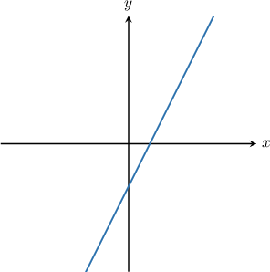

To get the graph of $y=|f(x)|$ from the graph of $y=f(x),$ we take the part of $y=f(x)$ that lies below the $x$-axis and reflect it across the $x$-axis.

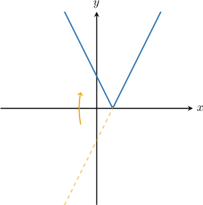

### Example: Plotting the Absolute Value of a Function Given Its Graph

#### Question

The graph of $y=f(x)$ is shown below. What is the graph of $y=|f(x)|?$

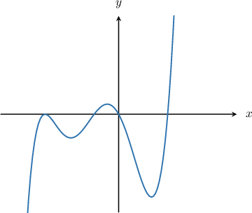

#### Explanation

To get the graph of $y=|f(x)|$ from the graph of $y=f(x),$ we take the part of $y=f(x)$ that lies below the $x$-axis and reflect it across the $x$-axis.

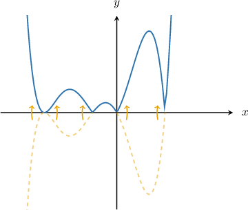

### Plotting the Absolute Value of the Argument of a Function

Suppose we have the graph $y=f(x).$ How do we plot the graph of $y = f(|x|)?$

First, notice that since $\left|-x\right| = |x|,$ we have that

$$

f(\left|x\right|)=f(\left|-x\right|).

$$

Therefore, the values of $f(|x|)$ will be equal for corresponding positive and negative values of $x.$ Moreover, every input is non-negative. Thus, to plot the graph of $y = f(|x|)$ from the graph of $y=f(x),$ we reflect the *right* half of the graph across the $y$-axis.

For example, the graph of $y=f(x)$ is shown below. What is the graph of $y=f(|x|)?$

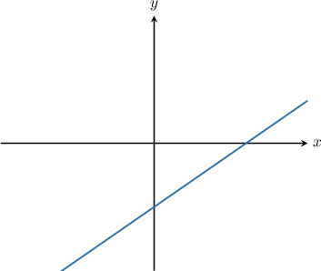

To get the graph of $y=f(|x|)$ from the graph of $y=f(x),$ we reflect the part of $y=f(x)$ that lies to the right of the $y$-axis across the $y$-axis.

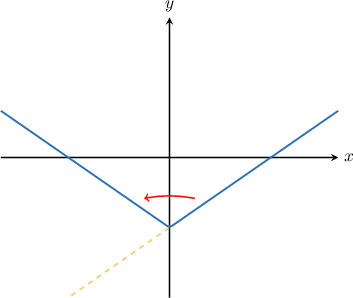

**Watch out:** Pay attention to the notation. Although they look similar, $f(|x|) \neq |f(x)|.$ These two functions are defined differently and have different graphs!

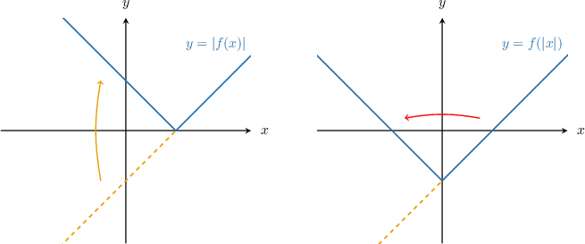

### Example: Plotting the Absolute Value of the Argument of a Function Given Its Graph

#### Question

The graph of $y=f(x)$ is shown below. What is the graph of $y=f(|x|)?$

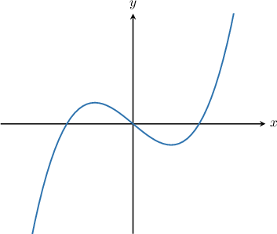

#### Explanation

To get the graph of $y=f(|x|)$ from the graph of $y=f(x),$ we reflect the part of $y=f(x)$ that lies to the right of the $y$-axis across the $y$-axis.

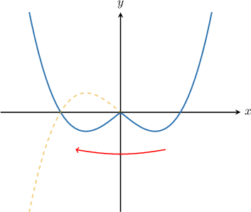

### Example: Plotting the Absolute Value of a Function and Its Argument

#### Question

The graph of $y=f(x)$ is shown below. What is the graph of $y=|f(|x|)|?$

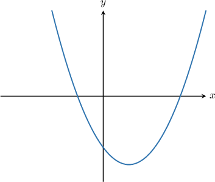

#### Explanation

We find the graph of $y=|f(|x|)|$ in two steps.

- To get the graph of $y=f(|x|)$ from the graph of $y=f(x),$ we reflect the part of $y=f(x)$ that lies to the right of the $y$-axis across the $y$-axis.

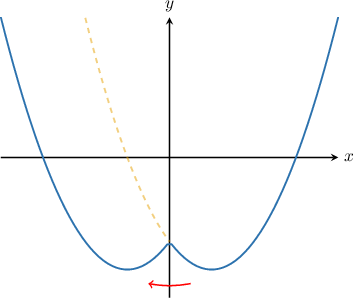

- Then, to get the graph of $y=|f(|x|)|$ from the graph of $y=f(|x|),$ we reflect the part of $y=f(|x|)$ that lies below the $x$-axis across the $x$-axis.

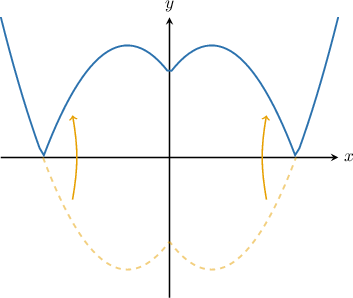
