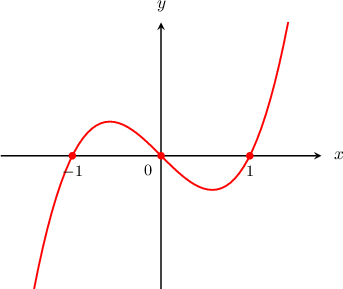
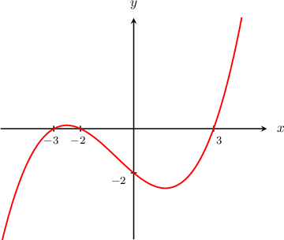
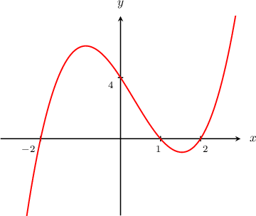
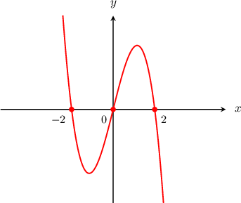
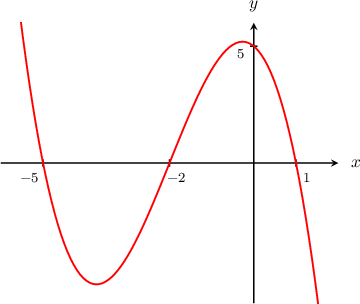
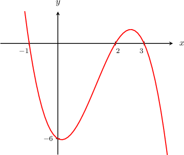

# Graphing Cubic Curves Containing Three Distinct Real Roots

Source: https://www.mathacademy.com/topics/1654?courseId=51
Topic ID: 1654

## Prerequisites

- [Roots of Quadratic Functions](../algebra-i/661-roots-of-quadratic-functions.md)
- [Graphing Elementary Cubic Functions](./1653-graphing-elementary-cubic-functions.md)
- [Factoring Cubic Polynomials Using the Factor Theorem](./2119-factoring-cubic-polynomials-using-the-factor-theorem.md)

## Lesson

### Introduction

The graph of any cubic function $y = f(x)= ax^3 + bx^2 + cx +d$ (where $a >0$) has a characteristic inverted ${\textsf{S}}$-shape, with $y$-values ranging from $-\infty$ to $+\infty.$ This means that every such function has *at least* one real root and *at most* three distinct roots.

For instance, suppose that we want to plot the graph of $y = x^3-x.$ Then we set $y=0$ to find the roots:

$$

\begin{aligned}𝑥^{3}−𝑥 & =0 \\ 𝑥(𝑥^{2}−1) & =0 \\ 𝑥(𝑥−1)(𝑥+1) & =0\end{aligned}

$$

By the zero-product rule, we get three distinct roots $x=0, -1, 1.$

So, we draw an inverted ${\textsf{S}}$-shaped graph that passes through these three roots, as follows:

### Example: Graphing a Factored Cubic Curve with Positive Leading Coefficient

#### Question

Graph the curve corresponding to the equation $y=\dfrac{1}{9}(x-3)(x+2)(x+3).$

#### Explanation

First, notice that the function is a product of $3$ linear binomials, so this function is a cubic function. Moreover, it is a positive cubic because if we were to expand the parentheses, the coefficient of the $x^3$ term would be positive:

$$

\dfrac{1}{9}({\color{blue}{x}}-3)({\color{red}{x}}+2)(x+3) = \dfrac 1 9\cdot {\color{blue}{x}}\cdot {\color{red}{x}}\cdot x +\cdots = \dfrac 1 9 x^3+\cdots

$$

The equation is already in factored form. So by the zero-product rule, we deduce that the roots are $x=3,$ $x=-2,$ and $x=-3.$

We also find the $y$-intercept of the curve by plugging the value $x=0$ into the equation:

$$

\begin{aligned}𝑦 & =\frac{1}{9}(0−3)(0+2)(0+3) \\ & =\frac{(−3)(2)(3)}{9} \\ & =−2\end{aligned}

$$

So, we draw an inverted ${\textsf{S}}$-shaped graph that passes through the three roots $x=-3,-2,3$ and has the $y$-intercept $y=-2,$ as follows:

### Example: Graphing an Expanded Cubic Curve with Positive Leading Coefficient

#### Question

Given that $x=2$ is a root of $f(x)=x^3-x^2-4x+4,$ graph the curve $y=f(x).$

#### Explanation

We are told that $x=2$ is a root of $f(x),$ which means that $(x-2)$ is a factor of $f(x).$ So, to find the other roots of $f(x)$ we use synthetic division to divide $f(x)$ by $(x-2)\mathbin{:}$

$$

\begin{aligned} & 𝑥^{3} & 𝑥^{2} & 𝑥^{1} & 𝑥^{0} \\ 2 & 1 & −1 & −4 & 4 \\ & & 2 & 2 & −4 \\ & 1 & 1 & −2 & 0\end{aligned}

$$

We obtain

$$

\begin{aligned}𝑓(𝑥) & =(𝑥−2)(𝑥^{2}+𝑥−2) \\ & =(𝑥−2)(𝑥−1)(𝑥+2),\end{aligned}

$$

so the other two roots of $f(x)$ are $x=1$ and $x=-2.$

Now, let's find the $y$-intercept. To do that, we substitute $x=0,$ and we get

$$

\begin{aligned}𝑦 & =(0−2)(0−1)(0+2) \\ & =(−2)(−1)(2) \\ & =4.\end{aligned}

$$

So, we draw an inverted ${\textsf{S}}$-shaped graph that passes through the three roots $x=-2,1,2$ and has the $y$-intercept $y=4,$ as follows:

### Negative Cubic Curves With Three Distinct Real Roots

The graph of any cubic function $y = f(x)= ax^3 + bx^2 + cx +d$ (where $a <0$) has a characteristic ${\textsf{S}}$-shape, with $y$-values ranging from $+\infty$ to $-\infty.$ This means that every such function has *at least* one real root and *at most* three distinct roots.

For instance, suppose that we want to plot the graph of $y = -x^3+4x.$ Then we set $y=0$ to find the roots:

$$

\begin{aligned}−𝑥^{3}+4𝑥 & =0 \\ −𝑥(𝑥^{2}−4) & =0 \\ −𝑥(𝑥−2)(𝑥+2) & =0\end{aligned}

$$

So by the zero-product rule, we get three distinct roots $x=0, -2, 2.$

So, we draw an ${\textsf{S}}$-shape that passes through these three roots, as follows:

### Example: Graphing a Factored Cubic Curve with Negative Leading Coefficient

#### Question

Graph the curve corresponding to the equation $y=f(x)$ where $f(x)=\dfrac{1}{2}(x+5)(1-x)(x+2).$

#### Explanation

First, notice that the function is a product of $3$ linear binomials, so this function is a cubic function. Moreover, it is a negative cubic because if we were to expand the parentheses, the coefficient of the $x^3$ term would be negative:

$$

\dfrac{1}{2}({\color{blue}{x}}+5)(1-{\color{red}{x}})(x+2) = \dfrac 1 2\cdot {\color{blue}{x}}\cdot (-{\color{red}{x}})\cdot x +\cdots = -\dfrac 1 2 x^3+\cdots

$$

The equation is given in the factored form. So by the zero-product rule, we deduce that the roots are $x=-5,$ $x=1,$ and $x=-2.$

We now find the $y$-intercept of the curve by plugging the value $x=0$ into the equation:

$$

\begin{aligned}𝑦 & =\frac{1}{2}(0+5)(1−0)(0+2) \\ & =\frac{(5)(1)(2)}{2} \\ & =5\end{aligned}

$$

So, we draw an ${\textsf{S}}$-shaped graph that passes through the three roots $x=-5,-2,1$ and has the $y$-intercept $y=5,$ as follows:

### Example: Graphing an Expanded Cubic Curve with Negative Leading Coefficient

#### Question

Given that $x=-1$ is a root of $f(x)=-x^3+4x^2-x-6,$ graph the curve $y=f(x).$

#### Explanation

Since $x=-1$ is a root of $f(x),$ this means that $(x+1)$ is a factor of $f(x),$ and therefore, we can begin factoring $f(x)$ by dividing it by $(x+1).$ We use synthetic division, as follows:

$$

\begin{aligned} & 𝑥^{3} & 𝑥^{2} & 𝑥^{1} & 𝑥^{0} \\ −1 & −1 & 4 & −1 & −6 \\ & & 1 & −5 & 6 \\ & −1 & 5 & −6 & 0\end{aligned}

$$

So we obtain

$$

\begin{aligned}𝑓(𝑥) & =(𝑥+1)(−𝑥^{2}+5𝑥−6) \\ & =−(𝑥+1)(𝑥^{2}−5𝑥+6) \\ & =−(𝑥+1)(𝑥−2)(𝑥−3).\end{aligned}

$$

Setting the factors equal to zero, we find that the roots of $f(x)$ are $x=-1,2,3.$

Now, let's find the $y$-intercept. To do that, we substitute $x=0,$ and we get

$$

\begin{aligned}𝑦 & =−(0+1)(0−2)(0−3) \\ & =−(1)(−2)(−3) \\ & =−6.\end{aligned}

$$

So, we draw an ${\textsf{S}}$-shaped graph that passes through the three roots $x=-1,2,3$ and has the $y$-intercept $y=-6,$ as follows:

