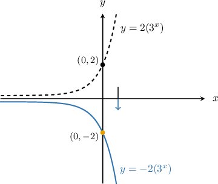
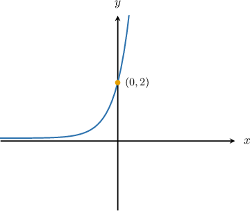
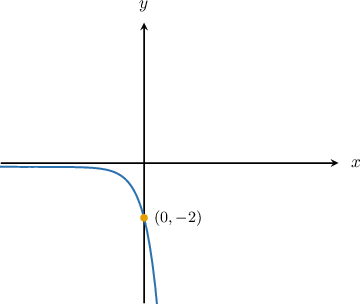
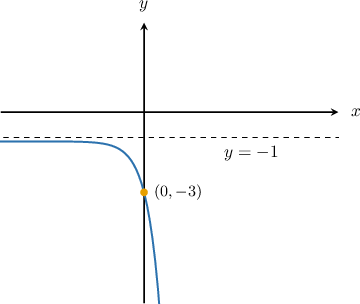
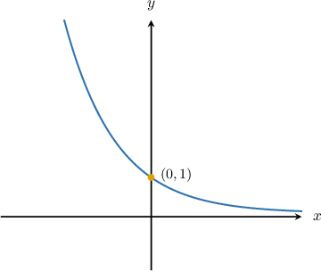
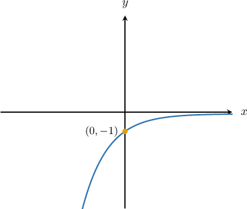
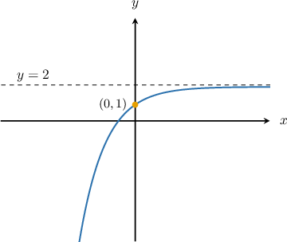

# Vertical Reflections of Exponential Functions

Source: https://www.mathacademy.com/topics/1682?courseId=51
Topic ID: 1682

## Prerequisites

- [Vertical Translations of Exponential Decay Functions](./456-vertical-translations-of-exponential-decay-functions.md)

## Lesson

### Introduction

To plot the graph of $y=-2(3^x),$ we take the curve $y=2(3^x)$ and reflect it in the $x$-axis, as shown below:

This transformation is called a **reflection in the $\boldsymbol{x}$-axis**, and it occurs because the output $y$-values of the function $y=2(3^x)$ are made negative by the transformation.

If we combine vertical translations with reflection, we get a general form

$$

y = -a(b^x) + k.

$$

This is the equation of a reflected exponential graph $y=-a(b^x)$ that is translated $k$ units up.

### Example: Vertical Reflections of Exponential Growth Functions

#### Question

Plot the graph of $y=-2(7^x)-1.$

#### Explanation

To plot the given function, we follow these steps:

- We take the curve $y=2(7^x).$

- Reflect it on the $x$-axis to give $y=-2(7^x).$ The $y$-intercept moves from $(0,2)$ to $(0,-2)$ but the horizontal asymptote stays at $y=0.$

- Then, vertically shift it by $1$ unit down to give $y=-2(7^x)-1.$ The point $(0,-2)$ moves to $(0,-3)$ and the horizontal asymptote moves from $y=0$ to $y=-1.$

### Example: Vertical Reflections of Exponential Decay Functions

#### Question

Plot the graph of $y = -\left(\dfrac 12 \right)^x + 2.$

#### Explanation

To plot the given function, we follow these steps:

- We take the curve $y=\left(\dfrac{1}{2}\right)^{x}.$

- Reflect it on the $x$-axis to give $y=-\left(\dfrac{1}{2}\right)^{x}.$ The $y$-intercept moves from $(0,1)$ to $(0,-1)$ but the horizontal asymptote stays at $y=0.$

- Then, vertically shift it by $2$ units up to give $y=-\left(\dfrac{1}{2}\right)^{x}+2.$ The point $(0,-1)$ moves to $(0,1)$ and the horizontal asymptote moves from from $y=0$ to $y=2.$

