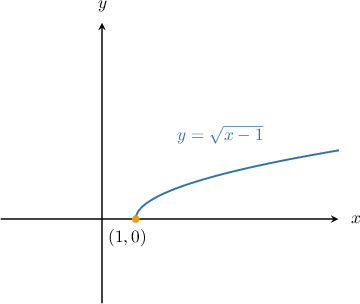
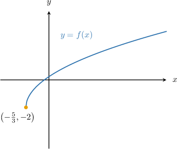
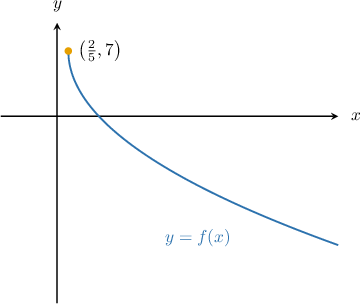
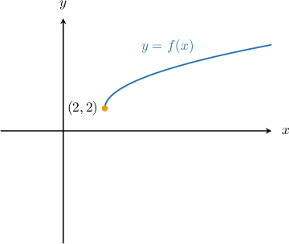

# Properties of Transformed Square Root Functions

Source: https://www.mathacademy.com/topics/1875?courseId=51
Topic ID: 1875

## Prerequisites

- [Graph Transformations of Square Root Functions](./1540-graph-transformations-of-square-root-functions.md)
- [The Range of a Function: Advanced Cases](../algebra-i/3728-the-range-of-a-function-advanced-cases.md)
- [Further Solving Linear Inequalities](../../../../middle-school/lessons/grade-7/4034-further-solving-linear-inequalities.md)

## Lesson

### Introduction

The domain of a radical function is limited to the set of $x$-values that make the expression under the square root positive or zero.

For example, the domain of $\sqrt{x}$ is $x \geq 0,$ or $x \in [0,\infty)$ in interval notation.

On the other hand, the domain of $\sqrt{-x}$ is given by

$$

-x \geq 0

$$

which simplifies to

$$

x \leq 0.

$$

Thus, the domain of $\sqrt{-x}$ is $x \in (-\infty, 0].$

As another example, the domain of $\sqrt{x-1}$ is given by

$$

x -1 \geq 0

$$

which simplifies to

$$

x \geq 1,

$$

or $x \in [1, \infty)$ in interval notation.

We can also see that this is true from the graph of the function. The graph of $y=\sqrt{x-1}$ is shown below.

In general, to find the domain of a radical function of the form $y = \sqrt{g(x)},$ we need to solve the inequality $g(x) \geq 0.$

### Example: Finding the Domain of a Transformed Square Root Function

#### Question

What is the domain of $f(x) = \sqrt{3x+5}-2?$

#### Explanation

The domain of $y = \sqrt{x}$ is

$$

x \ge 0.

$$

To find the domain of $g(x) = \sqrt{3x+5} -2,$ we replace $x$ with $3x+5$ in the above inequality. This gives

$$

{3x+5} \ge 0.

$$

Solving this inequality, we get

$$

\begin{aligned}3𝑥+5 & ≥0 \\ 3𝑥 & ≥−5 \\ 𝑥 & ≥−\frac{5}{3}.\end{aligned}

$$

Therefore, the domain of $f(x)$ is $x\in \left[-\dfrac{5}{3}, \infty\right).$

We can also see that this is true from the graph of the function. The graph of $y=f(x)$ is shown below.

### The Range of a Transformed Square Root Function

Now, let's examine the range of a transformed radical function. For example, what is the range of

$$

f(x) = -3\sqrt{5x-2}+7?

$$

The range of $\sqrt x$ is

$$

\sqrt x \ge 0.

$$

Horizontal shifts and stretches do not affect the range. So, we have

$$

\sqrt{5x-2} \ge 0.

$$

Multiplying the above inequality by $-3$ and then adding $7,$ we get

$$

\begin{aligned}\sqrt{√5𝑥−2} & ≥0 \\ −3\sqrt{√5𝑥−2} & ≤0 \\ −3\sqrt{√5𝑥−2}+7 & ≤7.\end{aligned}

$$

Therefore, the range of the given function is $f(x) \in (-\infty,7].$

We can also see that this is true from the graph of the function. The graph of $y=f(x)$ is shown below.

### Example: Finding the Range of a Transformed Square Root Function

#### Question

Which of the following values are possible outputs of $f(x) = 2 \sqrt{x- 2} + 2?$

1. $1$

2. $2$

3. $6$

#### Explanation

The range of $\sqrt x$ is

$$

\sqrt x \ge 0.

$$

Horizontal shifts do not affect the range. So, we have

$$

\sqrt{x-2} \ge 0.

$$

Multiplying the above inequality by $2$ and then adding $2,$ we get

$$

\begin{aligned}\sqrt{√𝑥−2} & ≥0 \\ 2\sqrt{√𝑥−2} & ≥0 \\ 2\sqrt{√𝑥−2}+2 & ≥2.\end{aligned}

$$

Therefore, the range of the given function is $f(x) \in [2,\infty).$

Among the given values, only $f(x)=2$ and $f(x)=6$ lie in the range. So, the correct answer is "II and III only."

We can also see that this is true from the graph of the function. The graph of $y=f(x)$ is shown below.

### The Roots of a Transformed Square Root Function

To find the roots of a transformed radical function, we must set the function expression equal to zero and solve for $x.$

For instance, what are the roots of $f(x) = \sqrt{2x+1} + 5?$

In this case, we set

$$

\sqrt{2x+1} + 5 = 0.

$$

We solve this equation by making $x$ the subject, as follows:

$$

\begin{aligned}\sqrt{√2𝑥+1}+5 & =0 \\ \sqrt{√2𝑥+1} & =−5\end{aligned}

$$

This equation does not have any solutions since its left-hand side is always nonnegative, while the right-hand side is negative.

Therefore, $f(x)$ has no roots.

### Example: Finding the Roots of a Transformed Square Root Function

#### Question

Find the root of $f(x) = \sqrt{6x+7} - 5.$

#### Explanation

To find the root of $f(x),$ we must solve $f(x)=0\mathbin{:}$

$$

\sqrt{6x+7} - 5 = 0

$$

We solve this equation by making $x$ the subject, as follows:

$$

\begin{aligned}\sqrt{√6𝑥+7}−5 & =0 \\ \sqrt{√6𝑥+7} & =5 \\ (\sqrt{√6𝑥+7})^{2} & =5^{2} \\ 6𝑥+7 & =25 \\ 6𝑥 & =18 \\ 𝑥 & =3\end{aligned}

$$

Finally, we must check the answer by substituting it back into the initial equation:

$$

\begin{aligned}\sqrt{√6⋅3+7}−5 & =0 \\ \sqrt{√25} & =5 \\ 5 & =5\,✓\end{aligned}

$$

Therefore, the root of $f(x)$ is $x=3.$

### Example: Finding a Transformed Square Root Function Given Some Properties

#### Question

Let $f(x)=a\sqrt{b-x}+c.$ Now consider the following properties of $f(x)\mathbin{:}$

- The domain of $f(x)$ is $x \in (-\infty, 2].$

- The range is $f(x) \in [2, \infty).$

- The point $(1,4)$ lies on the graph of $y=f(x).$

Find the value of $a+b+c.$

#### Explanation

Let's consider each property in turn.

- The domain of $f(x)=a\sqrt{b-x}+c\,$ is determined by the following inequality: We are given that the domain is $x\in \left(-\infty, 2\right],$ which is equivalent to $x\le 2.$ Hence, we obtain

- Since the range is unbounded on the right-hand side, we know that $a>0.$ Furthermore, since we are given that the lowest point in the range is $2,$ we must have This means that $c=2.$

- Finally, since the point $(1,4)$ lies on the graph of $y=f(x),$ we have

Therefore, our function is $f(x)=2\sqrt{2-x}+2,$ and

$$

a+b+c = 2 + 2 + 2 = 6.

$$
