# Invertible Functions

Source: https://www.mathacademy.com/topics/1889?courseId=51
Topic ID: 1889

## Prerequisites

- [Graphs of Inverse Functions](./756-graphs-of-inverse-functions.md)
- [One-To-One Functions](./1886-one-to-one-functions.md)

## Lesson

### Introduction

A function is **invertible** on an interval if and only if it's one-to-one. In other words, it must pass the horizontal line test.

Not all functions have inverses! For example, consider the function $f(x)=x^2-1$ whose graph is shown below.

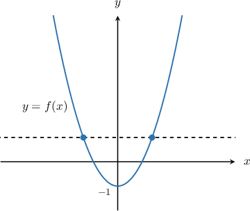

Notice that $f(x)$ is not a one-to-one since it does not satisfy the horizontal line test.

To find the graph of a function's inverse, we usually reflect it over the line $y=x.$ However, if we reflect $f(x)$ over the line $y=x,$ the result is not a function since it will not satisfy the vertical line test.

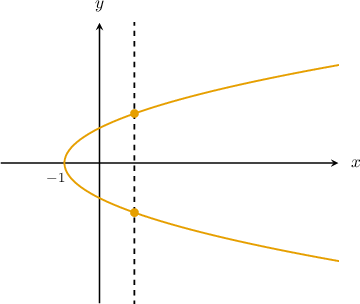

Therefore, $f(x)$ is *not* invertible.

If a function is not invertible, we can sometimes make it invertible by restricting its domain.

Here, if we take $f(x)=x^2-1$ over the restricted interval $x \in (0,\infty),$ then it passes the horizontal line test and we can find the corresponding inverse function by reflecting the graph of $y=f(x)$ over the line $y=x.$

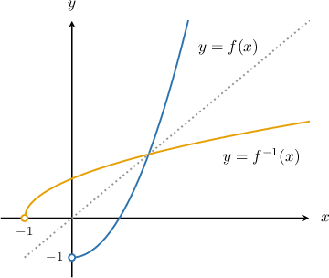

To determine if a function is invertible over a particular domain, we need to use the horizontal line test to check if it's a one-to-one function.

### Example: Identifying an Invertible Function From Its Graph

#### Question

Which of the graphs below correspond to an invertible function?

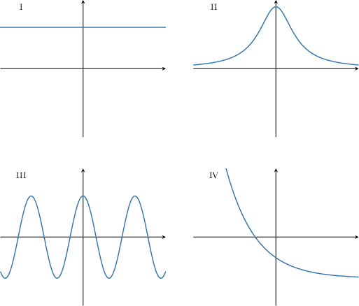

#### Explanation

A function is invertible if and only if it's a one-to-one function. To determine which of the functions are one-to-one, we use the horizontal line test.

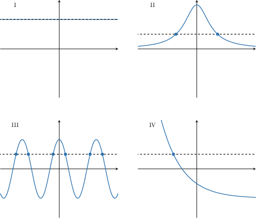

From the above, we see that:

- In graph IV, any horizontal line will intersect the curve at most once, no matter where we draw the line. Therefore, graph IV shows a one-to-one function. This means that the function is invertible.

- For graphs I, II, and III, some horizontal lines intersect the curve more than once. So, these are not one-to-one functions. As a result, they are not invertible.

Therefore, the correct answer is "IV only".

### Example: Identifying the Intervals on Which a Function is Invertible Given Its Graph

#### Question

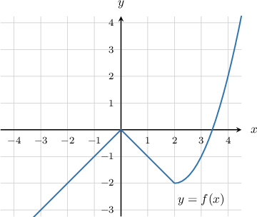

On which of the following intervals is the function $f(x)$ (shown above) invertible?

1. $(-3,-1]$

2. $(0,4]$

3. $[-2,2)$

#### Explanation

A function is invertible on a particular interval if and only if it's a one-to-one function on that interval. To determine the intervals on which the function is invertible, we use the horizontal line test.

- The given function is invertible on the interval $x\in (-3,-1].$ Indeed, any horizontal line will intersect the curve at most once, no matter where we draw the line.

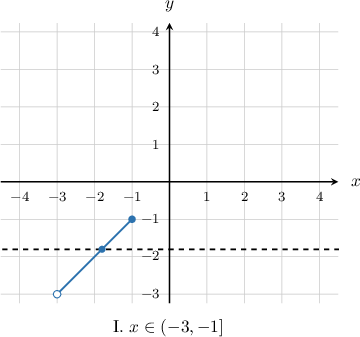

- The given function is **** invertible on the intervals $(0,4]$ and $[-2,2)$ because some horizontal lines will intersect the curve more than once.

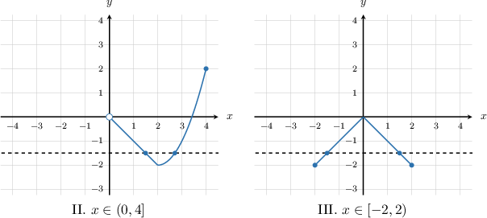

Therefore, the correct answer is "I only".

### Example: Identifying the Intervals on Which a Function is Invertible Given a Description

#### Question

Given that $f(x)=|x-2|-2,$ on which of the following intervals is $f(x)$ invertible?

1. $x \in (-\infty, 2]$

2. $x \in (0, \infty)$

3. $x \in (-1,4]$

#### Explanation

First, let's graph the given function. The graph of the function $f(x)=|x-2|-2$ can be obtained in the following way:

1. Take the curve $y=|x|.$

2. Translate it by $2$ units to the right, to get $y= |x-2|.$

3. Finally, translate $y= |x-2|$ by $2$ units down to get $f(x)=|x-2|-2.$

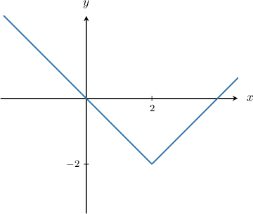

Now, remember that a function is invertible on a particular interval if and only if it's a one-to-one function on that interval. To determine the intervals on which the function is invertible, we use the horizontal line test.

- The function $f(x)$ is invertible on the interval $x\in(-\infty,2].$ Indeed, on this interval, any horizontal line will intersect the curve at most once, no matter where we draw the line.

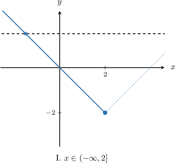

- The function $f(x)$ is not invertible on any of the intervals $x\in(0,\infty)$ and $x \in (-1,4].$ On these intervals, some horizontal lines will intersect the curve more than once.

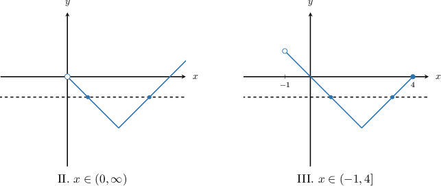

Therefore, the correct answer is "I only".
