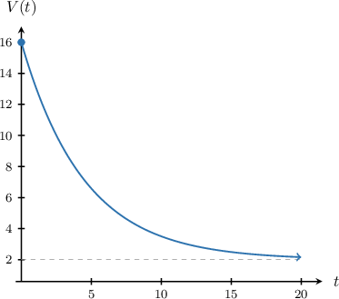
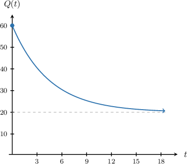
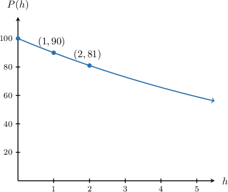
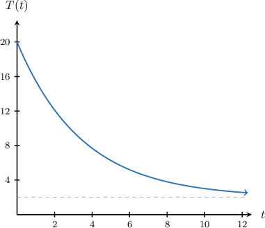

# Interpreting Graphs of Exponential Functions

Source: https://www.mathacademy.com/topics/2001?courseId=51
Topic ID: 2001

## Prerequisites

- [Vertical Translations of Exponential Decay Functions](./456-vertical-translations-of-exponential-decay-functions.md)
- [Solving Exponential Growth Problems](../algebra-i/2464-solving-exponential-growth-problems.md)
- [Solving Exponential Decay Problems](../algebra-i/2466-solving-exponential-decay-problems.md)

## Lesson

### Introduction

Exponential functions are used to model important natural phenomena, as well as in situations in business and commerce.

We can often determine important properties of exponential systems from their graphs.

For example, suppose the value of a printing machine, in thousands of dollars, can be modeled using the exponential function $V(t),$ where $t$ represents the time (in years) since the machine was first purchased. The graph of $V(t)$ is shown below.

We can deduce the following important information from the graph:

- First, notice that the graph intersects the vertical axis at the point $(0, 16).$ This tells us that $V(0) = 16.$ Since $V$ is measured in thousands of dollars, we conclude that the machine was initially valued at $16\cdot 1\,000 = 16\,000.$

- Second, we see that $V(t)\to 2$ as $t\to\infty.$ Since $V(t)$ is measured thousands of dollars, we conclude that the minimum value of the machine (no matter how old it gets) is $2\cdot 1\,000 = 2\,000.$

### Example: Interpreting Initial Values and End Behavior

#### Question

The amount of a certain chemical in a substance can be modeled using an exponential function $Q(t).$ The quantity $Q$ is measured in tens of milliliters, and $t$ is the time, in hours, since the observations started. The graph of $Q(t)$ is shown below. Approximately how much of this chemical is in the substance after $24$ hours?

#### Explanation

We want to know the value of $Q(24).$ However, we note that $t=24$ is not shown on the graph.

However, from the graph we see that $Q(t)\to 20$ as $t\to\infty.$ Since $Q(t)$ is measured in tens of milliliters, the approximate amount of chemical in the substance for large values of $t$ is $20\cdot 10 = 200$ milliliters.

Therefore, we conclude that $Q(24)\approx 200$ milliliters.

### Example: Making Predictions by Determining a Common Ratio

#### Question

The atmospheric pressure $P,$ in kilopascals, $h$ kilometers above sea level can be modeled using the exponential function $P(h) = ab^h,$ where $a$ and $b$ are constants. According to this model, what is the atmospheric pressure at $4$ kilometers above sea level? Express your answer to the nearest in kilopascal.

#### Explanation

Notice that the following points lie on the graph:

$$

(0,100), \quad (1, 90), \quad (2,81)

$$

Using these points, we note that there is a common ratio of $0.9$ between successive values of $P$ for integer $t\mathbin{:}$

$$

\dfrac{90}{100} = \dfrac{81}{90} = 0.9

$$

Therefore, we must have $b = 0.9.$ Hence,

$$

P(h) = a\cdot 0.9^h.

$$

In addition, $P(0) = 100.$ Therefore, $a=100,$ and we have

$$

P(h) = 100 \cdot 0.9^h.

$$

Finally, to determine the atmospheric pressure at $4$ kilometers above sea level, we evaluate $P(4)\mathbin{:}$

$$

P(4) = 100 \cdot 0.9^4 \approx 66\,\textrm{kPa}

$$

rounded to the nearest kilopascal.

### Example: Matching a Function to a Graph

#### Question

A cake is taken out of the oven. The function $T(t)$ denotes the temperature, in tens of degrees Celsius, of the cake $t$ minutes after being taken out of the oven. The graph of $T(t)$ is shown above. Which of the following expressions could be the function $T(t)?$

1. $18\left(\dfrac{3}{4}\right)^t + 2$

2. $18\left(\dfrac{4}{3}\right)^t + 2$

3. $20\left(\dfrac{3}{4}\right)^t + 2$

4. $2\left(\dfrac{3}{4}\right)^t + 20$

#### Explanation

First, notice that $T(t)$ must include an exponential decay term. This allows us to exclude the following option:

$$

18\left(\dfrac{4}{3}\right)^t + 2

$$

where the term $18\left(\dfrac{4}{3}\right)^t$ represents exponential growth since $\dfrac{4}{3} > 1$ and $t > 0.$

So, we have the remaining three options:

$$

18\left(\dfrac{3}{4}\right)^t + 2, \qquad 20\left(\dfrac{3}{4}\right)^t + 2, \qquad 2\left(\dfrac{3}{4}\right)^t + 20

$$

Let's remove those options that don't have the required features of $T(t).$

- First, note that we require $T(t)\to 2$ as $t\to\infty.$ This allows us to exclude the following option: since this expression approaches $20$ as $t\to\infty.$

- Second, note that we require $T(0) = 20.$ This allows us to exclude the following option: since this expression equals $20 + 2 = 22$ when $t=0.$

Therefore, we conclude that the required function is the following:

$$

T(t) = 18\left(\dfrac{3}{4}\right)^t + 2

$$
