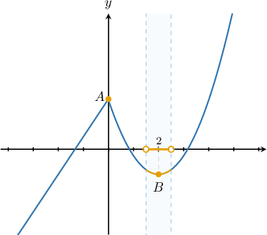
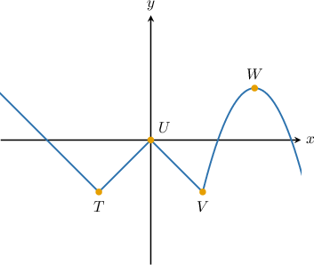
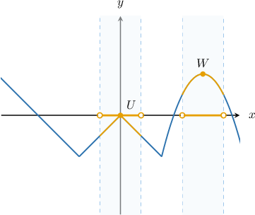
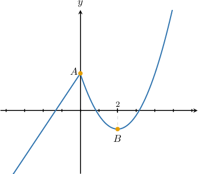
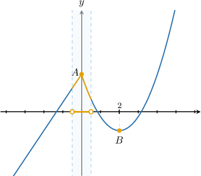
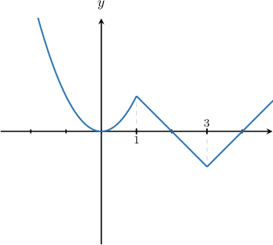
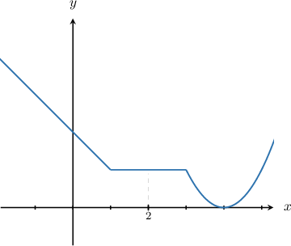
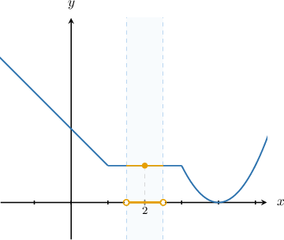
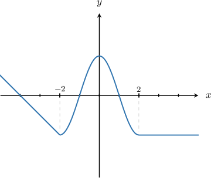
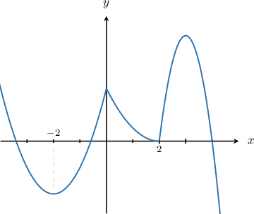

# Local Extrema of Functions

Source: https://www.mathacademy.com/topics/2707?courseId=51
Topic ID: 2707

## Prerequisites

- [Global Extrema of Functions](../algebra-i/1888-global-extrema-of-functions.md)

## Lesson

### Introduction

A **local extremum** (or **relative extremum**) of a function is a point that is either a maximum or minimum point of the function relative to an (open) interval in the function's domain.

For example, consider the function shown in the graph below.

The graph has a peak at the point $A$ where $x=0.$ We say that the function has a **local maximum** when $x=0.$ We also say that the point $A$ is a **local maximum point** of the function.

This means that we can take an open interval of $x$-values around $x=0$ such that $A$ will be the highest point on the graph in this interval.

Similarly, the graph has a valley at the point $B$ where $x=2.$ We say that the function has a **local minimum** when $x=2.$ We can also say that the point $B$ is a **local minimum point** of the function.

This means that we can take an open interval of $x$-values around $x=2$ such that $B$ will be the lowest point on the graph in this interval.

### Example: Identifying the Local Extrema of a Function Visually

#### Question

The graph of the function $y=f(x)$ is shown below. Which of the points shown are the local maxima of the function?

#### Explanation

Consider the point $U.$ We can take an open interval of $x$-values such that $U$ will be the highest point on the graph in this interval. So, $U$ is a local maximum.

A similar interval exists for the point $W,$ too. So, $W$ is also a local maximum.

### Writing a Condition for a Point To Be a Local Extremum

Let's go back to looking at the function $y=f(x)$ that we saw earlier.

The point $A$ where $x=0$ is a local maximum of $f(x)$ because we can draw an open interval around $x=0$ such that the point $A$ is the highest point on the graph. One such interval is $x\in (-0.5,0.5),$ shown below:

Everywhere in this interval, the value of the function is *less than or equal to* $f(0),$ the largest value of the function in this interval. We can write this mathematically as

$\qquad$ $f(x) \leq f(0)$ for all $x\in(-0.5, 0.5).$

Similarly, the point $B$ where $x=2$ is a local minimum of $f(x)$ because we can draw an open interval around $x=2$ such that the point $B$ is the lowest point on the graph. One such interval is $x\in (1.5,2.5),$ shown below:

Everywhere in this interval, the value of the function is *greater than or equal to* $f(2),$ the smallest value of the function in this interval. We can write this mathematically as

$\qquad$ $f(x) \geq f(2)$ for all $x\in(1.5, 2.5).$

### Example: Identifying the Local Extrema of a Function Using a Condition

#### Question

For which of the following values of $x$ does the function $y = f(x),$ shown below, attain a local minimum?

1. $x=0$

2. $x=1$

3. $x=3$

#### Explanation

Let's examine each of the given points in turn.

- The function has a local minimum at $x=0.$ For example, in the interval $(-0.5,0.5),$ the smallest value of the function is attained at $x=0,$ as shown below. We can write this mathematically as $f(x) \ge f(0) \:$ for all $\: x \in (-0.5,0.5).$

- The function does ** have a local minimum at $x=1.$ For any open interval containing $x=1$, there will be points on the graph that lie below $f(1)$.

- The function has a local minimum at $x=3.$ For example, in the interval $(2.5,3.5),$ the smallest value of the function is attained at $x=3,$ as shown below. We can write this mathematically as $f(x) \ge f(3) \:$ for all $\: x \in (2.5,3.5).$

Therefore, the correct answer is "I and III only."

### Special Cases of Extrema

Can a point on a graph be both a local minimum *and* a local maximum?

To answer this question, let's consider the function $f(x)$ given by the graph below.

Now consider the point where $x=2.$ Our goal is to determine which type of extremum it is. To do this, we consider the values of $f(x)$ in the open interval $(1.5, 2.5),$ shown below.

Now, notice the following:

- The point where $x=2$ is a local maximum because $f(x) \le f(2) \:$ for all $\: x \in (1.5,2.5)\quad {\color{\green}\checkmark}$

- The point where $x=2$ is a local minimum because $f(x) \ge f(2) \:$ for all $\: x \in (1.5,2.5)\quad {\color{\green}\checkmark}$

Therefore, $x=2$ is both a local maximum *and* a local minimum of $f(x)!$

This might seem strange. But, notice that $x=2$ lies within an interval where the function is constant. This is a special case where a particular point is both a local minimum and a local maximum.

### Example: Identifying True Statements Regarding a Function's Local Extrema

#### Question

Let $f(x)$ be the function shown below. Which of the following statements are true?

1. $f(x)$ attains a local maximum at $x=-2$

2. $f(x)$ attains a local minimum at $x=2$

3. $f(x)$ attains a local maximum at $x=0$

#### Explanation

Let's examine each of the given statements in turn.

- Statement I is false. The function has a local minimum at $x=-2.$ For example, in the interval $(-2.5,-1.5),$ the smallest value of the function is attained at $x=-2,$ as shown below. We can write this mathematically as $f(x) \ge f(-2) \:$ for all $\: x \in (-2.5,-1.5).$

- Statement II is true. The function has a local minimum at $x=2.$ For example, in the interval $(1.5,2.5),$ the smallest value of the function is attained at $x=2,$ as shown below. We can write this mathematically as $f(x) \ge f(2) \:$ for all $\: x \in (1.5,2.5).$

- Statement III is true. The function has a local maximum at $x=0.$ For example, in the interval $(-0.5,0.5),$ the greatest value of the function is attained at $x=0,$ as shown below. We can write this mathematically as $f(x) \le f(0) \:$ for all $\: x \in (-0.5,0.5).$

Therefore, the correct answer is "II and III only."

### Example: Global vs. Local Extrema

#### Question

The graph of a function $y = f(x)$ is shown below. Which of the following statements are true?

1. $f(x)$ attains a local minimum at $x=2$

2. $f(x)$ attains a **** maximum at $x=0$

3. $f(x)$ attains a local minimum at $x=-2$

#### Explanation

Let's examine each of the given statements in turn.

- Statement I is true. The function has a local minimum at $x=2.$ For example, in the interval $(1.5,2.5),$ the smallest value of the function is attained at $x=2,$ as shown below. We can write this mathematically as $f(x) \ge f(2) \:$ for all $\: x \in (1.5,2.5).$

- Statement II is false. The function does ** have a global maximum at $x=0.$ The global maximum is the highest point on the graph, but our function has points where its value is greater than $f(0).$ For example, $f(0) \lt f(3).$

- Statement III is true. The function has a local minimum at $x=-2.$ For example, in the interval $(-2.5,-1.5),$ the smallest value of the function is attained at $x=-2,$ as shown below. We can write this mathematically as $f(x) \ge f(-2) \:$ for all $\: x \in (-2.5,-1.5).$

Therefore, the correct answer is "I and III only."
