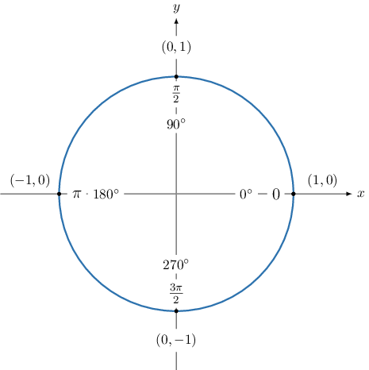

# Trigonometric Ratios of Quadrantal Angles Outside the Standard Range

Source: https://www.mathacademy.com/topics/3568?courseId=51
Topic ID: 3568

## Prerequisites

- [Coterminal Angles](./261-coterminal-angles.md)
- [Finding Trigonometric Ratios of Quadrantal Angles](./269-finding-trigonometric-ratios-of-quadrantal-angles.md)

## Lesson

### Introduction

For quadrantal angles that lie outside $[0^\circ,360^\circ),$ we first find a coterminal angle in the interval $[0^\circ,360^\circ),$ and then we proceed as usual.

For example, if the angle is $540^\circ,$ then we write

$$

540^\circ - 360^\circ = 180^\circ.\quad{\color{green}{\checkmark}}

$$

So $180^\circ$ is coterminal with $540^\circ,$ and we need to look at the point on the unit circle that corresponds to $180^\circ,$ which is $(-1,0).$

We can do a similar thing when working with negative angles. For example, if the angle is $-\dfrac{7\pi}{2},$ we can write

$$

\begin{aligned}−\frac{7𝜋}{2}+2𝜋 & =−\frac{3𝜋}{2} \\ −\frac{3𝜋}{2}+2𝜋 & =\frac{𝜋}{2}.\,✓\end{aligned}

$$

So, we need to look at the point that corresponds to $\dfrac{\pi}2,$ that is, $(0,1).$

### Example: Computing a Trigonometric Ratio of a Quadrantal Angle Greater Than One Full Rotation

#### Question

$\sin \left(\dfrac{7\pi}{2}\right) =$

#### Explanation

First, we find an angle that's coterminal with $\dfrac{7\pi}{2}$ and lies in the range $[0,2\pi).$

$$

\begin{aligned}\frac{7𝜋}{2}−2𝜋 & =\frac{3𝜋}{2}\,✓\end{aligned}

$$

Therefore, $\sin \left(\dfrac{7\pi}2\right) = \sin \left(\dfrac{3\pi}2\right).$

The angle $\dfrac{3\pi}{2}$ is a quadrantal angle. Let's draw out the quadrantal angles on the unit circle.

From the unit circle, we see that the angle $\dfrac{3\pi}{2}$ corresponds to the point $(0,-1).$

Since the sine of the angle corresponds to the $y$-coordinate, we have $\sin{\left(\dfrac{3\pi}{2}\right)} = -1.$

Therefore, $\sin \left(\dfrac{7\pi}2\right) = -1.$

### Example: Computing the Trigonometric Ratio of a Negative Quadrantal Angle

#### Question

$\cot (-270^\circ) =$

#### Explanation

First, we find an angle that's coterminal with $-270^\circ$ that lies in the range $[0^\circ, 360^\circ).$

$$

-270^\circ + 360^\circ = 90^\circ\quad{\color{green}{\checkmark}}

$$

Therefore, $\cot\left(-270^\circ\right) = \cot{90^\circ}.$

The angle $90^\circ$ is a quadrantal angle. Let's draw out the quadrantal angles on the unit circle.

From the unit circle, we see that the angle $90^\circ$ corresponds to the point $(0,1).$

- Since the cosine of the angle corresponds to the $x$-coordinate, we have $\cos{90^\circ} = 0.$

- Since the sine of the angle corresponds to the $y$-coordinate, we have $\sin{90^\circ} = 1.$

So, using the fact that $\cot{\theta} = \dfrac{\cos\theta}{\sin\theta},$ we have

$$

\cot{90^\circ} = \dfrac{\cos{90^\circ}}{\sin{90^\circ}} = \dfrac{0}{1}.

$$

Therefore, $\cot(-270^\circ) =0.$
