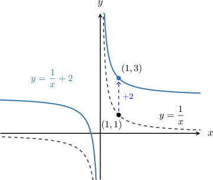
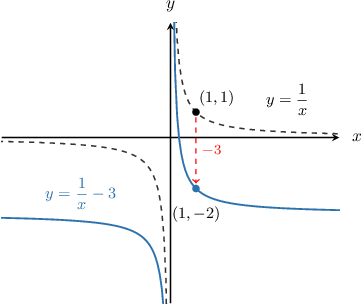
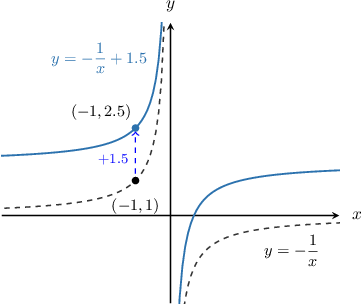
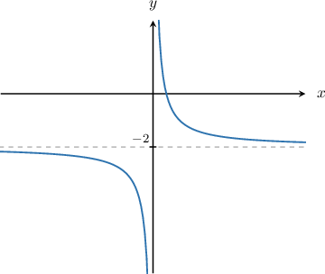
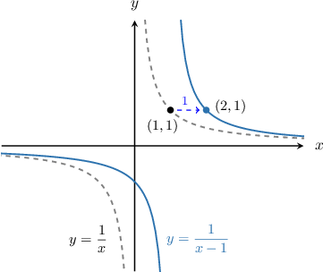
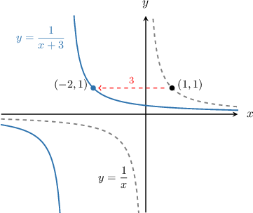
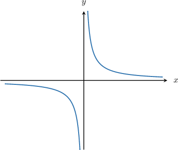
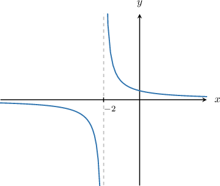
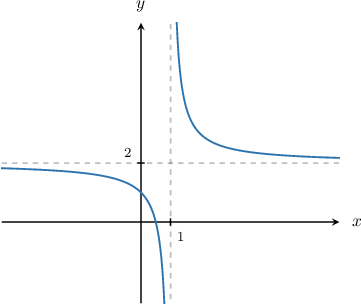

# Graph Transformations of Reciprocal Functions

Source: https://www.mathacademy.com/topics/3735?courseId=51
Topic ID: 3735

## Prerequisites

- [Horizontal Translations of Functions](./1584-horizontal-translations-of-functions.md)
- [Graphing Reciprocal Functions](./2033-graphing-reciprocal-functions.md)

## Lesson

### Introduction

In general, the graph of

$$

y=\dfrac{1}{x}+k

$$

is a vertical translation of the graph of $y=\dfrac{1}{x}$ by $k$ units up.

For example, to plot the function

$$

y=\dfrac{1}{x} \, {\color{blue} \, +\, 2},

$$

we translate the original curve *up* by $\color{blue}2$ units:

Similarly, to plot the function

$$

y=\dfrac{1}{x} \, {\color{red} - \, 3},

$$

we translate the original curve *down* by $\color{red}3$ units:

With vertical translations of the reciprocal function, the vertical asymptote doesn't change, but the horizontal asymptote is translated by the same number of units.

### Vertical Translations of a Negative Reciprocal Curve

We also know the graph of $y=-\dfrac{1}{x},$ so we can plot vertical translations of this function as well.

For example, to plot the function

$$

y=-\dfrac{1}{x} \, {\color{blue} \, +\, 1.5},

$$

we translate the original curve *up* by $\color{blue}1.5$ units:

### Example: Graphing Vertical Translations of Reciprocal Functions

#### Question

Sketch the graph of $y = \dfrac{1}{x} - 2.$

#### Explanation

First, let's sketch the graph of $y=\dfrac{1}{x}.$

Since we have $y=\dfrac{1}{x}{\color{red}\,-\,2},$ we need to translate the graph of $y=\dfrac{1}{x}$ ** by $\color{red}2$ units.

Now, since the graph of $y=\dfrac 1 x$ is translated down by $2$ units, the horizontal asymptote $y=0$ is also translated down by $2$ units. So, the equation of the new horizontal asymptote is $y=-2.$

Therefore, the correct graph is as follows:

### Horizontal Translations of a Reciprocal Curve

Because we know how to plot the graph of $y=\dfrac{1}{x},$ we can also plot horizontal translations of this graph. In general, the graph of

$$

y=\dfrac{1}{x-h}

$$

is a horizontal translation of the graph of $y=\dfrac{1}{x}$ by $h$ units *right*.

For example, to plot the graph of

$$

y=\dfrac{1}{x {\color{blue} \, - \, 1}},

$$

we translate the original curve horizontally by $\color{blue}1$ unit *right*:

The graph of

$$

y=\dfrac{1}{x+h}

$$

is a horizontal translation of the graph of $y=\dfrac{1}{x}$ by $h$ units *left*.

For example, to plot the graph of

$$

y=\dfrac{1}{x{\color{red} \, + \, 3}},

$$

we translate the original curve by $\color{red}3$ units *left*:

**Watch out!** Horizontal translations are always counter-intuitive. The translation $y=\dfrac{1}{x-h}$ is to the right and the translation $y=\dfrac{1}{x+h}$ is to the left, even though it seems like it should be the other way around.

With horizontal translations of the reciprocal function, the horizontal asymptote doesn't change, but the vertical asymptote is translated by the same number of units.

### Example: Graphing Horizontal Translations of Reciprocal Functions

#### Question

Sketch the graph of $f(x) = \dfrac{1}{x+2}.$

#### Explanation

First, let's sketch the graph of $y=\dfrac{1}{x}.$

Since we have $y = \dfrac{1}{x \color{red} + 2},$ we need to translate the graph of $y=\dfrac{1}{x}$ to the ** by $\color{red}2$ units.

Now, since the graph of $y = \dfrac 1 x$ is translated to the left by $2$ units, the vertical asymptote $x = 0$ is also translated to the left by $2$ units. So, the equation of the new vertical asymptote is $x=-2.$

Therefore, the correct graph is as follows:

### Combining Horizontal and Vertical Translations

We can combine horizontal and vertical translations of reciprocal functions.

In general, the graph of

$$

y = \dfrac{1}{x-h} + k

$$

is obtained from the graph of $y=\dfrac{1}{x}$ by translating it

- horizontally by $h$ units to the right, and

- vertically by $k$ units up.

The same is true regarding translations of the negative reciprocal function. In general, the graph of

$$

y = -\dfrac{1}{x-h} + k

$$

is obtained from the graph of $y=-\dfrac{1}{x}$ by translating it

- horizontally by $h$ units to the right, and

- vertically by $k$ units up.

### Example: Combining Horizontal and Vertical Translations of Reciprocal Functions

#### Question

Plot the graph of $y=f(x) = \dfrac{1}{x-1}+2.$

#### Explanation

The given function can be obtained by translating $y=\dfrac{1}{x}$ both horizontally and vertically.

We have two translations:

- the $\color{red}-1$ in the denominator means a horizontal translation of $1$ unit to the **, and

- the $\color{blue}+2$ outside the fraction means a vertical translation of $2$ units **.

So, the new graph looks as follows:

