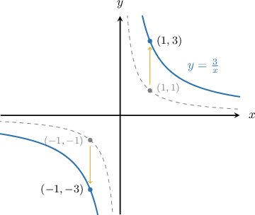
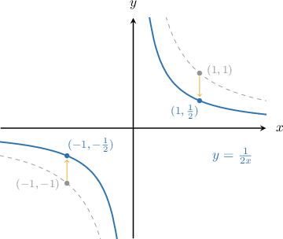
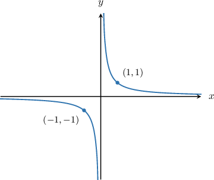
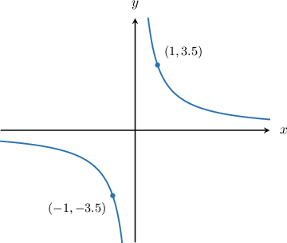
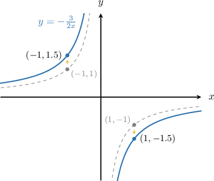
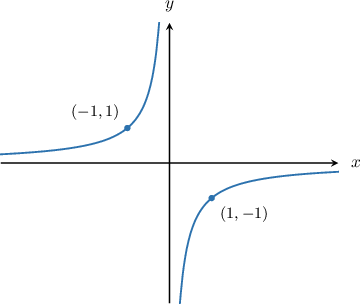
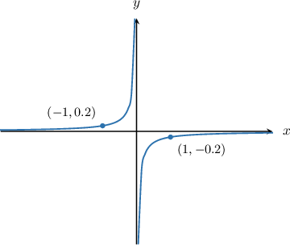
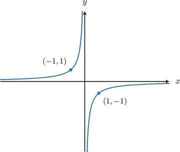
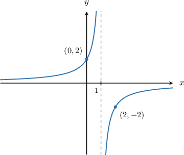
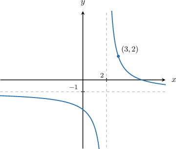

# Combining Graph Transformations of Reciprocal Functions

Source: https://www.mathacademy.com/topics/455?courseId=51
Topic ID: 455

## Prerequisites

- [Combining Reflections With Other Graph Transformations](./2841-combining-reflections-with-other-graph-transformations.md)
- [Graph Transformations of Reciprocal Functions](./3735-graph-transformations-of-reciprocal-functions.md)

## Lesson

### Introduction

To sketch the graph of we start with the graph of and stretch it by a scale factor of parallel to the -axis, as shown below.

Note the following:

- The point on is mapped to the point on

- The point on is mapped to the point on

### Applying a Stretch With a Scale Factor Less Than One

Similarly, to sketch the graph of $y=\dfrac{1}{2x},$ we take the graph of $y=\dfrac1x$ and stretch it by a scale factor of $\dfrac12$ parallel to the $y$-axis.

Note the following:

- The point $(1,1)$ on $y=\dfrac1x$ is mapped to the point $\left(1,\dfrac12\right)$ on $y=\dfrac{1}{2x}.$

- The point $(-1,-1)$ on $y=\dfrac1x$ is mapped to the point $\left(-1,-\dfrac12\right)$ on $y=\dfrac{1}{2x}.$

### Example: Graphing a Stretched Reciprocal Function

#### Question

Sketch the graph of $y = \dfrac{7}{2x}.$

#### Explanation

To plot $y = \dfrac{7}{2x},$ we apply the following steps:

- Take the curve $y=\dfrac{1}{x}.$

- Stretch the result by a scale factor of $\dfrac{7}{2}$ parallel to the $y$-axis to get the graph of $y=\dfrac{7}{2x}.$

### Applying a Stretch to a Negative Reciprocal Curve

We can apply stretches to negative reciprocal curves too.

For example, to sketch the graph of $y=-\dfrac{3}{2x},$ we start with the graph of $y=-\dfrac1x$ and stretch it by a scale factor of $\dfrac32$ parallel to the $y$-axis, as shown below.

### Example: Graphing a Stretched Negative Reciprocal Function

#### Question

Sketch the graph of $y = -\dfrac{1}{5x}.$

#### Explanation

To plot $y = -\dfrac{1}{5x},$ we apply the following steps:

- Take the curve $y=-\dfrac{1}{x}.$

- Stretch the result by a scale factor of $\dfrac 1 5$ parallel to the $y$-axis to get the graph of $y=-\dfrac{1}{5x}.$

### Example: Graphing a Transformed Reciprocal Function

#### Question

Graph the function $y = -\dfrac{2}{x-1}-1.$

#### Explanation

To plot $y = -\dfrac{2}{x-1}-1,$ we apply the following steps:

- Take the curve $y=-\dfrac{1}{x}.$

- Translate it by one unit to the right to get the graph of $y=-\dfrac{1}{x-1}.$ Notice that the vertical asymptote is now $x=1.$

- Then, stretch the result by a scale factor of $2$ parallel to the $y$-axis to get the graph of $y=-\dfrac{2}{x-1}.$

- Finally, translate it by $1$ unit down to get the graph of $y=-\dfrac{2}{x-1}-1.$ Notice that the horizontal asymptote is now $y=-1.$

### Example: Solving for Some Unknowns Given the Graph of a Transformed Reciprocal Function

#### Question

The diagram above shows the graph of $y = \dfrac{a}{x-b}+k.$ What is the value of $a+b+k?$

#### Explanation

First, notice that the horizontal asymptote of the graph is $y=-1,$ while the vertical asymptote is $x=2.$ This means that $k=-1$ and $b=2,$ and we can re-write our function as

$$

y = \dfrac{a}{x-2}+(-1) = \dfrac{a}{x-2}-1.

$$

Also, we are given that the point $(3,2)$ lies on the graph. Substituting its coordinates into the equation above, we obtain

$$

\begin{aligned}𝑦 & =\frac{𝑎}{𝑥−2}−1 \\ 2 & =\frac{𝑎}{3−2}−1 \\ 3 & =\frac{𝑎}{1} \\ 𝑎 & =3.\end{aligned}

$$

Finally, $a+b+k = 3+2+(-1) = 4.$
