# Vertical Translations of Exponential Decay Functions

Source: https://www.mathacademy.com/topics/456?courseId=51
Topic ID: 456

## Prerequisites

- [Vertical Translations of Exponential Growth Functions](./817-vertical-translations-of-exponential-growth-functions.md)
- [Graphing Exponential Decay Functions](../algebra-i/1531-graphing-exponential-decay-functions.md)

## Lesson

### Introduction

Adding or subtracting a value to the graph of $y=\left(\dfrac{1}{2} \right)^x$ will **translate** (shift) the graph up or down the $y$-axis.

For instance, $y=\left(\dfrac{1}{2} \right)^x+3$ has the same shape as $y=\left(\dfrac{1}{2} \right)^x,$ but it's shifted $3$ units up.

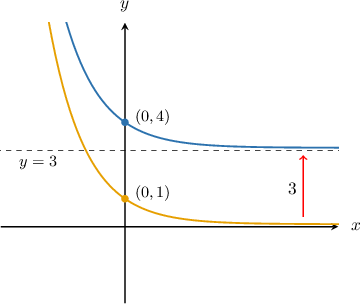

Note the following points:

- The $y$-intercept $(0,1)$ has moved up $3$ units to the point $(0,4).$

- The horizontal asymptote $y=0$ has moved up $3$ units to $y=3.$

Now, consider the graph of $y=\left(\dfrac{1}{2} \right)^x-3.$ In this case, the graph of $y=\left(\dfrac{1}{2} \right)^x$ is shifted $3$ units *down*.

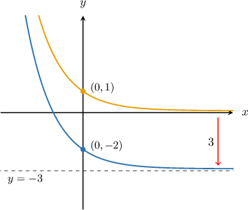

### Example: Identifying a Vertically Shifted Exponential Decay Curve

#### Question

Plot the graph of $y=\left(\dfrac{1}{4}\right)^{x}-3.$

#### Explanation

First we plot the graph of $y=\left(\dfrac{1}{4}\right)^{x}{:}$

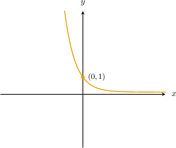

To sketch the graph of $y=\left(\dfrac{1}{4}\right)^{x}-3,$ we take the graph of $y=\left(\dfrac{1}{4}\right)^{x}$ and shift it $3$ units down. The $y$-intercept moves from $(0,1)$ to $(0,-2),$ and the horizontal asymptote moves from $y=0$ to $y=-3.$

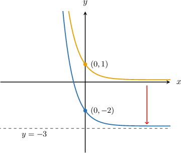

### Example: Identifying the Shift Applied to an Exponential Decay Curve

#### Question

The graph below shows the curve $y=\left(\dfrac{1}{4} \right)^{x} + c.$ Determine the value of $c$ and find the equation of the curve.

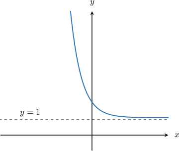

#### Explanation

The horizontal asymptote of $y = \left(\dfrac{1}{4} \right)^x$ is $y = 0.$

The vertical translation $y=\left(\dfrac{1}{4} \right)^x+c$ shifts the asymptote to $y=c.$

In the graph above, the horizontal asymptote is $y=1.$ Therefore, $c=1.$

### Combining Vertical Shift and Vertical Stretch

When an exponential decay function is vertically shifted *and* stretched, we apply the stretch first and the shift second.

For example, to plot the function $y=2\left(\dfrac{1}{4} \right)^x+3,$ we start by plotting the graph of $y = \left(\dfrac{1}{4} \right)^x{:}$

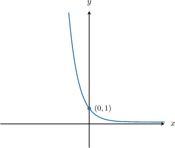

Next, we plot the graph of $y = 2\left(\dfrac{1}{4}\right)^x.$ To do this, we scale the graph above by a factor of $2.$ The $y$-intercept moves from $(0,1)$ to $(0,2)$ but the horizontal asymptote stays at $y=0.$

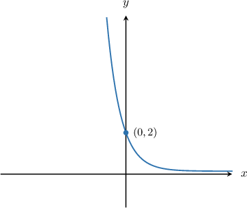

Finally, we plot the graph of $y = 2\left(\dfrac{1}{4}\right)^x + 3.$ To do this, we shift the above graph $3$ units above. The $y$-intercept moves from $(0,2)$ to $(0,5)$ and the horizontal asymptote moves from $y=0$ to $y=3.$

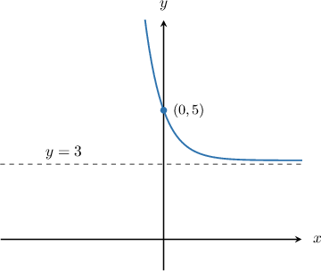

### Example: Identifying a Vertically Shifted and Stretched Exponential Decay Curve

#### Question

Plot the graph of $y = 2\left(\dfrac{1}{5}\right)^x + 1.$

#### Explanation

First, we plot the graph of $y = \left(\dfrac{1}{5}\right)^x\mathbin{:}$

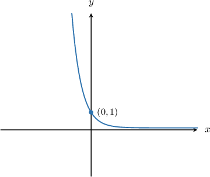

Next, we plot the graph of $y = 2\left(\dfrac{1}{5}\right)^x.$ To do this, we scale the graph above by a factor of $2.$ The $y$-intercept moves from $(0,1)$ to $(0,2)$ but the horizontal asymptote stays at $y=0.$

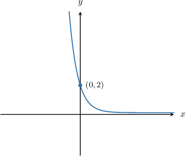

Finally, we plot the graph of $y = 2\left(\dfrac{1}{5}\right)^x + 1.$ To do this, we shift the above graph $1$ unit up. The $y$-intercept moves from $(0,2)$ to $(0,3),$ and the horizontal asymptote moves from $y=0$ to $y=1.$

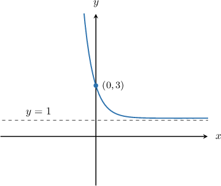

### Example: Identifying the Shift and Stretch Applied to an Exponential Decay Curve

#### Question

The graph below shows the curve $y = k\left(\dfrac{1}{2}\right)^{x}+c.$ Determine the values of $k$ and $c$ and find the equation of the curve.

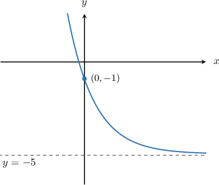

#### Explanation

The horizontal asymptote of the curve $y=k\left(\dfrac{1}{2}\right)^{x}+c$ is $y=c.$ In the graph above, the horizontal asymptote is $y=-5$, hence $c=-5.$

We can solve for $k$ by finding a point on the graph and substituting for $x$ and $y.$ The labeled point on the graph is $(0,-1),$ so we substitute $x=0$ and $y=-1$ into the function and solve for $k\mathbin{:}$

$$

\begin{aligned}𝑘(\frac{1}{2})^{𝑥}+𝑐 & =𝑦 \\ 𝑘(\frac{1}{2})^{𝑥}−5 & =𝑦 \\ 𝑘(\frac{1}{2})^{0}−5 & =−1 \\ 𝑘−5 & =−1 \\ 𝑘 & =4\end{aligned}

$$

Therefore, the equation of the curve is $y = 4\left(\dfrac{1}{2}\right)^{x} - 5.$
