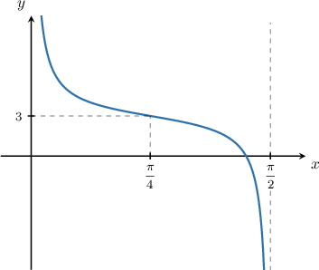
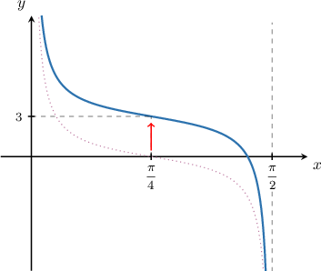
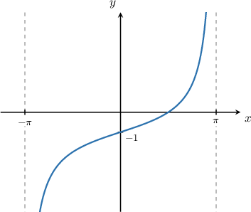
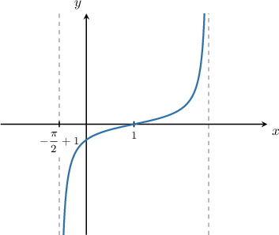
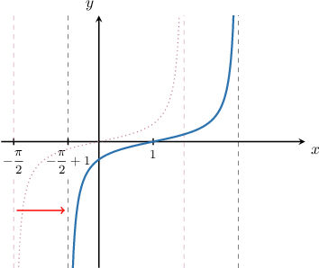
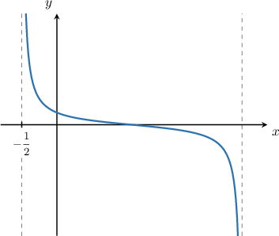
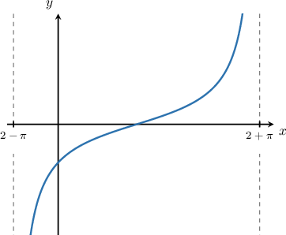

# Graph Transformations of Tangent and Cotangent

Source: https://www.mathacademy.com/topics/654?courseId=51
Topic ID: 654

## Prerequisites

- [Vertical Translations of Trigonometric Functions](./206-vertical-translations-of-trigonometric-functions.md)
- [Horizontal Stretches of Trigonometric Functions](./784-horizontal-stretches-of-trigonometric-functions.md)
- [Combining Graph Transformations: Two Operations](./1254-combining-graph-transformations-two-operations.md)
- [Horizontal Translations of Trigonometric Functions](./1659-horizontal-translations-of-trigonometric-functions.md)
- [Vertical Stretches of Trigonometric Functions](./1661-vertical-stretches-of-trigonometric-functions.md)

## Lesson

### Introduction

Let's consider the graph below that shows a section of the function $y=\cot(2x)+D,$ where $D$ is a constant.

Let's determine the value of $D$ using our knowledge of graph transformations.

The constant $D$ represents a vertical shift of the function $y=\cot\left(2x\right).$ From the graph, the given curve is a cotangent function $\cot(2x)$ that's been shifted **up** by $3$ units, as shown below.

So, the equation of the curve is

$$

y=\cot\left(2x\right)+3.

$$

Therefore, $D =3.$

### Example: Identifying the Vertical Shift of a Transformed Tangent or Cotangent Curve

#### Question

Finding the vertical shift $D$ of the function $y=\tan\left(\dfrac{x}{2}\right) + D.$

#### Explanation

The constant $D$ represents a vertical shift of the function $y=\tan\left(\dfrac{x}{2}\right).$

From the graph, we see that the given curve shifted **** by $1$ unit. So, the equation of the curve is

$$

y=\tan\left(\dfrac{x}{2}\right)-1.

$$

Therefore, $D =-1.$

### Horizontal Shifts

Consider the graph below that shows a section of the function

$$

y=\dfrac{1}{2}\tan{(x+C)}, \quad -\dfrac{\pi}{2} < C < \dfrac{\pi}{2},

$$

where $C$ is a constant.

The constant $C$ represents a horizontal shift of the function $y=\dfrac 1 2\tan x.$ Recall that, for the graph of a general function $y=f(x){:}$

- a shift to the *right* by $c$ units results in the graph of the function $y=f(x-c),$ and

- a shift to the *left* by $c$ units results in the graph of the function $y=f(x+c).$

The given graph shows a tangent function that's been shifted *right* by $1$ unit. We know this because the left asymptote is shifted $1$ unit to the right, as shown below.

So, the equation of the curve is

$$

y=\frac 1 2\tan(x-1).

$$

Therefore, $C =-1.$

### Example: Identifying the Horizontal Shift of a Transformed Tangent or Cotangent Curve

#### Question

The graph below shows a section of the function $y=\dfrac{1}{3}\cot{(x+C)},$ where $C$ is a constant. Given that $-\dfrac{\pi}{2} < C < \dfrac{\pi}{2},$ what is the value of $C?$

#### Explanation

The constant $C$ represents a horizontal shift of the function $y=\dfrac 1 3\cot x.$

From the graph, we see that the given curve shifted **** by $\dfrac{1}{2}$ units. So, the equation of the curve is

$$

y=\frac 1 3\cot\left(x+\dfrac{1}{2}\right).

$$

Therefore, $C = \dfrac{1}{2}.$

### Example: Identifying the Horizontal Stretch of a Transformed Tangent or Cotangent Curve

#### Question

The graph below shows a section of the function $y=\tan{\left(Bx-1\right)},$ where $B$ is a constant. What is the value of $B?$

#### Explanation

We can calculate the period $T$ by computing the difference in the $x$-values between two consecutive asymptotes. Therefore,

$$

T = (2+\pi) - \left(2-\pi\right) = 2\pi.

$$

The formula for the period $T$ of the function $y=A\tan(Bx + C) + D$ is given by

$$

T = \dfrac{\pi}{B}.

$$

Applying the formula for the period, we get

$$

2\pi = \dfrac{\pi}{B} \quad\Longrightarrow\quad B = \dfrac{\pi}{2\pi} = \dfrac 1 2.

$$

Therefore, $B=\dfrac 1 2.$
