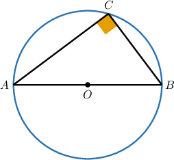
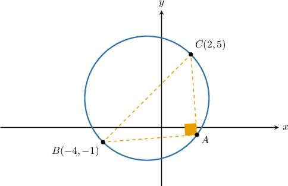
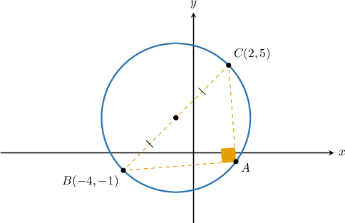
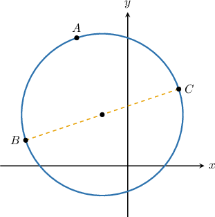
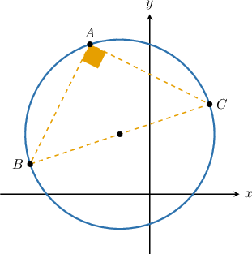
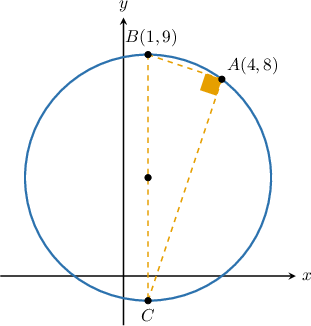
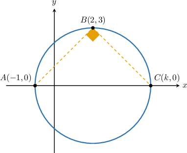

# Thales' Theorem in the Coordinate Plane

Source: https://www.mathacademy.com/topics/1187?courseId=126
Topic ID: 1187

## Prerequisites

- [Thales' Theorem](./517-thales-theorem.md)
- [Circles in the Coordinate Plane](./1183-circles-in-the-coordinate-plane.md)
- [Finding Equations of Perpendicular Lines](./3562-finding-equations-of-perpendicular-lines.md)

## Lesson

### Introduction

Let's recall Thales' Theorem:

*If the points $A,$ $B,$ and $C$ lie on the circumference of a circle and $\overline{AB}$ is a diameter of the circle, then $\angle ACB$ is a right angle.*

Note that the **converse** of Thales' theorem is also true:

*If the points $A,$ $B,$ and $C$ lie on the circumference of a circle and $\angle ACB$ is a right angle, then $\overline{AB}$ is a diameter of the circle.*

In this lesson, we'll learn how to apply Thales' theorem in the coordinate plane.

### Example: Finding a Circle's Center

#### Question

The points $A, B$ and $C$ lie on a circle and $m\angle{BAC}=90^\circ.$ What are the coordinates of the circle's center?

#### Explanation

Since $m\angle{BAC}=90^\circ,$ by Thales' theorem, $\overline{BC}$ is a diameter of the circle. Therefore, the circle's center is the midpoint of $\overline{BC}.$

Now, we use the midpoint formula:

$$

\begin{aligned}(\frac{𝑥_{1}+𝑥_{2}}{2},\frac{𝑦_{1}+𝑦_{2}}{2})=(\frac{−4+2}{2},\frac{−1+5}{2})=(−1,2)\end{aligned}

$$

Therefore, the center of the circle is $(-1,2).$

### Example: Finding the Length of a Chord Given the Diameter and the Length of Another Chord

#### Question

The points $A$, $B,$ and $C$ lie on the above circle. The chord $\overline{BC}$ is a diameter of the circle and $BC= 2\sqrt{10}.$ Given that $AB=2\sqrt{5},$ calculate the length of the chord $\overline{AC}.$

#### Explanation

Since the points $A,$ $B,$ and $C$ lie on the circle, and $\overline{BC}$ is a diameter, it follows that $\triangle ABC$ is a right triangle.

So, using the Pythagorean theorem, we get

$$

\begin{aligned}𝐴𝐶 & =\sqrt{√𝐵𝐶^{2}−𝐴𝐵^{2}} \\ & =\sqrt{√(2\sqrt{√10})^{2}−(2\sqrt{√5})^{2}} \\ & =\sqrt{√4(10)−4(5)} \\ & =\sqrt{√40−20} \\ & =\sqrt{√20} \\ & =2\sqrt{√5}.\end{aligned}

$$

### Example: Finding the Length of a Chord Given the Diameter and the Endpoints of Another Chord

#### Question

The points $A$ and $B$ with coordinates $(4, 8)$ and $(1,9),$ respectively, lie on the circumference of a circle of radius $4.$ If a third point $C$ also lies on the circle and $\overline{BC}$ is a diameter, what is the value of $AC?$

#### Explanation

The radius of the circle is $r=4,$ and since $\overline{BC}$ is a diameter of the circle, we have

$$

\begin{aligned}𝐵𝐶=2𝑟=2(4)=8.\end{aligned}

$$

Now, since $A$ lies on a circle and $\overline{BC}$ is a diameter, it follows that $\triangle ABC$ is a right triangle.

Using the distance formula to calculate $AB,$ we get

$$

\begin{aligned}𝐴𝐵 & =\sqrt{√(4−1)^{2}+(8−9)^{2}} \\ & =\sqrt{√(3)^{2}+(−1)^{2}} \\ & =\sqrt{√10}.\end{aligned}

$$

Finally, the Pythagorean theorem gives

$$

\begin{aligned}𝐴𝐶 & =\sqrt{√𝐵𝐶^{2}−𝐴𝐵^{2}} \\ & =\sqrt{√8^{2}−(\sqrt{√10})^{2}} \\ & =\sqrt{√64−10} \\ & =\sqrt{√54} \\ & =3\sqrt{√6}.\end{aligned}

$$

### Example: Finding the Endpoint of a Chord that Forms a Right Triangle with a Given Chord

#### Question

The points $A,$ $B,$ and $C$ lie on the circumference of a circle. The coordinates of $A$ and $B$ are $\left(-1,0\right)$ and $\left(2,3\right),$ respectively. If $\overline{AC}$ is a diameter of the circle and the coordinates of $C$ are $(k,0),$ then what is the value of $k?$

#### Explanation

The angle $\angle ABC$ is subtended by the diameter $\overline{AC},$ so its measure is $90^\circ.$ So we have $\overset{\longleftrightarrow}{AB} \perp \overset{\longleftrightarrow}{CB}.$

Using the coordinates $A(-1,0)$ and $B(2,3),$ let's find the slope of the line $\overset{\longleftrightarrow}{AB}\mathbin{:}$

$$

m_{AB} = \dfrac{y_2 - y_1}{x_2 - x_1} = \dfrac{3 - 0}{2 - (-1)} = 1

$$

Since $\overset{\longleftrightarrow}{CB}$ is perpendicular to $\overset{\longleftrightarrow}{AB},$ its slope is the negative reciprocal:

$$

m_{CB} = -\dfrac{1}{m_{BC}} = -1

$$

Since $\overset{\longleftrightarrow}{CB}$ passes through the point $B(2,3)$ with slope $m_{CB} = -1,$ its equation in slope-point form must be

$$

\begin{aligned}𝑦−𝑦_{1} & =𝑚_{𝐶𝐵}(𝑥−𝑥_{1}) \\ 𝑦−3 & =−1⋅(𝑥−2) \\ 𝑦−3 & =−(𝑥−2).\end{aligned}

$$

Now, the point $C(k,0)$ also lies on $\overset{\longleftrightarrow}{CB},$ so its coordinates $(k,0)$ must satisfy the equation above:

$$

\begin{aligned}𝑦−3 & =−(𝑥−2) \\ 0−3 & =−(𝑘−2) \\ −3 & =−𝑘+2 \\ 𝑘 & =5\end{aligned}

$$

So, the answer is $k=5.$
