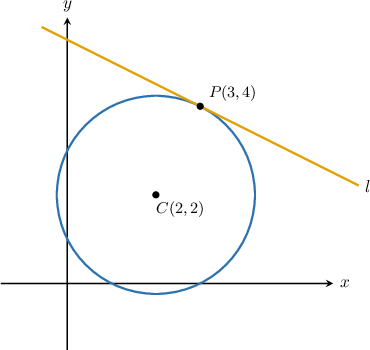
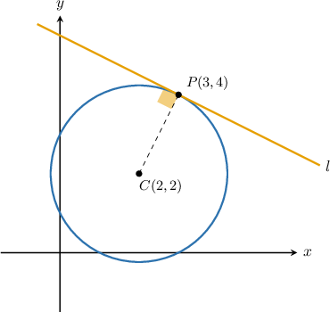
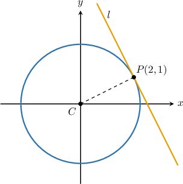
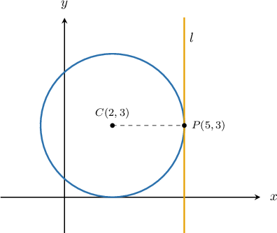
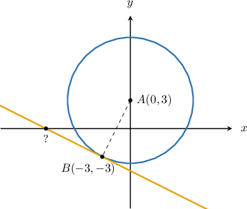

# Equations of Tangent Lines to Circles

Source: https://www.mathacademy.com/topics/1188?courseId=126
Topic ID: 1188

## Prerequisites

- [Tangent Lines to Circles](./578-tangent-lines-to-circles.md)
- [Circles in the Coordinate Plane](./1183-circles-in-the-coordinate-plane.md)
- [Finding Equations of Perpendicular Lines](./3562-finding-equations-of-perpendicular-lines.md)

## Lesson

### Introduction

We can use the properties of circles and tangents to calculate the equation of a tangent to a circle.

Consider a circle whose center is at the point $C(2,2),$ and the point $P(3,4)$ that lies on the circle. Let $l$ be the tangent to the circle at $P.$

How can we calculate the equation of $l?$

Remember that the tangent line to a circle is perpendicular to the radius at the point of tangency, as shown below.

To find the slope of $l,$ we start by finding the slope of $\overline{CP}.$

Let $m_1$ be the slope of $\overline{CP}.$ Then, using the coordinates $C(2,2)$ and $P(3,4),$ we have

$$

\begin{aligned}𝑚_{1} & =\frac{𝑦_{2}−𝑦_{1}}{𝑥_{2}−𝑥_{1}} \\ & =\frac{4−2}{3−2} \\ & =\frac{2}{1} \\ & =2.\end{aligned}

$$

Now, let $m_2$ be the slope of $l.$ Since $l$ is perpendicular to $\overline{CP},$ its slope is given by the *negative reciprocal* of $m_1\mathbin{:}$

$$

\begin{aligned}𝑚_{2} & =−\frac{1}{𝑚_{1}} \\ & =−\frac{1}{2}\end{aligned}

$$

So, the slope of the tangent line is $m_2 = -\dfrac{1}{2}.$

Finally, we can compute the equation of $l$ using point-slope form using the fact that $P(3,4)$ lies on the line:

$$

\begin{aligned}𝑦−4 & =−\frac{1}{2}(𝑥−3) \\ 𝑦−4 & =−\frac{1}{2}𝑥+\frac{3}{2} \\ 𝑦 & =−\frac{1}{2}𝑥+\frac{11}{2}\end{aligned}

$$

### Example: Finding the Equation of a Tangent Line

#### Question

The point $P(2,1)$ lies on a circle centered at $C(0,0),$ as shown above. The line $l$ is tangent to the circle at $P.$ Find the equation of $l.$

#### Explanation

Let $m_1$ be the slope of the radius $\overline{CP}.$ Then, using the coordinates of the points $C(0,0)$ and $P(2,1),$ we compute the slope as

$$

\begin{aligned}𝑚_{1} & =\frac{𝑦_{2}−𝑦_{1}}{𝑥_{2}−𝑥_{1}} \\ & =\frac{1−0}{2−0} \\ & =\frac{1}{2}.\end{aligned}

$$

Now, let $m_2$ be the slope of $l.$ Since $l$ is perpendicular to $\overline{CP},$ its slope is given by the negative reciprocal of $m_1\mathbin{:}$

$$

\begin{aligned}𝑚_{2}=−\frac{1}{𝑚_{1}} & =−(\frac{1}{2})^{−1} \\ & =−2\end{aligned}

$$

Finally, since the tangent line $l$ passes through the point $P(2,1),$ we can find the equation of $l$ using point-slope form:

$$

\begin{aligned}𝑦−𝑦_{1} & =𝑚_{2}(𝑥−𝑥_{1}) \\ 𝑦−1 & =−2(𝑥−2) \\ 𝑦−1 & =−2𝑥+4 \\ 𝑦 & =−2𝑥+5\end{aligned}

$$

So, the equation of the tangent to the circle at $P$ is

$$

y=-2x+5.

$$

### Example: Finding the Equation of a Vertical Tangent Line

#### Question

The point $P$ with coordinates $(5,3)$ lies on a circle that's centered at the point $C$ with coordinates $(2,3).$ Find the equation of the tangent line to the circle at $P.$

#### Explanation

Let's consider the corresponding diagram.

From the diagram, we see that the radius $\overline{CP}$ is horizontal. Since the tangent at $P$ is perpendicular to $\overline{CP},$ this means that the tangent is a vertical line.

Since the $x$-coordinate of $P$ is $5,$ we conclude that the equation of the tangent is $x=5.$

### Example: Finding an Intercept of a Tangent Line

#### Question

Let $B(-3,-3)$ be a point lying on the circumference of a circle centered at $A(0,3)$ and let $l$ be the tangent line to the circle at $B.$ Find the $x$-intercept of the tangent.

#### Explanation

Let's consider the corresponding diagram.

Let $m_1$ be the slope of the radius $\overline{AB}.$ Then, using the coordinates $A(0,3)$ and $B(-3,-3),$ we have

$$

\begin{aligned}𝑚_{1} & =\frac{𝑦_{2}−𝑦_{1}}{𝑥_{2}−𝑥_{1}} \\ & =\frac{−3−3}{−3−0} \\ & =\frac{−6}{−3} \\ & =2.\end{aligned}

$$

The tangent line to a circle at a point is perpendicular to the radius at that point. So, if the slope of the tangent line at $B$ is $m_2,$ then we can calculate $m_2$ by taking the negative reciprocal of $m_1 \mathbin{:}$

$$

\begin{aligned}𝑚_{2} & =−\frac{1}{𝑚_{1}} \\ & =−\frac{1}{2}\end{aligned}

$$

The tangent passes through $B(-3,-3)$ with slope $m_2 = -\dfrac{1}{2}.$ So, the equation of the tangent in point-slope form is

$$

\begin{aligned}𝑦−𝑦_{1} & =𝑚_{2}(𝑥−𝑥_{1}) \\ 𝑦−(−3) & =−\frac{1}{2}(𝑥−(−3)) \\ 𝑦+3 & =−\frac{1}{2}(𝑥+3).\end{aligned}

$$

Finally, to find the $x$-intercept of the line we need to set $y=0$ and solve for $x,$ as follows:

$$

\begin{aligned}𝑦+3 & =−\frac{1}{2}(𝑥+3) \\ (0)+3 & =−\frac{1}{2}(𝑥+3) \\ −6 & =𝑥+3 \\ 𝑥 & =−9.\end{aligned}

$$

Therefore, $x$-intercept of the tangent line is $-9.$
