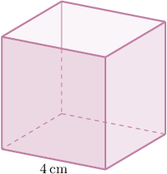

# Volumes of Cubes

Source: https://www.mathacademy.com/topics/1467?courseId=126
Topic ID: 1467

## Prerequisites

- [The Cube Root of a Perfect Cube](../../../../middle-school/lessons/prealgebra/1819-the-cube-root-of-a-perfect-cube.md)
- [Faces, Vertices, and Edges of Polyhedrons](./2484-faces-vertices-and-edges-of-polyhedrons.md)
- [Units of Area and Volume](../../../../elementary-school/lessons/grade-5/3872-units-of-area-and-volume.md)

## Lesson

### Introduction

Suppose that we have a cube whose edges are $2\,\text{cm}$ in length, like the one shown below.

The formula for the volume $V$ of a cube with sides of length $s$ is given by

$$

V = s^3.

$$

To find the volume of this cube, we substitute $s=2 \: \text{cm}$ into the formula. This gives

$$

V = (2\, \text{cm})^3 = 8 \text{ cm}^3 .

$$

So the volume of the cube is $8\,\text{cm}^3.$

### Example: Calculating the Volume of a Cube

#### Question

What is the volume of the cube?

#### Explanation

The volume $V$ of a cube can be found using the formula

$$

V = s^3,

$$

where $s$ is the side length of the cube.

Substituting $s=4\,\text{cm}$ into the formula, we get

$$

V = (4\, \text{cm})^3 = 64\, \text{cm}^3 .

$$

### Example: Finding a Side Length of a Cube Given Its Volume

#### Question

The volume of a cube is $729\, \text{cm}^3.$ Find the length of the edges of the cube.

#### Explanation

Since the volume of a cube is

$$

V = s^3,

$$

where $s$ is the length of an edge, we can find $s$ as follows:

$$

s = \sqrt[3]{V} = \sqrt[3]{729} = 9

$$

Therefore, the length of the edges is $9\,\text{cm}.$

### Example: The Volume of a Cube: Word Problems

#### Question

Six identical plastic cubic containers have a combined volume of $48 \: \text{ft}^3.$ Find the side length of a single container.

#### Explanation

First, we find the volume of a single container:

$$

\dfrac{48 \: \text{ft}^3}{6} = 8 \: \text{ft}^3

$$

Now, we need to find the side length of one container.

Since the volume of a cube is

$$

V = s^3,

$$

where $s$ is the length of a side, we can find $s$ as follows:

$$

s = \sqrt[3]{V} = \sqrt[3]{8} = 2

$$

Therefore, the length of a side of a single container is $2\,\text{ft}.$
