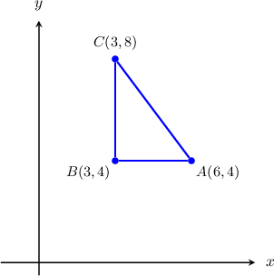
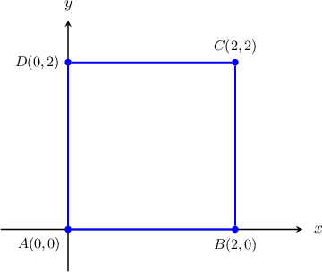
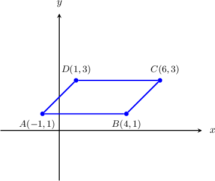
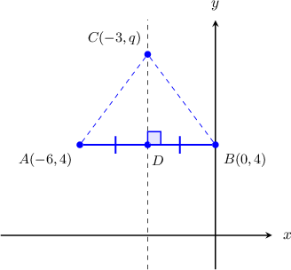

# Calculating Perimeters in the Plane

Source: https://www.mathacademy.com/topics/1479?courseId=126
Topic ID: 1479

## Prerequisites

- [The Distance Formula](./459-the-distance-formula.md)
- [Adding and Subtracting Radicals](../../../../middle-school/lessons/prealgebra/484-adding-and-subtracting-radicals.md)
- [Midpoints in the Coordinate Plane](./485-midpoints-in-the-coordinate-plane.md)
- [Diagonals of Squares](./2887-diagonals-of-squares.md)

## Lesson

### Introduction

We can use our knowledge of calculating distances in the coordinate plane to find the perimeter of polygons.

For example, consider $\triangle ABC$ below with vertices $A(6,4),$ $B(3,4),$ $C(3,8).$

Since $\overline{AB}$ is horizontal, we can calculate the length of this segment by computing the absolute value of the difference between the $x$-coordinates of the endpoints:

$$

\begin{aligned}𝐴𝐵 & =|𝑥_{𝐵}−𝑥_{𝐴}| \\ & =|6−3| \\ & =3\end{aligned}

$$

Similarly, since $\overline{BC}$ is vertical, we can calculate the length of this segment by computing the absolute value of the difference between the $y$-coordinates of the endpoints:

$$

\begin{aligned}𝐵𝐶 & =|𝑦_{𝐶}−𝑦_{𝐵}| \\ & =|8−4| \\ & =4\end{aligned}

$$

To compute the length of $\overline{AC},$ we use the distance formula, as follows:

$$

\begin{aligned}𝐴𝐶 & =\sqrt{√(𝑥_{𝐶}−𝑥_{𝐴})^{2}+(𝑦_{𝐶}−𝑦_{𝐴})^{2}} \\ & =\sqrt{√(3−6)^{2}+(8−4)^{2}} \\ & =\sqrt{√9+16} \\ & =5\end{aligned}

$$

Therefore, the perimeter is of the triangle is

$$

\begin{aligned}𝑝 & =𝐴𝐵+𝐴𝐶+𝐵𝐶 \\ & =3+5+4 \\ & =12.\end{aligned}

$$

### Example: Calculating the Perimeter of a Polygon With Horizontal and Vertical Sides Only

#### Question

What is the perimeter of the square $ABCD$ with vertices $A(0,0),$ $B(2,0),$ $C(2,2),$ and $D(0,2)?$

#### Explanation

Let's plot the square using the given coordinates.

Since our quadrilateral is a square, $AB=BC=CD=AD.$

From the diagram, we can calculate the length of $\overline{AB}\mathbin{:}$

$$

\begin{aligned}𝐴𝐵 & =|𝑥_{𝐵}−𝑥_{𝐴}| \\ & =|2−0| \\ & =2\end{aligned}

$$

Therefore, the perimeter of the polygon is

$$

\begin{aligned}𝑝 & =𝐴𝐵+𝐵𝐶+𝐶𝐷+𝐷𝐴 \\ & =4𝐴𝐵 \\ & =4⋅2 \\ & =8.\end{aligned}

$$

### Example: Calculating the Perimeter of a Polygon Using the Distance Formula

#### Question

What is the perimeter of the parallelogram $ABCD$ with vertices $A(-1,1)$, $B(4,1)$, $C(6,3),$ and $D(1,3)?$

#### Explanation

Let's plot the parallelogram using the given coordinates.

Since the segment $\overline{AB}$ is horizontal, we can easily compute its length:

$$

\begin{aligned}𝐴𝐵 & =|𝑥_{𝐵}−𝑥_{𝐴}| \\ & =|4−(−1)| \\ & =5\end{aligned}

$$

To compute the length of $\overline{BC},$ we use the distance formula, as follows:

$$

\begin{aligned}𝐵𝐶 & =\sqrt{√(𝑥_{𝐶}−𝑥_{𝐵})^{2}+(𝑦_{𝐶}−𝑦_{𝐵})^{2}} \\ & =\sqrt{√(6−4)^{2}+(3−1)^{2}} \\ & =\sqrt{√4+4} \\ & =2\sqrt{√2}\end{aligned}

$$

Therefore, the perimeter of the parallelogram is

$$

\begin{aligned}𝑝 & =𝐴𝐵+𝐴𝐶+𝐵𝐶+𝐶𝐷 \\ & =2𝐴𝐵+2𝐵𝐶 \\ & =2⋅5+2⋅2\sqrt{√2} \\ & =10+4\sqrt{√2}.\end{aligned}

$$

### Example: Finding the Perimeter of a Square Given Two Opposite Coordinates

#### Question

Given that $A(2,2)$ and $C(5,5)$ are the coordinates of two opposite vertices of a square $ABCD,$ what is the perimeter of the square?

#### Explanation

We need to calculate the measure of the sides of the square. To do that, we first find the measure of the diagonal $\overline{AC}\mathbin{:}$

$$

\begin{aligned}𝐴𝐶 & =\sqrt{√(𝑥_{𝐶}−𝑥_{𝐴})^{2}+(𝑦_{𝐶}−𝑦_{𝐴})^{2}} \\ & =\sqrt{√(5−2)^{2}+(5−2)^{2}} \\ & =\sqrt{√3^{2}+3^{2}} \\ & =\sqrt{√9+9} \\ & =\sqrt{√18} \\ & =3\sqrt{√2}\end{aligned}

$$

Now, if $a$ is the measure of a side of the square, we obtain

$$

\begin{aligned}𝑎 & =\frac{𝐴𝐶}{\sqrt{√2}} \\ & =\frac{3\sqrt{√2}}{\sqrt{√2}} \\ & =3.\end{aligned}

$$

Therefore, the perimeter of the square is

$$

\begin{aligned}𝑝 & =4𝑎 \\ & =4⋅3 \\ & =12.\end{aligned}

$$

### Example: Finding the Coordinates of a Vertex of a Polygon Given Its Perimeter

#### Question

The points $A(-6,4),$ $B(0,4),$ and $C(p,q)$ are the coordinates of the vertices of an isosceles triangle $\triangle ABC$ with base $\overline{AB}$ and perimeter $16.$ Given that $q>4,$ find the coordinates of $C.$

#### Explanation

Let's sketch our triangle.

Since the vertex $C$ is equidistant from $A$ and $B$, it lies on the perpendicular bisector of the segment $\overline{AB}.$ In our case, this is the line $x=-3.$ So the coordinates of $C$ are $(-3,q),$ where $q$ is an unknown parameter.

From the diagram, we can calculate the length of $\overline{AB}\mathbin{:}$

$$

\begin{aligned}𝐴𝐵 & =|𝑥_{𝐵}−𝑥_{𝐴}| \\ & =|0−(−6)| \\ & =6\end{aligned}

$$

On the other hand, the length of $\overline{AC}$ can be found as follows:

$$

\begin{aligned}𝐴𝐶 & =\sqrt{√(𝑥_{𝐶}−𝑥_{𝐴})^{2}+(𝑦_{𝐶}−𝑦_{𝐴})^{2}} \\ & =\sqrt{√(−3−(−6))^{2}+(𝑞−4)^{2}} \\ & =\sqrt{√9+(𝑞−4)^{2}}\end{aligned}

$$

Since $AC=BC$ and the perimeter is $16,$ we obtain

$$

\begin{aligned}16 & =𝐴𝐶+𝐵𝐶+𝐴𝐵 \\ 16 & =2𝐴𝐶+𝐴𝐵 \\ 16 & =2𝐴𝐶+6 \\ 2𝐴𝐶 & =10 \\ 𝐴𝐶 & =5 \\ 𝐴𝐶^{2} & =5^{2} \\ 9+(𝑞−4)^{2} & =25 \\ (𝑞−4)^{2} & =16 \\ 𝑞−4 & =±4 \\ 𝑞 & =0,\,8.\end{aligned}

$$

Therefore, since we are told that $q > 4,$ the coordinates of the point $C$ are $(-3,8).$
