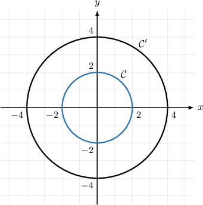
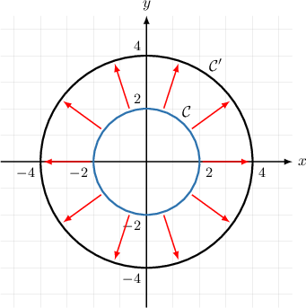
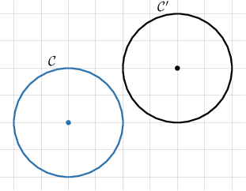
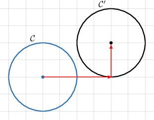
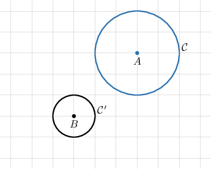
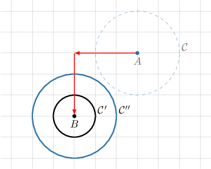
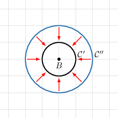
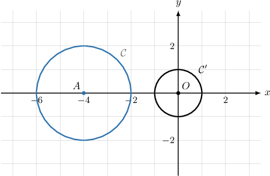
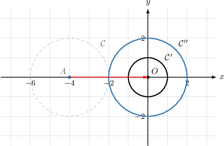
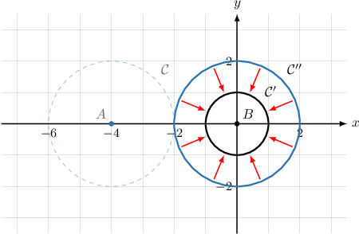

# Circle Similarity

Source: https://www.mathacademy.com/topics/1503?courseId=126
Topic ID: 1503

## Prerequisites

- [Similarity Transformations](./491-similarity-transformations.md)
- [Circles](./1404-circles.md)

## Lesson

### Introduction

Any two circles are similar because any circle can be mapped to any other circle using a combination of similarity transformations.

To demonstrate, consider the circles $\mathcal C$ and $\mathcal C'$ centered at $O$ and with radii $2$ and $4,$ respectively.

We can double the radius of $\mathcal{C}$ so that it has the same radius as $\mathcal{C}'.$ To do this, we use a dilation with center $O$ and scale factor $2.$

Since $\mathcal C$ is mapped to $\mathcal C'$ under this transformation, the two circles are similar.

### Example: Determining a Dilation That Maps One Circle Onto Another

#### Question

What transformation maps the circle $\mathcal{C}$ with center at the origin and radius $2$ onto the circle $\mathcal{C'}$ with center at the origin and radius $8?$

#### Explanation

Notice that both circles have center $O.$ So, mapping $\mathcal{C}$ onto $\mathcal{C'}$ can be done using only a dilation.

The radius of $\mathcal C$ is $r_1 = 2$ units, and the radius of $\mathcal C'$ is $r_2 = 8$ units. Therefore, the required dilation has a scale factor of

$$

k = \dfrac{r_2}{r_1} = \dfrac{8}{2} = 4.

$$

Therefore, to map the circle $\mathcal{C}$ onto the circle $\mathcal{C'},$ we apply a dilation with center $O$ and scale factor $4.$

### Example: Determining a Translation That Maps One Circle Onto Another

#### Question

Consider the diagram shown below. What transformation maps the circle $\mathcal{C}$ onto the circle $\mathcal{C'}?$

#### Explanation

Notice that both circles have a radius of $2.$ So, the two circles are congruent.

Since the circles are congruent, mapping $\mathcal C$ onto $\mathcal C'$ can be done using only a translation, as shown below.

Therefore, to map the circle $\mathcal{C}$ onto the circle $\mathcal{C'},$ we apply a translation of $4$ units to the right and $2$ units up.

### Example: Completing a True Statement Regarding Circle Similarity

#### Question

The following transformation maps the circle $\mathcal{C}$ onto the circle $\mathcal{C'}\mathbin{:}$

**

What should be substituted into the blank spaces?

#### Explanation

First, we apply a translation of $3$ units to the left and $3$ units down. This maps the circle $\mathcal{C}$ with center $A$ and radius $2$ onto the circle $\mathcal{C''}$ with center $B$ and radius $2$, as shown below.

Then, a dilation with center $B$ and a scale factor $\dfrac{1}{2}$ maps the circle $\mathcal{C''}$ onto the circle $\mathcal{C'}.$

Therefore, the correct sentence that describes the mapping is as follows:

**

### Example: Describing a Similarity Transformation Using Function Composition

#### Question

Consider the following functions:

$$

f(x,y)=(x+p,y+q), \qquad g(x,y)=(kx,ky)

$$

The function $f(x,y)$ is applied to $\mathcal C,$ and then $g(x,y)$ is applied to the result. The image of $\mathcal C$ under this sequence of transformations is $\mathcal C'.$ What is $p+q+k?$

#### Explanation

First, we note the following:

- the function $f(x,y) = (x+p,y+q)$ represents a translation of $p$ units right and $q$ units up, and

- the function $g(x,y) = (kx,ky)$ is a dilation of scale factor $k.$

A translation of $4$ units right, represented by

$$

f(x,y) = (x+4,y),

$$

maps the circle $\mathcal C$ with center $A$ and radius $2$ onto the circle $\mathcal C''$ with center $O$ and radius $2.$ Therefore, $p=4$ and $q=0.$

Then, a dilation with center $O$ and scale factor $\dfrac12$ maps the circle $\mathcal C''$ onto the circle $\mathcal C'$ with center $O$ and radius $1.$

The function that performs this dilation is

$$

g(x,y) = \left( \dfrac12x, \dfrac12x \right),

$$

and therefore $k = \dfrac12.$

Finally,

$$

p+q+k = 4+0+\dfrac12 = \dfrac92.

$$
