# Rotations of Geometric Figures

Source: https://www.mathacademy.com/topics/1517?courseId=126
Topic ID: 1517

## Prerequisites

- [Right, Straight, Full, and Null Angles](../../../../elementary-school/lessons/grade-4/1509-right-straight-full-and-null-angles.md)
- [Translations of Geometric Figures](./1516-translations-of-geometric-figures.md)

## Lesson

### Introduction

We can use a protractor to **rotate** a point by a certain angle about another point.

To demonstrate, let's rotate the point $A$ below by an angle of $80^\circ$ **counterclockwise** around the point $O.$

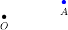

**Step 1.** We draw a ray $\overset{\longrightarrow}{OA}$

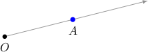

**Step 2.** Using a protractor, draw a **counterclockwise** angle $\angle {BOA}$ which measures $80^\circ.$

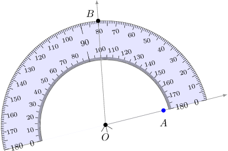

**Step 3.** Using a compass, we mark a point $A'$ on $\overset{\longrightarrow}{OB}$ such that the segment $\overline{OA'}$ is congruent to $\overline{OA}.$

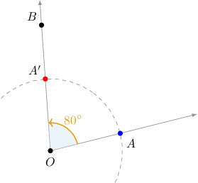

The point $A'$ is the image of $A$ under a rotation of $80^\circ$ counterclockwise around the point $O.$ We're done!

### Example: Rotating a Point by a Multiple of 90 Degrees

#### Question

The point $C$ shown below is rotated by $270^\circ$ **** about the origin. What is the image of $C$ under the action of this transformation?

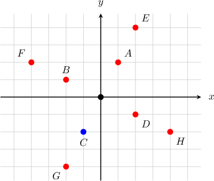

#### Explanation

We rotate the point $C$ by an angle of $270^\circ$ ** about the origin as follows:

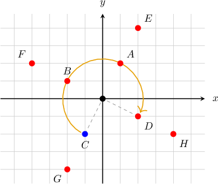

### Example: Rotating a Point by an Angle

#### Question

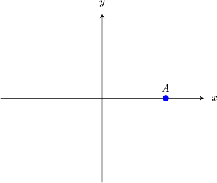

The point $A$ shown above is rotated by $80^\circ$ **** about the origin. Plot the resulting point $A'.$

#### Explanation

The point and its image under rotation about the origin must be equidistant from the center of rotation (origin). In other words, both our points should lie on the same circle centered at the origin.

We rotate the point $A$ by an angle of $80^\circ$ counterclockwise about the origin as follows:

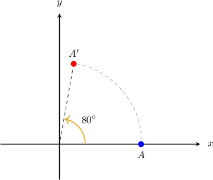

### Rotating Polygons

To rotate a polygon about a point, we rotate each of its vertices and then connect the vertices with line segments.

For example, suppose the triangle below is rotated by clockwise about the point What is the resulting polygon?

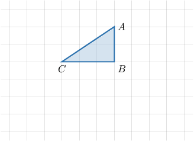

To rotate the triangle, we rotate each vertex and connect the resulting vertices using line segments.

First, let's rotate the point Placing a protractor on the ray we draw an angle of

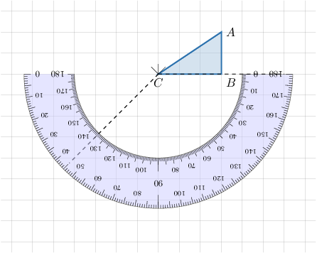

Using a ruler on the second side of the angle, we mark a point such that

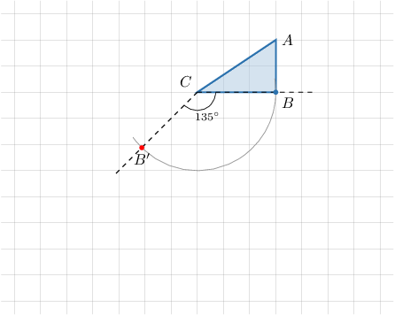

We use the same method to rotate which gives as the resulting point.

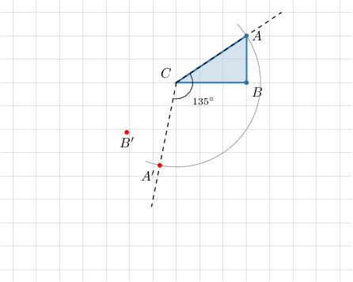

Finally, we note that the position of doesn't change as it's the center of the rotation.

Our rotated triangle is shown below.

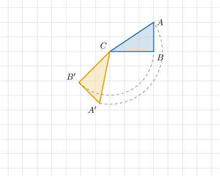

### Example: Rotating a Polygon by an Angle

#### Question

The polygon shown below is rotated by an angle of $45^\circ$ counterclockwise about the point $C.$ Draw the resulting polygon.

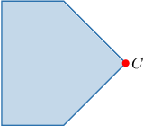

#### Explanation

To rotate the given polygon by an angle of $45^\circ$ counterclockwise about the point $C,$ we rotate each vertex by an angle of $45^\circ$ counterclockwise about $C$ and then connect the corresponding adjacent vertices using line segments. The result is shown below.

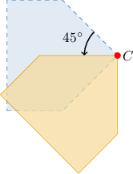
