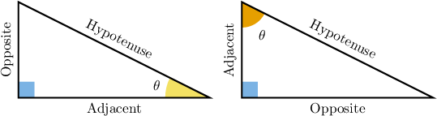
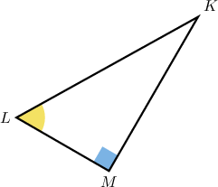
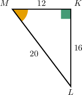
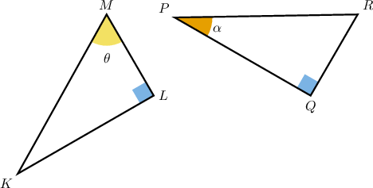

# Angles and Sides in Right Triangles

Source: https://www.mathacademy.com/topics/1597?courseId=126
Topic ID: 1597

## Prerequisites

- [Classifying Triangles](../../../../middle-school/lessons/prealgebra/1601-classifying-triangles.md)

## Lesson

### Introduction

Given an angle $\theta$ (pronounced "th-ay-ta") in a right triangle, the sides of the triangle have some special names: **opposite**, **adjacent** and **hypotenuse**.

- **Opposite:** the side opposite to the angle $\theta.$

- **Adjacent:** the side next to (or touching) the angle $\theta.$

- **Hypotenuse:** the longest side of the triangle, which is always opposite to the right angle.

The opposite and adjacent sides are relative to the angle in question. If $\theta$ is representing the other angle, then the name of these sides change to reflect their position relative to the other angle.

Note that the variable $\theta$ is the most commonly used variable in trigonometry, just like $x$ in algebra. However, other variables are often used as well.

### Example: Identifying All Sides in Relation to an Angle

#### Question

Relative to $\angle L$, which sides are the opposite, adjacent, and hypotenuse?

#### Explanation

Relative to $\angle L,$

- the opposite side is $\overline{MK},$

- the adjacent side is $\overline{LM},$ and

- the hypotenuse is $\overline{LK}.$

### Example: Identifying a Particular Side in Relation to One Angle

#### Question

Relative to $\angle LMK,$ what is the length of the adjacent side?

#### Explanation

The adjacent side to $\angle LMK$ is $\overline{MK},$ and its length is $12.$

### Example: Identifying Sides in Relation to Two Angles

#### Question

Relative to the angles $\theta$ and $\alpha,$ which sides are the opposite sides?

#### Explanation

Relative to the angle $\theta,$ the opposite side is $\overline{KL}.$

Relative to the angle $\alpha,$ the opposite side is $\overline{QR}.$
