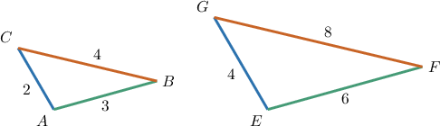
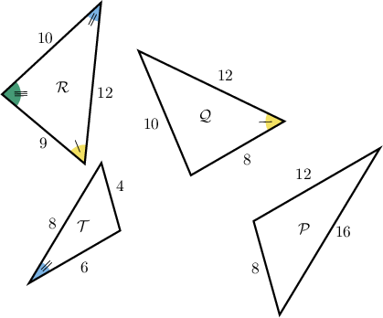
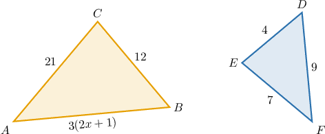
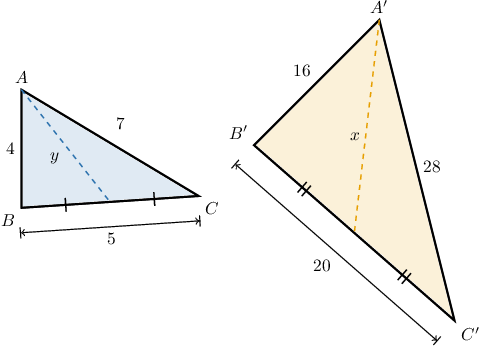
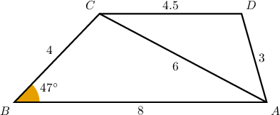
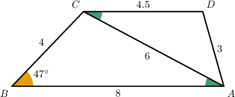

# The SSS Similarity Criterion

Source: https://www.mathacademy.com/topics/1919?courseId=126
Topic ID: 1919

## Prerequisites

- [Side Lengths and Angle Measures of Similar Polygons](./1367-side-lengths-and-angle-measures-of-similar-polygons.md)
- [Solving Rational Equations Containing Binomials Using Cross-Multiplication](../algebra-i/3555-solving-rational-equations-containing-binomials-using-cross-multiplication.md)
- [Consecutive Angles](../../../../middle-school/lessons/prealgebra/4104-consecutive-angles.md)

## Lesson

### Introduction

The **side-side-side (SSS) similarity criterion** can be used as a shortcut to prove that two triangles are similar. It states the following:

Two triangles are similar if the ratios of the lengths of their corresponding sides are equal.

To demonstrate, consider the triangles below.

Let's check the ratios of the corresponding sides:

$$

\begin{aligned}\frac{𝐴𝐵}{𝐸𝐹} & =\frac{3}{6}=\frac{1}{2} \\ \frac{𝐵𝐶}{𝐹𝐺} & =\frac{4}{8}=\frac{1}{2} \\ \frac{𝐶𝐴}{𝐺𝐸} & =\frac{2}{4}=\frac{1}{2}\end{aligned}

$$

The ratios are all equal, so according to the SSS criterion, the two triangles are similar:

$$

\triangle ABC \sim \triangle EFG.

$$

### Example: Identifying Similar Triangles Using the SSS Criterion

#### Question

According to the SSS criterion only, which of the following triangles is similar to $\mathcal{T}?$

#### Explanation

The side-side-side (SSS) similarity criterion states the following:

Two triangles are similar if the ratios of the lengths of their corresponding sides are equal.

With that in mind, let's examine each of the given triangles.

- $\mathcal{P}$ is similar to $\mathcal{T}$ by SSS since the ratios of the lengths of the corresponding sides are equal:

- $\mathcal{Q}$ is ** similar to $\mathcal{T}$ by SSS since the ratios of the lengths of the corresponding sides are not equal:

- $\mathcal{R}$ is ** simlar to $\mathcal{T}$ by SSS since the ratios of the lengths of the corresponding sides are not equal:

Therefore, the correct answer is "$\mathcal{P}$ only."

### Example: Solving for an Unknown Given Two Similar Triangles

#### Question

Find the value of $x$ that makes $\triangle ABC$ similar to $\triangle FDE.$

#### Explanation

By the SSS similarity criterion, for $\triangle ABC$ to be similar to $\triangle FDE,$ we require that the ratios of the corresponding sides are equal. In other words,

$$

\dfrac{AB}{FD}=\dfrac{BC}{DE}=\dfrac{AC}{EF}.

$$

Therefore, to find $x,$ we solve the following:

$$

\begin{aligned}\frac{𝐴𝐵}{𝐹𝐷} & =\frac{𝐵𝐶}{𝐷𝐸} \\ \frac{3(2𝑥+1)}{9} & =\frac{12}{4} \\ \frac{3(2𝑥+1)}{9} & =3 \\ 3(2𝑥+1) & =27 \\ 2𝑥+1 & =9 \\ 2𝑥 & =8 \\ 𝑥 & =4\end{aligned}

$$

### Example: Calculating the Length of an Element of a Triangle Given a Similar Triangle

#### Question

For the triangles $\triangle ABC$ and $\triangle A'B'C'$ shown below, the dashed segments are the medians corresponding to the sides $\overline{BC}$ and $\overline{B'C'}$, respectively. Find the value of $\dfrac{x}{y}.$ **

#### Explanation

First, notice the following:

$$

\begin{aligned} \dfrac{{A'C'}}{{AC}} &= \dfrac{28}{7}=4\\[5pt] \dfrac{{B'C'}}{{BC}} &= \dfrac{20}{5}=4\\[5pt] \dfrac{{A'B'}}{{AB}} &= \dfrac{16}{4}=4\\[5pt] \end{aligned}

$$

Since the corresponding sides are proportional, the triangles are similar by the SSS similarity criterion with a scale factor of $4.$

The ratio of corresponding medians of similar triangles is equal to the scale factor. Therefore, we get

$$

\begin{aligned}\frac{𝑥}{𝑦} & =4.\end{aligned}

$$

### Example: Determining the Measure of an Angle Using the SSS Criterion

#### Question

Given the diagram below, find the measure of $\angle BCD.$

#### Explanation

Consider triangles $\triangle BAC$ and $\triangle ACD.$ Let's calculate the ratios of corresponding sides:

$$

\begin{aligned}\frac{𝐴𝐵}{𝐴𝐶} & =\frac{8}{6}=\frac{4}{3} \\ \frac{𝐵𝐶}{𝐴𝐷} & =\frac{4}{3} \\ \frac{𝐴𝐶}{𝐶𝐷} & =\frac{6}{4.5}=\frac{4}{3}\end{aligned}

$$

Since the ratios are equal, we conclude that $\triangle BAC\sim\triangle ACD$ by the SSS criterion. Therefore,

$$

\begin{aligned}∠𝐴𝐶𝐷≅∠𝐶𝐴𝐵.\end{aligned}

$$

Now, since the angles $\angle ACD$ and $\angle CAB$ are congruent, they are alternate interior angles, and we have

$$

\overline{AB} \parallel \overline{CD}.

$$

Therefore, the consecutive interior angles $\angle ABC$ and $\angle BCD$ are supplementary, and we obtain the following:

$$

\begin{aligned}𝑚∠𝐵𝐶𝐷+𝑚∠𝐴𝐵𝐶 & =180^{∘} \\ 𝑚∠𝐵𝐶𝐷+47^{∘} & =180^{∘} \\ 𝑚∠𝐵𝐶𝐷 & =133^{∘}\end{aligned}

$$
