# Nets of Polyhedrons

Source: https://www.mathacademy.com/topics/2468?courseId=126
Topic ID: 2468

## Prerequisites

- [Faces, Vertices, and Edges of Polyhedrons](./2484-faces-vertices-and-edges-of-polyhedrons.md)

## Lesson

### Introduction

We can represent $3$-dimensional shapes in $2$-dimensions using **nets**. To make a polyhedron net, we take its faces and lay them out as if they were lying flat and open.

Below, we have the net of a polyhedron, but which one?

We can get back the original polyhedron by folding the net along its edges to form a solid shape. The way we fold the net is shown below:

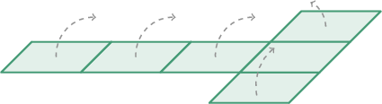

As a result, we get a cube:

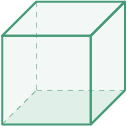

### Example: Identifying a Polyhedron Given Its Net

#### Question

The net of which polyhedron is shown below?

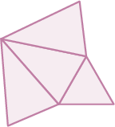

#### Explanation

We fold the net along its edges to form a solid shape, as shown below.

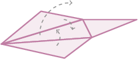

As a result, we get a triangular pyramid:

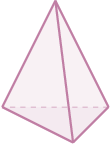

### Example: Identifying the Net of a Polyhedron

#### Question

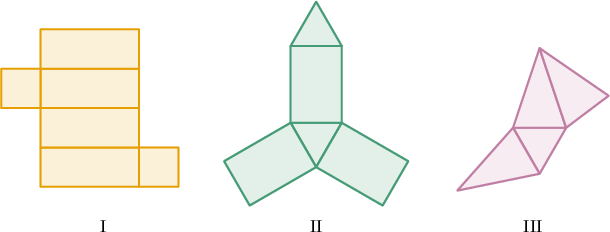

Which of the nets above is the net of a rectangular prism?

#### Explanation

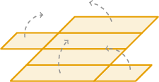

If we were to fold the net above along its edges, then we'd get a rectangular prism, as shown below:

Notice that the other two nets have triangular faces, so they cannot be the nets of a rectangular prism.

Therefore, the correct answer is I.

### Example: Identifying Nets That Do Not Correspond to a Particular Polyhedron

#### Question

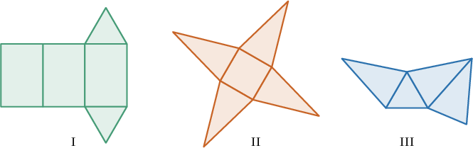

Which of the nets above is **** the net of a pyramid?

#### Explanation

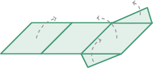

If we were to fold the net above along its edges, then we'd get a triangular prism, as shown below:

Notice that the other two nets give us pyramids. Therefore, the correct answer is I.

### Example: Identifying True Statements Given Some Polyhedra Nets

#### Question

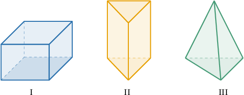

Which of the statements is true about the solids shown above?

1. The net of solid I consists of triangles only.

2. The net of solid II consists of $4$ triangles and $2$ rectangles.

3. The net of solid III consists of triangles only.

#### Explanation

Let's sketch the net of each solid.

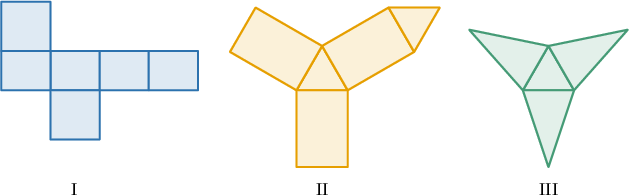

Now, let's go through the statements one by one.

- Statement I is false because the net of solid I consists of rectangles.

- Statement II is false because the net of solid II consists of $2$ triangles and $3$ rectangles.

- Statement III is true.

Therefore, the correct answer is "III only."
