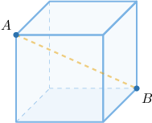
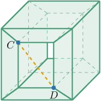
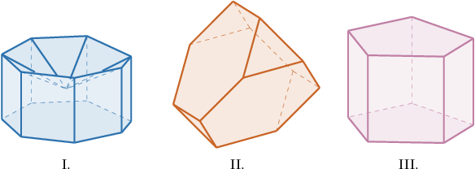
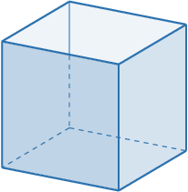
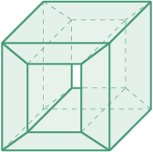

# Euler's Formula for Polyhedra

Source: https://www.mathacademy.com/topics/2849?courseId=126
Topic ID: 2849

## Prerequisites

- [Polygons](../../../../middle-school/lessons/prealgebra/1317-polygons.md)
- [Nets of Polyhedrons](./2468-nets-of-polyhedrons.md)

## Lesson

### Introduction

A polyhedron is **convex** if and only if the following condition holds:

*If we take any two distinct points $A$ and $B$ that belong to the polyhedron, then all the points on the line segment $\overline{AB}$ also belong to the polyhedron.*

In this context, a point *belongs* to a polyhedron if it lies either on one of its faces or within its interior.

One of the simplest examples of a convex polyhedron is a cube. No matter which two points $A$ and $B$ we pick, the line segment $\overline{AB}$ always belongs to the cube.

On the other hand, take a look at the following O-shaped polyhedron and the points $C$ and $D$ that belong to it. This polyhedron resembles a cube, except that a rectangular prism is carved out of the middle.

Notice that some points on the line segment $\overline{CD}$ lie outside the solid. Therefore, this polyhedron is not convex.

### Example: Visually Identifying Convex Polyhedra

#### Question

Which of the polyhedra below are convex?

#### Explanation

A polyhedron is convex if and only if the following condition holds:

**

With that in mind, let's examine our solids in turn.

- Solid I is ** convex. The above condition does not hold. As a counterexample, let's consider the points $A$ and $B,$ as shown below. Notice that some points on the line segment $\overline{AB}$ lie outside the solid.

- Solids II and III are convex. Indeed, the above condition holds for any two points that belong to the solids.

Therefore, the correct answer is "II and III only."

### Euler's Formula for Polyhedra

**Euler's formula for polyhedra** states that for any convex polyhedron, the following relationship must be satisfied:

$$

V - E + F = 2

$$

where $V$ is the number of vertices, $E$ is the number of edges, and $F$ is the number of faces of the polyhedron.

For example, let's consider a cube.

For any given cube, we have the following:

- there are $8$ vertices, so $V=8,$

- there are $12$ edges, so $E=12,$ and

- there are $6$ faces, so $F = 6.$

We can now verify that Euler's formula holds:

$$

\begin{aligned}𝑉−𝐸+𝐹 & =8−12+6 \\ & =8−6 \\ & =2\,✓\end{aligned}

$$

We can use Euler's formula for polyhedra to check whether convex polyhedra with specific properties can exist. Let's see how.

### Example: Applying Euler's Formula for Polyhedra

#### Question

Which of the following do **** exist?

1. A convex polyhedron with $12$ vertices, $18$ edges, $8$ faces

2. A convex polyhedron with $6$ vertices, $8$ edges, $3$ faces

3. A convex polyhedron with $11$ vertices, $18$ edges, $6$ faces

#### Explanation

Euler's formula for polyhedra tells us that for any convex polyhedron, we have

$$

V - E + F = 2,

$$

where $V$ is the number of vertices, $E$ is the number of edges, and $F$ is the number of faces of the polyhedron.

With that in mind, let's examine the given information.

- Polyhedron I does exist. Substituting the number of vertices, edges, and faces into the left-hand side of Euler's formula, we obtain

- Polyhedron II cannot exist. Substituting the number of vertices, edges, and faces into the left-hand side of Euler's formula, we obtain

- Polyhedron III cannot exist. Substituting the number of vertices, edges, and faces into the left-hand side of Euler's formula, we obtain

Therefore, the correct answer is "II and III only."

### Example: Applying Euler’s Formula for Polyhedra Given a Description of a Polyhedron's Faces

#### Question

A convex polyhedron consists of $8$ equilateral triangles and $6$ squares. How many vertices does the polyhedron have?

#### Explanation

Euler's formula for polyhedra tells us that for any convex polyhedron, we have

$$

V - E + F = 2,

$$

where $V$ is the number of vertices, $E$ is the number of edges, and $F$ is the number of faces of the polyhedron.

With that in mind, let's examine our polyhedron.

First, we compute the number of faces:

$$

F=8+6=14

$$

Next, notice that $8$ equilateral triangles and $6$ squares have a total of

$$

S = 8 \cdot 3 + 6 \cdot 4 = 24+24 = 48

$$

sides combined. Moreover, each edge of the polyhedron is created when two face sides coincide. So, the number of edges of the polyhedron must be equal to

$$

E = \dfrac{S}{2} = \dfrac{48}{2} = 24.

$$

Finally, substituting $E=24$ and $F=14$ into Euler's formula, we can solve for $V$ as follows:

$$

\begin{aligned}𝑉−𝐸+𝐹 & =2 \\ 𝑉−(24)+(14) & =2 \\ 𝑉−10 & =2 \\ 𝑉 & =12\end{aligned}

$$

Therefore, our polyhedron has $12$ vertices.

### Euler Characteristic

The **Euler characteristic** of any polyhedron is denoted by the Greek letter $\chi$ (pronounced "k-eye") and is equal to the number

$$

\displaystyle \chi =V-E+F,

$$

where $V$ is the number of vertices, $E$ is the number of edges, and $F$ is the number of faces of the polyhedron. Any convex polyhedron has $\chi = 2.$

Let's compute $\chi$ for the O-shaped polyhedron we encountered earlier.

The solid has $V=16$ vertices, $E=32$ edges, and $F=16$ faces. Therefore, the Euler characteristic for this polyhedron is

$$

\begin{aligned}𝑉−𝐸+𝐹=16−32+16=0\end{aligned}

$$

Since $\chi = 0\neq 2,$ this polyhedron is not convex.
