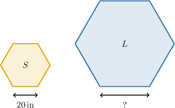
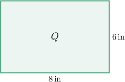

# Working With Areas of Similar Polygons

Source: https://www.mathacademy.com/topics/2941?courseId=126
Topic ID: 2941

## Prerequisites

- [Fractions of Fractions](../../../../middle-school/lessons/prealgebra/323-fractions-of-fractions.md)
- [Areas of Similar Polygons](./1197-areas-of-similar-polygons.md)

## Lesson

### Introduction

The length of a side of the hexagon ${S}$ is $20\, \text{in}.$ The ratio of the area of the larger hexagon to the area of the smaller one is $25:4.$ Given that the two hexagons ${S}$ and ${L}$ are similar, what is the length of the side of the hexagon ${L}?$

Recall that if two polygons are similar with scale factor $k,$ then the ratio of the two areas is equal to $k^2.$

We are told that

$$

\dfrac{\mathcal{A}_{L}}{\mathcal{A}_{S}} = \dfrac{25}{4}.

$$

So, we have

$$

k^2 = \dfrac{25}{4}\quad\Rightarrow\quad k = \sqrt{\dfrac{25}{4}} = \dfrac{5}{2}.

$$

As a result, the side length of polygon ${L}$ is $\dfrac{5}{2}$ times the side length of polygon ${S}.$ Therefore, the side length of the larger polygon is

$$

20 \cdot \dfrac{5}{2} = 50 \,\text{in}.

$$

### Example: Finding a Side Length Given the Ratio Between Areas of Similar Polygons

#### Question

The triangle $\triangle ABC$ has area $60 \, \mathrm{cm^2}$ and ${AB}=9\, \mathrm{cm}.$ The area of $\triangle A'B'C'$ is $4$ times the area of $\triangle ABC.$ Find $A'B'$ given that $\triangle ABC\sim \triangle A'B'C'.$

#### Explanation

If two polygons are similar with scale factor $k,$ then the ratio of the two areas is equal to $k^2.$

We are told that

$$

\dfrac{\mathcal{A}_{A'B'C'}}{\mathcal{A}_{ABC}} = 4.

$$

So, we have that

$$

k^2 = 4\quad\Rightarrow\quad k = \sqrt{4} = 2.

$$

So, the length of $\overline{A'B'}$ is $2$ times the length of the side $\overline{AB}$ of ${\triangle ABC}.$ Therefore, we obtain

$$

\begin{aligned}𝐴^{′}𝐵^{′} & =𝐴𝐵⋅2 \\ & =9⋅2 \\ & =18\,cm.\end{aligned}

$$

### Example: Calculating the Dimensions of a Polygon Given Area Information Regarding a Similar Polygon

#### Question

The rectangle $Q$ above has been obtained by dilating another rectangle $P.$ If the area of $Q$ is $\dfrac{16}{25}$ times the area of $P$, find the dimensions of $P.$

#### Explanation

If two polygons are similar with scale factor $k,$ then the ratio of the two areas is equal to $k^2.$

We are told that

$$

\dfrac{\mathcal{A}_Q}{\mathcal{A}_P} = \dfrac{16}{25}.

$$

So, we have that

$$

k^2 = \dfrac{16}{25}\quad\Longrightarrow\quad k = \sqrt{\dfrac{16}{25}} = \dfrac 4 5.

$$

Therefore, to obtain rectangle $Q$, each dimension of $P$ has been multiplied by $\dfrac45.$ This implies that to revert from $Q$ to $P,$ we need to divide each dimension of $Q$ by $\dfrac45.$

Hence, the dimensions of $P$ are

$$

\dfrac{8}{\left(\dfrac{4}{5}\right)}=10\,\text{in} \qquad \text{and}\qquad \dfrac{6}{\left(\dfrac{4}{5}\right)}=\dfrac{15}{2}\,\text{in}.

$$

### Example: Finding the Area of a Polygon Given Some Information About a Similar Figure

#### Question

A rectangle $ABCD$ has sides ${AB}= 15\, \mathrm{cm}$ and ${BC}= 6\, \mathrm{cm}.$ A similar rectangle $A'B'C'D'$ has perimeter $p'=84 \, \mathrm{cm}.$ What is the area of $A'B'C'D'?$

#### Explanation

If two polygons are similar with scale factor $k,$ then the ratio of the two areas is equal to $k^2.$

Let $p$ denote the perimeter of $ABCD.$ Then, we have

$$

\begin{aligned}𝑝 & =15⋅2+6⋅2 \\ & =30+12 \\ & =42\,cm.\end{aligned}

$$

The ratio between the perimeters of the rectangles is

$$

\begin{aligned} k &= \dfrac{84}{42} = 2 \end{aligned}

$$

and the area of the rectangle $ABCD$ is

$$

\begin{aligned} \mathcal{A} &= 15 \cdot 6 = 90 \, \mathrm{cm^2}. \end{aligned}

$$

Therefore, we can calculate the area ${\mathcal{A}'}$ of the rectangle $A'B'C'D'$ using the ratio $k\mathbin{:}$

$$

\begin{aligned}\frac{A^{′}}{A} & =𝑘^{2} \\ \frac{A^{′}}{90} & =2^{2} \\ A^{′} & =90⋅4 \\ & =360\,^{2}.\end{aligned}

$$
