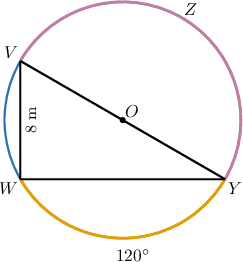
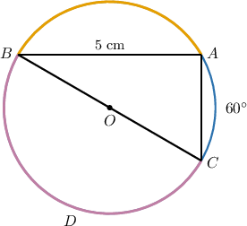
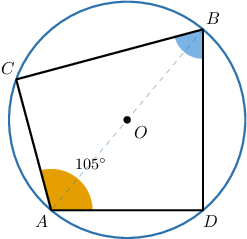
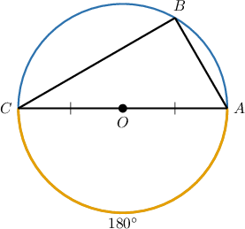
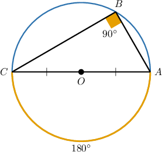

# Further Angles in Inscribed Right Triangles

Source: https://www.mathacademy.com/topics/3663?courseId=126
Topic ID: 3663

## Prerequisites

- [30-60-90 Triangles](./262-30-60-90-triangles.md)
- [Isosceles Right Triangles](./263-isosceles-right-triangles.md)
- [Inscribed Angles](./497-inscribed-angles.md)
- [Angles in Inscribed Right Triangles](./505-angles-in-inscribed-right-triangles.md)
- [Interior Angles of Polygons](../../../../middle-school/lessons/prealgebra/1319-interior-angles-of-polygons.md)

## Lesson

### Introduction

How can we find the diameter of a circle shown below?

According to the inscribed angle theorem, the measure of an inscribed angle is half the measure of its intercepted arc. So, we must have

$$

\begin{aligned}𝑚∠𝑌𝑉𝑊 & =\frac{1}{2}⋅𝑚\overset{𝑊𝑌}{⌢} \\ & =\frac{1}{2}⋅120^{∘} \\ & =60^{∘}.\end{aligned}

$$

Now, since $\triangle{VWY}$ is inscribed in the circle and $\overline{VY}$ is a diameter, we get that $m\angle{YWV} = 90^\circ$ by Thales' theorem.

Therefore, $\triangle{VWY}$ is a $30^\circ$-$60^\circ$-$90^\circ$ triangle whose shorter side is $\overline{WV}=8\,\text{m},$ and the hypotenuse is given by

$$

VY = 2 \cdot WV = 2 \cdot 8 = 16 \,\text{m}.

$$

Finally, we conclude that the diameter of the circle is $16 \,\text{m}.$

### Example: Finding a Radius or Diameter of a Circle Given an Inscribed Special Right Triangle

#### Question

What is the radius of the circle above?

#### Explanation

Since the measure of an inscribed angle is half the measure of its intercepted arc, we must have

$$

\begin{aligned}𝑚∠𝐴𝐵𝐶 & =\frac{1}{2}⋅𝑚\overset{𝐴𝐶}{⌢} \\ & =\frac{1}{2}⋅60^{∘} \\ & =30^{∘}.\end{aligned}

$$

Now, since $\triangle{ABC}$ is inscribed in the circle and $\overline{BC}$ is a diameter, we get that $m\angle{CAB} = 90^\circ.$

Hence, $\triangle{ABC}$ is a $30^\circ$-$60^\circ$-$90^\circ$ triangle whose longer side is $\overline{AB}.$ Therefore, its hypotenuse is given by

$$

\begin{aligned}𝐵𝐶 & =2⋅\frac{𝐴𝐵}{\sqrt{3}} \\ & =2⋅\frac{5}{\sqrt{3}} \\ & =\frac{10}{\sqrt{3}} \\ & =\frac{10}{\sqrt{3}}⋅\frac{\sqrt{3}}{\sqrt{3}} \\ & =\frac{10\sqrt{3}}{3}.\end{aligned}

$$

Finally, the radius of the circle is $OB=\dfrac12\cdot BC = \dfrac{5\sqrt 3}{3} \,\text{cm}.$

### Example: Finding an Angle in an Inscribed Quadrilateral

#### Question

Given that $m\angle{CAD}=105^\circ,$ find the measure of $\angle{CBD}.$

#### Explanation

Notice that $\triangle{ADB}$ and $\triangle{ACB}$ are inscribed in the circle and $\overline{AB}$ is a diameter. Therefore,

$$

m\angle{ADB}=m\angle{ACB}=90^\circ.

$$

Now, the sum of the interior angles of the quadrilateral ${ACBD}$ is

$$

2 \cdot 180^\circ = 360^\circ.

$$

Therefore,

$$

\begin{aligned}𝑚∠𝐶𝐴𝐷+𝑚∠𝐶+𝑚∠𝐶𝐵𝐷+𝑚∠𝐷 & =360^{∘} \\ 105^{∘}+90^{∘}+𝑚∠𝐶𝐵𝐷+90^{∘} & =360^{∘} \\ 285^{∘}+𝑚∠𝐶𝐵𝐷 & =360^{∘} \\ 𝑚∠𝐶𝐵𝐷 & =75^{∘}.\end{aligned}

$$

### Thales’ Theorem as a Consequence of the Inscribed Angle Theorem

Thales' theorem can be thought of as a consequence of the inscribed angle theorem.

Suppose that the points $A,$ $B,$ and $C$ lie on the circumference of the circle where $\overline{AC}$ is a diameter.

We wish to show that $m\angle{ABC}=90^\circ.$

First, since $\overline{AC}$ is a diameter of the circle, the inscribed angle $\angle{ABC}$ intercepts the arc $\overset{\frown}{AC}.$

Moreover, $m\overset{\frown}{AC} = 180^\circ$ since it spans exactly half the circle.

According to the inscribed angle theorem, the measure of the inscribed angle is always half the measure of its intercepted arc. Therefore, we have

$$

m\angle{ABC} = \dfrac{1}{2}\cdot 180^\circ = 90^\circ.

$$

Hence, $\triangle ABC$ is a right triangle.

