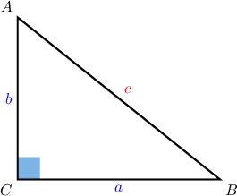
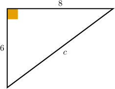
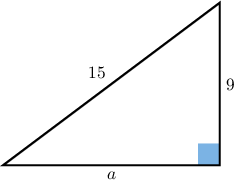

# The Pythagorean Theorem

Source: https://www.mathacademy.com/topics/433?courseId=126
Topic ID: 433

## Prerequisites

- [Solving Many-Variable Equations](../algebra-i/354-solving-many-variable-equations.md)
- [Solving Equations Using the Square Root Method](../algebra-i/430-solving-equations-using-the-square-root-method.md)
- [Classifying Triangles](../../../../middle-school/lessons/prealgebra/1601-classifying-triangles.md)
- [Evaluating Algebraic Radical Expressions](../algebra-i/2184-evaluating-algebraic-radical-expressions.md)

## Lesson

### Introduction

The **Pythagorean theorem**, also known as Pythagoras' theorem, is an important theorem related to right-angled triangles. Let's consider the right triangle depicted below.

The theorem can be written as

$$

\begin{aligned}𝑐^{2}=𝑎^{2}+𝑏^{2},\end{aligned}

$$

where

- $\color{red}c$ is the length of the longest side, which is called the **hypotenuse**, and

- $\color{blue}a$ and $\color{blue}b$ are the lengths of the two other sides, which are called the **legs**.

### Example: Finding the Length of the Hypotenuse of a Given Right Triangle

#### Question

Find the length of the hypotenuse in the triangle below.

#### Explanation

The given lengths are the legs of the right triangle, so let $a=8$ and $b=6.$ According to the Pythagorean theorem, we obtain

$$

\begin{aligned}𝑐^{2} & =𝑎^{2}+𝑏^{2} \\ 𝑐 & =\sqrt{√𝑎^{2}+𝑏^{2}}.\end{aligned}

$$

Substituting in the values for $a$ and $b$ gives us

$$

\begin{aligned}𝑐 & =\sqrt{√(8)^{2}+(6)^{2}} \\ & =\sqrt{√64+36} \\ & =\sqrt{√100} \\ & =10.\end{aligned}

$$

**** When taking the square root of $c^2$ we only take the positive value. The reason for this is that we cannot have a negative length.

### Example: Finding the Length of the Hypotenuse Given the Length of the Legs of a Right Triangle

#### Question

A right triangle has legs of length $5$ and $12.$ Calculate the length of its hypotenuse.

#### Explanation

Let $a=5,$ $b=12,$ and $c$ be the length of the hypotenuse. According to the Pythagorean theorem, we obtain

$$

\begin{aligned}𝑐^{2} & =𝑎^{2}+𝑏^{2} \\ 𝑐 & =\sqrt{√𝑎^{2}+𝑏^{2}}.\end{aligned}

$$

Substituting in the values for $a$ and $b$ gives us

$$

\begin{aligned}𝑐 & =\sqrt{√(5)^{2}+(12)^{2}} \\ & =\sqrt{√25+144} \\ & =\sqrt{√169} \\ & =13.\end{aligned}

$$

### Example: Determining the Length of a Leg Given a Right Triangle

#### Question

What is the length of $a$ in the triangle shown below?

#### Explanation

Here, we know the lengths of the hypotenuse and one leg, so let $b=9$ and $c=15.$ We need to find $a,$ the length of the other leg.

According to the Pythagorean theorem, we obtain

$$

\begin{aligned}𝑐^{2} & =𝑎^{2}+𝑏^{2} \\ 𝑎^{2} & =𝑐^{2}−𝑏^{2} \\ 𝑎 & =\sqrt{√𝑐^{2}−𝑏^{2}}.\end{aligned}

$$

Substituting in the values for $b$ and $c$ gives us

$$

\begin{aligned}𝑎 & =\sqrt{√(15)^{2}−(9)^{2}} \\ & =\sqrt{√225−81} \\ & =\sqrt{√144} \\ & =12.\end{aligned}

$$
