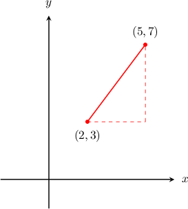
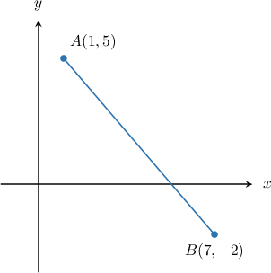

# The Distance Formula

Source: https://www.mathacademy.com/topics/459?courseId=126
Topic ID: 459

## Prerequisites

- [The Pythagorean Theorem](./433-the-pythagorean-theorem.md)
- [Distances Between Points in the Coordinate Plane](../../../../middle-school/lessons/prealgebra/573-distances-between-points-in-the-coordinate-plane.md)

## Lesson

### Introduction

To find the distance between two points on the Cartesian plane, we can create a right triangle and use the Pythagorean theorem.

To demonstrate, consider the points $(2, 3)$ and $(5, 7),$ shown in the diagram below. We draw a right triangle so that the segment between the two points is the hypotenuse.

We can find the distance between the points by finding the length of the hypotenuse $d$ using the Pythagorean theorem in the form

$$

d = \sqrt{a^2 + b^2}.

$$

From this perspective:

- $a$ is the distance between the $x$-coordinates.

- $b$ is the distance between the $y$-coordinates.

So the distance between the points $(2, 3)$ and $(5, 7)$ is given by

$$

\begin{aligned} d &= \sqrt{3^2 + 4^2} \\[3pt] &= \sqrt{9 + 16} \\[3pt] &= \sqrt{25} \\[3pt] &= 5. \end{aligned}

$$

In general, the distance $d$ between any two points in the Cartesian plane is given by the **distance formula**:

$$

d = \sqrt{(x_2 - x_1)^2 + (y_2 - y_1)^2}

$$

### Example: Determining the Length of a Segment

#### Question

What is the length of $\overline{AB}?$

#### Explanation

From the figure, we note that the points $A$ and $B$ have coordinates $𝑥_{1}$ and $𝑥_{2}$ respectively.

To find the length of $\overline{AB},$ we use the distance formula:

$$

\begin{aligned} AB &= \sqrt{(x_2 - x_1)^2 + (y_2 - y_1)^2}\\[3pt] &= \sqrt{(7 - 1)^2 + (-2 - 5)^2} \\[3pt] &= \sqrt{(6)^2 + (-7)^2} \\[3pt] &= \sqrt{36 + 49} \\[3pt] &= \sqrt{85} . \end{aligned}

$$

### Example: Calculating the Distance Between Two Points

#### Question

What is the distance between the points $(-9, 6)$ and $(13, 6)?$

#### Explanation

In this case, we have $𝑥_{1}$ and $𝑥_{2}$ So, the distance $d$ can be calculated using the distance formula, as follows:

$$

\begin{aligned} d &= \sqrt{(x_2 - x_1)^2 + (y_2 - y_1)^2} \\[3pt] &= \sqrt{(13 - (-9))^2 + (6 - 6)^2} \\[3pt] &= \sqrt{(22)^2 + (0)^2} \\[3pt] &= \sqrt{22^2} \\[3pt] &= 22 \end{aligned}

$$
