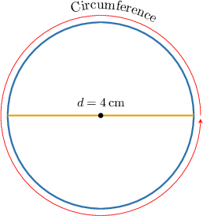
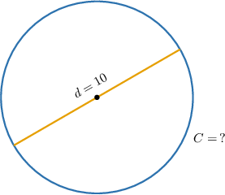
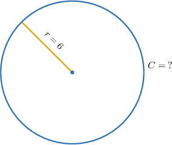
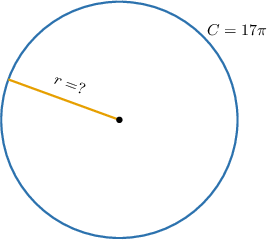
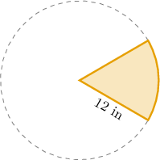

# The Circumference of a Circle

Source: https://www.mathacademy.com/topics/460?courseId=126
Topic ID: 460

## Prerequisites

- [Solving Many-Variable Equations](../algebra-i/354-solving-many-variable-equations.md)
- [Circles](./1404-circles.md)
- [Degrees of Accuracy](../algebra-i/2234-degrees-of-accuracy.md)

## Lesson

### Introduction

The **circumference** of a circle is the length of the path that goes around the circle.

The circumference is usually denoted by the letter $C.$

One important fact about the circumference is that, for *any* circle, no matter how small or large it is, the ratio of circumference $C$ to diameter $d$ is a fixed number! Specifically,

$$

\dfrac{C}{d} = {\color{blue}\boldsymbol{\pi}} \approx 3.141\,592\,654...

$$

This important irrational number is called **pi** (pronounced "pie") and we use the Greek letter $\pi$ to express it. So, we can calculate the circumference by using the following formula:

$$

\begin{aligned}𝐶=𝜋𝑑.\end{aligned}

$$

Here, our circle has diameter $4\,\textrm{cm},$ so its circumference is

$$

C = \pi \cdot 4 = 4\pi \approx 12.566\,\mathrm{cm},

$$

rounded to three decimal digits.

Since the diameter is twice as long as the radius ($d=2r$), we can also write the formula for the circumference as

$$

C = \pi d = 2\pi r.

$$

### Example: Calculating the Circumference of a Circle Given the Diameter

#### Question

What is the circumference $C$ of a circle with a diameter of $d=10?$

#### Explanation

We use the formula $C=\pi d$ and get

$$

\begin{aligned}𝐶 & =𝜋𝑑 \\ & =𝜋⋅10 \\ & =10𝜋.\end{aligned}

$$

This is the exact answer. If we want an approximate answer, say rounded to three decimal places, we can use the approximation $\pi\approx 3.14\,159,$ and we get

$$

\begin{aligned}𝐶 & =10⋅𝜋 \\ & ≈10⋅3.14\,159 \\ & ≈31.416.\end{aligned}

$$

### Example: Calculating the Circumference of a Circle Given the Radius

#### Question

What is the circumference $C$ of a circle with a radius of $6?$

#### Explanation

We use the formula $C=2\pi r$ to get

$$

\begin{aligned}𝐶 & =2𝜋𝑟 \\ & =2𝜋⋅6 \\ & =12𝜋.\end{aligned}

$$

### Example: Finding the Radius or Diameter of a Circle Given the Circumference

#### Question

What is the radius $r$ of a circle with a circumference of $C=17\pi?$

#### Explanation

We use the formula for the circumference $C=2\pi r$ and solve for $r.$ So, we have

$$

\begin{aligned}𝐶 & =2𝜋𝑟 \\ 17𝜋 & =2𝜋𝑟 \\ 𝑟 & =\frac{17𝜋}{2𝜋} \\ & =\frac{17}{2} \\ & =8.5.\end{aligned}

$$

### Calculating the Length of a Part of a Circle

The problem of finding the length of a circle or a part of a circle often appears in real life.

For example, consider the pie in the shape of a circle divided into six equal slices, as shown in the figure below.

How to find the total length of the border of one slice of pie?

The border of the slice of pie will consist of two parts:

- the top and the bottom parts, which consist of two radii;

- the right part (circular part), which consists of one-sixth of the circumference.

First, let's find the length of the circular part. The formula for the circumference of a circle is $C=2 \pi r,$ where $r=12\,\textrm{in}$ is the radius. Therefore, we have

$$

C = 2 \pi \cdot 12 = 24\pi\,\textrm{in}.

$$

Finally, the length of the border is

$$

\begin{aligned}\frac{𝐶}{6}+2𝑟 & =\frac{24𝜋}{6}+2⋅12 \\ & =(4𝜋+24)\,in.\end{aligned}

$$

### Example: Word Problems

#### Question

Carol has to wrap a rope around a circular column whose diameter is $20\,\textrm{cm}.$ What length of the rope will wrap the column perfectly?

#### Explanation

The length of the rope needed to wrap around the column is its circumference.

The formula for the circumference of a circle is $C = \pi d$, where $d=20\,\textrm{cm}$ is the diameter.

Therefore, we have

$$

C = \pi\cdot 20 = 20\pi \,\textrm{cm}.

$$
