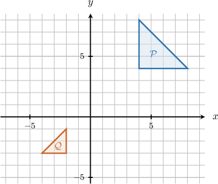
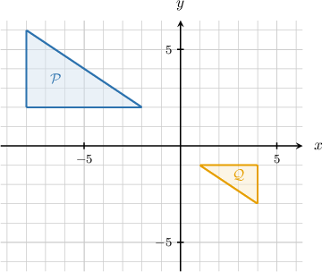
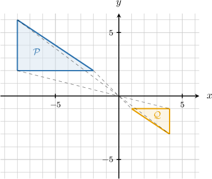

# Similarity Transformations

Source: https://www.mathacademy.com/topics/491?courseId=126
Topic ID: 491

## Prerequisites

- [Similarity and Similar Polygons](./490-similarity-and-similar-polygons.md)
- [Rigid Motions and Congruence](./2218-rigid-motions-and-congruence.md)

## Lesson

### Introduction

A **similarity transformation** maps a figure to a figure with the same shape, but not necessarily the same size. We can form a similarity transformation by combining a *dilation* with one or more *rigid motions*.

For example, triangle below is transformed step by step into triangle:

- First, it is *dilated* about the origin by a scale factor of Dilating about the origin by a scale factor of maps to

- Next, is *rotated* counterclockwise about the origin. Rotating by counterclockwise about the origin maps it to

- Finally, is *translated* units downward. Translating downward by units maps it to

So, after all three transformations, the final image of triangle is triangle as shown below.

Since is mapped to by a dilation followed by rigid motions, is similar to

In general, any sequence of transformations made up of a dilation and rigid motions is a similarity transformation.

### Similarity Transformations

In the previous slide, triangle was mapped to triangle by a dilation, a rotation, and a translation.

The final image is similar to the original figure because each type of transformation preserves shape:

- A *rigid motion* (such as a translation, rotation, or reflection) preserves both side lengths and angle measures. So, a rigid motion maps a figure to a *congruent* figure.

- A *dilation* with scale factor multiplies every side length by while preserving all angle measures. So, a dilation maps a figure to a *similar* figure.

Therefore, if we combine a dilation with one or more rigid motions, the final image has the same shape as the original figure.

Any transformation made up of translations, rotations, reflections, and dilations is called a *similarity transformation*.

### Example: Finding a Similarity Transformation Given a Polygon and Its Image

#### Question

If the figures $\mathcal P$ and $\mathcal Q$ are similar, then what transformation maps $\mathcal P$ onto $\mathcal Q?$

#### Explanation

The figures $\mathcal P$ and $\mathcal Q$ are similar. The ratios of the lengths of the corresponding sides are all equal, and all corresponding angles are equal.

Indeed, $\mathcal Q$ is the image of $\mathcal P$ under a dilation with center at the origin and scale factor $-\dfrac{1}{2}.$

### Example: Identifying True Statements Regarding Transformed Polygons

#### Question

A rectangle $ABCD$ is translated by $4$ units upward and then reflected over the $y$-axis. If the resulting quadrilateral is $PQRS,$ which of the following statements must be true?

1. $ABCD \sim PQRS$

2. $\angle A \cong \angle P$

3. $CD=RS$

#### Explanation

A similarity transformation is any transformation made up of rigid motions (rotations, reflections, and translations) and dilations.

A similarity transformation will map any polygon to a similar polygon.

With that in mind, let's examine each of the statements in turn.

- Statement I is true. We are given a combination of a translation and a reflection. As a result, we obtain that

- Statement II is true. Since $ABCD \sim PQRS,$ all corresponding angles of the rectangle must be congruent. In particular,

- Statement III is true. Since our combined transformation consists of rigid motions only (namely, reflection and translation), the distance between all points is preserved under the transformation. Therefore, we obtain that

Therefore, the correct answer is "I, II, and III."

### Transformations and Coordinates

We can describe a transformation by stating what happens to each point of a figure.

For example, a point might move to a new point If the same rule is applied to every point of the figure, then the whole figure is transformed.

Here are some common examples:

- *Translation:* moves every point the same distance in the same direction. For example, moving a figure units right and units up sends

- *Reflection over the -axis:* flips a figure across the -axis. For example, reflecting a figure over the -axis sends

- *Rotation counterclockwise about the origin:* turns a figure around the origin. For example, rotating a figure counterclockwise about the origin sends

- *Dilation centered at the origin:* multiplies both coordinates by the same scale factor. For example, a dilation with scale factor sends

### Example: Identifying Similarity Transformations

#### Question

Which of the following transformations map any polygon to a similar polygon?

1. $(x,y) \mapsto (-x, y)$

2. $(x,y) \mapsto (x, y-1)$

3. $(x,y) \mapsto (3x, 2y)$

#### Explanation

A similarity transformation is any transformation made up of rigid motions (rotations, reflections, and translations) and dilations.

A similarity transformation will map any polygon to a similar polygon.

With that in mind, let's examine each of the transformations in turn.

- Transformation I represents a reflection in the $y$-axis. Thus, it is a rigid motion and, therefore, a similarity transformation.

- Transformation II represents a translation by $1$ unit downward. Thus, it is a similarity transformation.

- Transformation III represents a stretch with different stretch factors in the $x$- and $y$ directions. This is not a similarity transformation.

Therefore, the correct answer is "I and II only."
