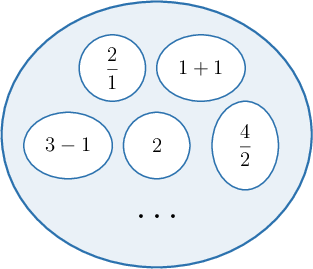
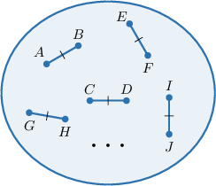
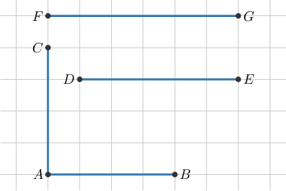
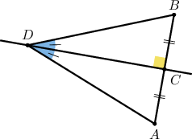

# Properties of Congruence

Source: https://www.mathacademy.com/topics/502?courseId=126
Topic ID: 502

## Prerequisites

- [Congruent Segments](../../../../middle-school/lessons/prealgebra/1462-congruent-segments.md)
- [Congruent Angles](../../../../middle-school/lessons/prealgebra/3554-congruent-angles.md)

## Lesson

### Introduction

We've seen what it means for two segments or angles to be congruent. In this lesson, we'll explore the concept of congruence in more detail. As we'll see, this deeper understanding is needed to prove results from geometry.

Before we explore congruence, let's take a step back and examine what it means for two numbers to be *equal.*

Consider the following statements:

$$

1+1 = 2, \qquad\qquad 2 = 3-1

$$

All three expressions, namely

$$

1+1,\qquad 2,\qquad 3-1

$$

are **equivalent representations** of the same number. That is, they all represent the number $2.$

There are many ways to represent the number $2.$ Let's list a few more:

$$

1+1, \qquad \dfrac{2}{1}, \qquad 3-1, \qquad 2, \qquad \dfrac{4}{2}, \qquad \ldots

$$

We can combine all these equivalent representations into a single collection (or **set**), like the one shown below.

Imagine that this set contains *all possible representations* of the number $2{:}$

Now, let's state some important properties that relate the different representations to each other:

- The **reflexive** property of equality: Every representation *equals itself*. For example, the statement is true. Also are both true.

- The **symmetric** property of equality: We can *switch the order* of the numbers in an equality statement. For example, Similarly,

- The **transitive** property of equality: If one representation equals a second, and the second equals a third, then the first equals the third: For example,

Reflexivity, symmetricity, and transitivity capture what it means for numbers to be equal. Please take a moment to reread them and make sure you understand. You'll be using them a lot in the future.

### Reflexivity, Symmetricity, and Transitivity of Equality

Let's now state our three properties of equality more generally:

- The **reflexive** property of equality: This states that every number equals itself.

- The **symmetric** property of equality: This states that if the first number equals the second, the second must equal the first.

- The **transitive** property of equality: This states that if the first number equals the second and the second equals the third, the first must equal the third.

### Example: Equality of Numbers

#### Question

Consider the following true statement.

$\qquad$ Since $2 \cdot 5 = 10$ and $10 = 4+6,$ we have $2 \cdot 5 = 4+6.$

Which property of equality makes this statement true?

#### Explanation

The following properties are valid for all integers $a, b,$ and $c{:}$

- The ** property of equality: This states that every number equals itself.

- The ** property of equality: This states that if the first number equals the second, the second must equal the first.

- The ** property of equality: This states that if the first number equals the second and the second equals the third, the first must equal the third.

We can rewrite the given sentence as follows:

If $2 \cdot 5 = 10$ and $10 = 4+6,$ then $2 \cdot 5 = 4+6.$

Therefore, this statement is true by the $\boxed{\color{blue}\textrm{transitive}}$ property of equality.

### Congruence of Segments

Recall that two segments are *congruent* if they have the same length.

Suppose we have a segment $\overline{AB}.$ Similar to earlier, we can create a collection (or **set**) containing *all* segments congruent to $\overline{AB}.$

Imagine this set contains *every* segment congruent to $\overline{AB}.$ In other words, it contains every segment with the *same length* as $\overline{AB}.$

Here's the key concept: segment congruence has the same equivalence properties as equality!

- The **reflexive** property of congruence: Every segment is congruent with itself: For example:

- The **symmetric** property of congruence: We can *switch the order* of the segments in a congruence statement: For example,

- The **transitive** property of congruence: If one segment is congruent to a second, and the second is congruent to a third, then the first is congruent to the third: For example,

### Reflexivity, Symmetricity, and Transitivity of Congruence

Suppose that $a, b,$ and $c$ are all segments. Let's state our three properties of segment congruence more generally.

- The *reflexive* property of congruence: This states that every segment is congruent to itself.

- The *symmetric* property of congruence: This states that if the first segment is congruent to the second, the second must be congruent to the first.

- The *transitive* property of congruence: This states that if the first segment is congruent to the second, and the second is congruent to the third, the first must be congruent to the third.

### Example: Segment Congruence

#### Question

Consider the following true statement.

$\qquad$ Since $\overline{AB} \cong \overline{AC},$ we have $\overline{AC} \cong \overline{AB}.$

Which property of congruence makes this statement true?

#### Explanation

The following properties are valid for all segments $a, b,$ and $c{:}$

- The ** property of congruence: This states that every segment is congruent to itself.

- The ** property of congruence: This states that if the first segment is congruent to the second, the second must be congruent to the first.

- The ** property of congruence: This states that if the first segment is congruent to the second, and the second is congruent to the third, the first must be congruent to the third.

We can rewrite the given sentence as follows:

If $\overline{AB} \cong \overline{AC},$ then $\overline{AC} \cong \overline{AB}.$

Therefore, this statement is true by the $\boxed{\color{blue}\textrm{symmetric}}$ property of congruence.

### Congruence of Angles

Congruent *angles* also have the properties of reflexivity, symmetricity, and transitivity. Let's list them:

- The **reflexive** property of congruence: This states that every angle is congruent to itself.

- The **symmetric** property of congruence: This states that if the first angle is congruent to the second, the second must be congruent to the first.

- The **transitive** property of congruence: This states that if the first angle is congruent to the second, and the second is congruent to the third, the first must be congruent to the third.

### Example: Angle Congruence

#### Question

Consider the following true statement.

$\qquad$ Since $\angle ADC \cong\angle BDC,$ we have $\angle BDC \cong \angle ADC.$

Which property of congruence makes this statement true?

#### Explanation

The following properties are valid for all angles $\angle a, \angle b,$ and $\angle c\,{:}$

- The ** property of congruence: This states that every angle is congruent to itself.

- The ** property of congruence: This states that if the first angle is congruent to the second, the second must be congruent to the first.

- The ** property of congruence: This states that if the first angle is congruent to the second, and the second is congruent to the third, the first must be congruent to the third.

We can rewrite the given sentence as follows:

If $\angle ADC \cong\angle BDC,$ then $\angle BDC \cong \angle ADC.$

Therefore, this statement is true by the $\boxed{\color{blue}\textrm{symmetric}}$ property of congruence.

### Omitting the Symmetric Property

We occasionally skip referencing the symmetric property when proving mathematical statements involving equality and congruence. This helps to make our proofs a bit shorter.

For example, suppose we have the following two equations:

We can construct a formal proof that using a so-called two-column format as follows:

The last line is true because, from rows 2 and 3 respectively, we have and so by the transitive property of equality,

We can construct a shorter proof by omitting the second line:

In this proof, the symmetric property is still applied "under the hood," but we don't explicitly refer to it.
