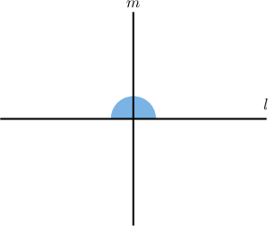
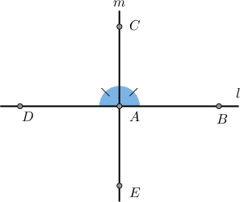
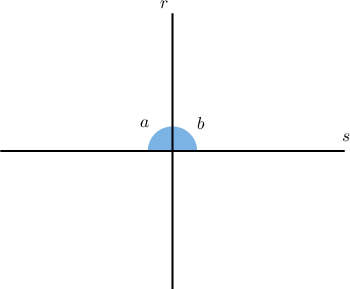
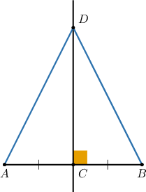
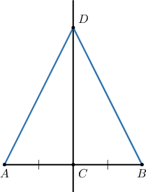
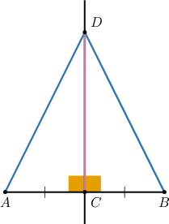
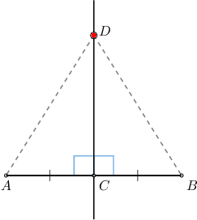

# Proving Perpendicular Line Theorems

Source: https://www.mathacademy.com/topics/5135?courseId=126
Topic ID: 5135

## Prerequisites

- [The Pythagorean Theorem](./433-the-pythagorean-theorem.md)
- [Solving Systems of Equations by Substitution](../../../../middle-school/lessons/prealgebra/487-solving-systems-of-equations-by-substitution.md)
- [Proving Congruence Statements](./1357-proving-congruence-statements.md)

## Lesson

### Introduction

In this lesson, we'll learn how to prove statements about perpendicular lines.

First, let's recall the definition of perpendicular lines.

*Two lines are*perpendicular*if they form a right angle at their intersection point.*

The diagram below shows two lines $m$ and $l,$ and a linear pair of angles.

We have two theorems about perpendicular lines and linear pairs, which we state below:

- The **linear pair perpendicular theorem**: *If two lines intersect to form a linear pair of **** angles, then the lines are perpendicular.* In other words, *if* two lines intersect to form a linear pair of congruent angles, this *guarantees* that the lines are perpendicular.

- The **converse linear pair perpendicular theorem**: *If two lines are perpendicular, then the lines intersect to form a linear pair of congruent angles.* In other words, *if* the lines are perpendicular, this *guarantees* that the angles in the linear pair are congruent.

We begin by proving the first theorem.

### Proving the Linear Pair Perpendicular Theorem

Suppose the angles $\angle BAC$ and $\angle CAD$ are congruent.

We wish to prove the following statement:

*The lines $l$ and $m$ are perpendicular.*

Our strategy for proving this result goes like this: By the linear pair postulate, the two angles are supplementary. But since they're also equal, both angles must equal $90^\circ.$ Therefore, the two lines are perpendicular.

Let's now construct our step-by-step proof:

- **Step 1**: We are given that $\angle BAC\cong \angle CAD.$

- **Step 2**: By the definition of *congruent angles*, we have that $m\angle BAC= m\angle CAD.$

- **Step 3**: By the *linear pair postulate* $\angle BAC$ and $\angle CAD$ are supplementary.

- **Step 4**: By the definition of *supplementary angles*, it follows that $m\angle BAC+m\angle CAD= 180^\circ.$

- **Step 5**: In steps 2 and 4 respectively, we showed that Therefore, using *substitution*, we obtain that

- **Step 6**: Using the result of step 5, we solve for $m\angle CAD{:}$

- **Step 7**: Finally, by the *definition of perpendicular lines*, we conclude that $l$ and $m$ are perpendicular, as required.

### Stating the Full Proof Using the Two-Column Format

The table below shows our proof of the linear perpendicular theorem in a two-column format.

### A Note Regarding the Addition and Multiplication Principles

In some of the following proofs, we often require *both* the addition and multiplication principles to solve equations. Other times, more complex steps may be needed to solve an equation.

When constructing formal proofs, it's cumbersome to state equivalent equations line-by-line until the desired solution is achieved. For this reason, we often simply state the solution and express the reason for the solution as "algebra."

Let's now prove the converse linear pair perpendicular theorem.

### Example: Proving the Linear Pair Perpendicular Theorems

#### Question

The lines $r$ and $s$ are perpendicular. At the point of intersection, they form a linear pair of angles $\angle a$ and $\angle b.$

Consider the following statement:

**

The table below provides proof of this statement. Please fill in the missing reasons to complete the proof.

#### Explanation

A sketch of the given information is shown above, and the correct proof is below.

Let's examine the rows of the table with missing parts in turn.

- Consider row 3. Notice that $\angle a$ and $\angle b$ form a linear pair. Therefore, by the linear pair postulate, these angles are supplementary.

- Consider row 6. From row 5, we have that $90^\circ + m\angle b = 180^\circ.$ By the addition principle, we can subtract $90^\circ$ from both sides of this equation:

- Consider row 9. From row 8, $\angle a$ and $\angle b$ have the same measures. Therefore, by definition of congruent angles, these angles are congruent.

### The Perpendicular Bisector Theorems

The diagram below shows a segment $\overline{AB}$ and a line $\overset{\longleftrightarrow}{CD},$ where $\overset{\longleftrightarrow}{CD}$ is the perpendicular bisector of $\overline{AB}.$

We have already seen two theorems about perpendicular bisectors. We state them below:

- The **perpendicular bisector theorem**: *If a point lies on the perpendicular bisector of a segment, then the point is equidistant from the segment's endpoints.* In other words, *if* a point lies on the perpendicular bisector of a segment, this *guarantees* that the point is the same distance from the segment's endpoints.

- The **converse perpendicular bisector theorem**: *If a point is equidistant from the endpoints of a segment, then it lies on the perpendicular bisector of the segment.* In other words, *if* a point is at the same distance from a segment's endpoints, this *guarantees* that the point lies on the perpendicular bisector of the segment.

In this lesson, we'll learn some proofs of the perpendicular bisector theorem. In a future lesson, we'll prove its converse.

Before we begin, note that in addition to the tools we've already used, we'll need to use the following:

- The definition of a bisector: *A bisector of a segment is a segment, line, or ray that bisects the segment.*

- The definition of a *perpendicular* bisector: *A perpendicular bisector of a segment is a segment, line, or ray that bisects the segment and is perpendicular to that segment.*

- The congruence criteria for triangles and CPCTC.

- The Pythagorean theorem (needed for an alternative proof).

### Proving the Perpendicular Bisector Theorem

Let's return to our diagram, where $\overset{\longleftrightarrow}{CD}$ is the perpendicular bisector of $\overline{AB}.$

We wish to prove the following statement:

*The segments $\overline{AD}$ and $\overline{BD}$ are congruent.*

Our strategy is to show that $\triangle ACD$ and $\triangle BCD$ are congruent. Then, we can use CPCTC to obtain the desired result.

We start by considering $\overset{\longleftrightarrow}{CD},$ which is the perpendicular bisector of $\overline{AB}.$

- **Step 1**: By the *definition of perpendicular lines*, $m\angle BCD=90^\circ,$ and $m\angle ACD=90^\circ.$ Let's add this to our diagram.

- **Step 2**: By the *transitive property of equality*, we have

- **Step 3**: Therefore, by the definition of *congruent angles*, we obtain

- **Step 4**: From the given information, $\overset{\longleftrightarrow}{CD}$ is the perpendicular bisector of $\overline{AB}$ and $C$ lies on $\overline{AB}.$ By the *definition of a bisector*, we have

- **Step 5**: From the diagram, we see that $\overline{CD}$ is a common side of $\triangle{ACD}$ and $\triangle{BCD}.$ By the *reflexive property of congruence*, $\overline{CD} \cong \overline{CD}.$

- **Step 6**: From steps 4, 3, and 5, we have Therefore, $\triangle{ACD} \cong \triangle{BCD}$ by the *SAS criterion*.

- **Step 7**: From step 6, we have $\triangle{{\color{red}{A}}C{\color{red}D}} \cong \triangle{{\color{red}{B}}C{\color{red}D}}.$ Therefore, by *CPCTC*, $\overline{AD} \cong \overline{BD},$ as required.

### Stating the Full Proof Using the Two-Column Format

The table below shows our proof of the perpendicular bisector theorem in a two-column format.

Let's now consider an alternative proof that uses the Pythagorean theorem.

### Example: Proving the Perpendicular Bisector Theorem

#### Question

Suppose is the perpendicular bisector of and is a point on

Consider the following statement:

**

The table below provides proof of this statement. Complete the proof by filling in the missing entries.

#### Explanation

Let's examine the rows of the table with missing parts in turn.

- Consider row 2. From row 1, we have that Then, by the Pythagorean theorem applied to we have

- Consider row 5. From the given information, is the perpendicular bisector of and lies on By the definition of a bisector, we have

- Consider row 7. From rows 6 and 4, we have that and Therefore, by substituting the first into the second,

- Consider row 9. From rows 2 and 8, we have Therefore, by the transitive property of equality, we have
