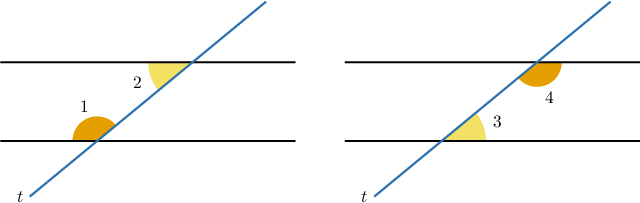
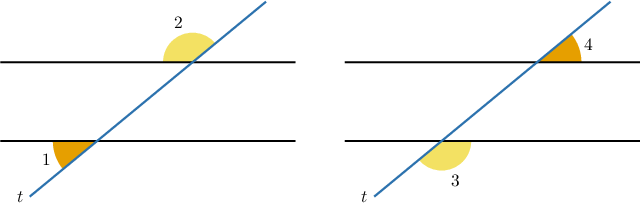
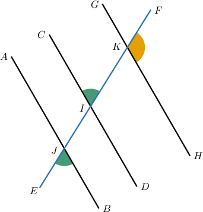
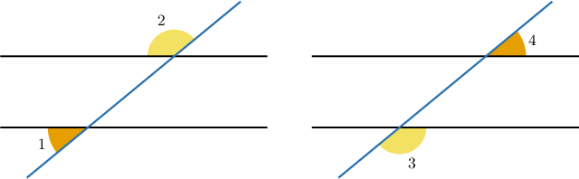
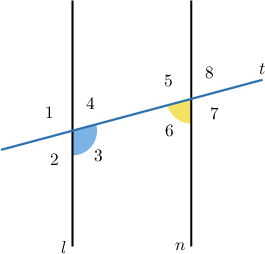
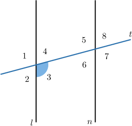
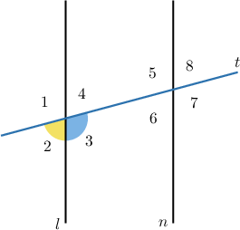
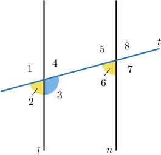
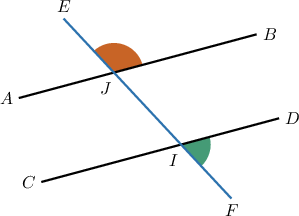

# Proving Consecutive Angle Theorems

Source: https://www.mathacademy.com/topics/5137?courseId=126
Topic ID: 5137

## Prerequisites

- [Solving Systems of Equations by Substitution](../../../../middle-school/lessons/prealgebra/487-solving-systems-of-equations-by-substitution.md)
- [Proving Alternate Angle Theorems](./5488-proving-alternate-angle-theorems.md)

## Lesson

### Introduction

In this lesson, we'll learn how to prove general statements about consecutive angles. But first, we must ensure we can correctly identify important theorems related to these angles.

The diagram below shows two lines cut by a transversal $t$ and two pairs of consecutive interior angles.

We have two theorems about consecutive interior angles that we've already seen. We state them below:

- The **consecutive interior angles theorem**: *If a transversal cuts two parallel lines, then the consecutive interior angles are supplementary.* In other words, *if* two lines are parallel, this *guarantees* that the consecutive interior angles are supplementary.

- The **converse consecutive interior angles theorem**: *If a transversal cuts two lines and the consecutive interior angles are supplementary, then the lines are parallel.* In other words, *if* the consecutive interior angles are supplementary, this *guarantees* that the lines are parallel.

Take a moment to ensure you understand the difference between the two theorems. You'll soon be asked to identify which applies to a particular situation.

Remember, consecutive interior angles are named this way for a reason:

- *Consecutive* means they are located *next to each other* on *the same side* of the transversal.

- *Interior* means they lie inside the (parallel) lines.

### Consecutive Exterior Angles

Next, consider the diagram below, which shows two lines cut by a transversal $t,$ and two pairs of consecutive exterior angles.

We have two theorems about consecutive exterior angles that are similar to those regarding consecutive interior angles.

- The **consecutive exterior angles theorem**: *If a transversal cuts two parallel lines, then the consecutive exterior angles are supplementary.* In other words, *if* two lines are parallel, this *guarantees* that the consecutive exterior angles are supplementary.

- The **converse consecutive exterior angles theorem**: *If a transversal cuts two lines and the consecutive exterior angles are supplementary, then the lines are parallel.* In other words, *if* the consecutive exterior angles are supplementary, this *guarantees* that the lines are parallel.

### Example: Identifying Theorems Involving Consecutive Angles

#### Question

Given that $m\angle EJB+m\angle HKF =180^\circ,$ by which theorem does it follow that $\overleftrightarrow{AB}$ and $\overleftrightarrow{GH}$ are parallel?

#### Explanation

If a transversal cuts two lines, we get two pairs of consecutive exterior angles.

So, in the given diagram, $\angle EJB$ and $\angle HKF$ are consecutive exterior angles.

The **** states that if two lines are cut by a transversal so that the consecutive exterior angles are supplementary, then the lines are parallel.

We are given that $\angle EJB$ and $\angle HKF$ are supplementary. Therefore, $\overleftrightarrow{AB}\parallel \overleftrightarrow{GH}$ by the converse consecutive exterior angles theorem.

### Proving Consecutive Angles Theorems

Consider the diagram below, where the parallel lines $l$ and $n$ are crossed by a transversal $t.$

We wish to prove the following statement:

*$\angle 3$ and $\angle 6$ are supplementary*

In other words, we want to prove the consecutive interior angles theorem!

To prove this theorem, we must start with one of the angles and construct a sequence of statements to show that the two angles are supplementary.

We start by considering the angle $\angle 3.$

Our strategy will be to use the fact that $\angle 2$ and $\angle 3$ form a linear pair (and are therefore supplementary) and the corresponding angles postulate to show that $\angle 2$ and $\angle 6$ are congruent. This will be enough to deduce the relationship between $\angle 3$ and $\angle 6.$

We complete the proof as follows:

- **Step 1**: By the *linear pair postulate*, $\angle 2$ and $\angle 3$ are supplementary. Let's add this to our diagram.

- **Step 2**: Since $\angle 2$ and $\angle 3$ are supplementary, we have by the *definition of supplementary angles*.

- **Step 3**: By the *corresponding angles postulate*, $\angle 2$ and $\angle 6$ are congruent. Let's add this to our diagram.

- **Step 4**: Since $\angle 2\cong\angle 6,$ then, by the *definition of congruent angles*,

- **Step 5**: In steps 2 and 4, respectively, we showed that Therefore, *by substituting* the second equality into the first, we conclude

- **Step 6**: Consequently, by the *definition of supplementary angles*, $\angle 3$ and $\angle 6$ are supplementary, as required.

It's **highly recommended** that you practice reconstructing this proof. Try to do this *without* referring to these notes.

### Stating the Full Proof Using the Two-Column Format

When stating geometry proofs, we often present them in a so-called two-column format.

The table below shows the proof of the consecutive interior angles theorem in a two-column format.

Let's now consider a proof of the consecutive exterior angles theorem.

### Example: Proving Consecutive Angle Theorems

#### Question

In the diagram above, the parallel lines $\overset{\longleftrightarrow}{AB}$ and $\overset{\longleftrightarrow}{CD}$ are crossed by the transversal $\overset{\longleftrightarrow}{EF}.$

Consider the following statement:

**

The table below gives the proof of the statement. Fill in the missing reasons and thus complete the proof.

#### Explanation

The correct proof is shown below.

Let's examine the rows of the table with missing parts in turn.

- Consider row 1. Note that $\angle{CIF}$ and $\angle{FID}$ form a linear pair. Therefore, by the linear pair postulate, these angles are supplementary.

- Consider row 4. Note that $\angle DIJ$ and $\angle BJE$ are corresponding angles. Therefore, by the corresponding angles postulate, these angles are congruent.

- Consider row 5. From rows 3 and 4, we have Therefore, by the transitive property of congruence, we have
