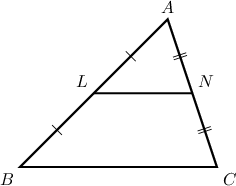
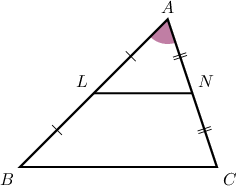
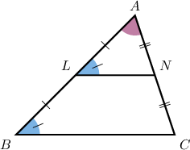
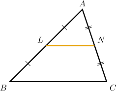
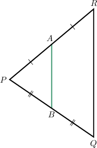
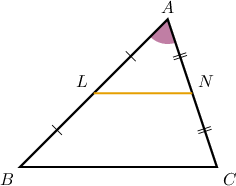
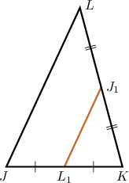
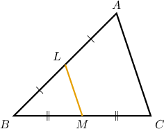

# Proving the Midpoint Theorem

Source: https://www.mathacademy.com/topics/5159?courseId=126
Topic ID: 5159

## Prerequisites

- [The Midpoint Theorem](./1387-the-midpoint-theorem.md)
- [Proving Similarity Statements](./5188-proving-similarity-statements.md)

## Lesson

### Introduction

In this lesson, we'll learn how to prove the midpoint theorem for triangles. Let's begin by stating the theorem.

*The line segment joining the midpoints of two sides of a triangle is parallel to the third side, and its length is equal to half the length of the third side.*

Notice that the midpoint theorem can be broken into two separate parts:

- **Part 1:** The segment joining the midpoints is *parallel to* the third side.

- **Part 2:** The segment joining the midpoints is *half the length* of the third side.

We'll start by proving the first part.

Consider the diagram below, where $L$ and $N$ are midpoints of the sides $\overline{AB}$ and $\overline{AC},$ respectively, of the triangle $\triangle{ABC}.$

We wish to prove the following statement:

$\overline{BC} \parallel \overline{LN}$

The proof strategy involves proving that $\triangle ABC\sim ALN,$ and then using the converse corresponding angles postulate to show that $\overline{BC}$ and $\overline{LN}$ are parallel.

We proceed as follows:

- **Step 1**: We are given that $L$ and $N$ are the midpoints of $\overline{AB}$ and $\overline{AC}$, respectively.

- **Step 2**: By the *definition of a midpoint*, we have

- **Step 3**: Using the *multiplication principle*, we obtain

- **Step 4**: Applying the *transitive property of equality* to the result from step 3, we get

- **Step 5**: $\angle{BAC}$ and $\angle{LAN}$ represent the same angle. Therefore, by the *reflexive property of congruence*, as shown below.

- **Step 6**: In steps 4 and 5, respectively, we showed that Therefore, $\triangle{ABC} \sim \triangle{ALN}$ by the *SAS similarity criterion*.

- **Step 7**: Since $\triangle{ABC} \sim \triangle{ALN},$ we have since they're *corresponding angles in similar triangles*.

- **Step 8**: Finally, notice that $\angle{ABC}$ and $\angle{ALN}$ are corresponding angles. Furthermore, they are congruent. Therefore, by the *converse corresponding angles postulate*, as required.

### Stating the Full Proof Using the Two-Column Format

The table below shows the proof of the first part of the midpoint theorem in a two-column format.

### Example: Partial Proofs of the First Part of the Midpoint Theorem

#### Question

In the diagram above, $B$ and $A$ are the midpoints of $\overline{PQ}$ and $\overline{RP},$ respectively. You may assume without proof that

$$

\dfrac{PA}{PR} = \dfrac12.

$$

Consider the following statement:

**

The table below gives the proof of the statement. Fill in the table and thus complete the proof.

#### Explanation

The correct proof is shown below.

Let's examine the rows of the table with missing parts in turn.

- Consider row 4. By the multiplication principle, we can divide the equation we obtained in row 3 by $PQ,$ as follows:

- Consider row 5. From rows 1 and 4, we have Therefore, by the transitive property of equality, we have

- Consider row 6. Notice that $\angle RPQ$ and $\angle APB$ represent the same angle. Therefore, by the reflexive property of congruence, we have $\angle{RPQ} \cong \angle{APB}.$

- Consider row 8. From row 7, we have Therefore, we have that $\angle PBA \cong \angle Q$ since they're corresponding angles in similar triangles.

### Proving the Second Part of the Midpoint Theorem

We'll now learn how to prove the second part of the midpoint theorem.

Consider the diagram below, where $L$ and $N$ are midpoints of the sides $\overline{AB}$ and $\overline{AC},$ respectively, of the triangle $\triangle ABC.$

We wish to prove the following statement:

$BC =2LN$

The strategy is to show that $\triangle ABC\sim \triangle ALN,$ and then use the properties of similar triangles (CPSTP) to prove the desired result.

We complete the proof as follows:

- **Step 1**: We are given that $L$ and $N$ are the midpoints of $\overline{AB}$ and $\overline{AC},$ respectively.

- **Step 2**: By the definition of a midpoint, we have

- **Step 3**: Using the multiplication principle, we obtain

- **Step 4**: Applying the *transitive property of equality* to the results from step 3, we get

- **Step 5**: $\angle{BAC}$ and $\angle{LAN}$ represent the same angle. Therefore, by the *reflexive property of congruence*, as shown below.

- **Step 6**: In steps 4 and 5, respectively, we showed that Therefore, $\triangle{ABC} \sim \triangle{ALN}$ by the *SAS similarity criterion*.

- **Step 7**: Since $\triangle{ABC} \sim \triangle{ALN},$ we have by *CPSTP*.

- **Step 8**: In steps 7 and 3 we showed that Then, the *transitive property of equality* gives

- **Step 9**: Finally, using the *multiplication principle*, we conclude that as required.

### Stating the Full Proof Using the Two-Column Format

The table below shows the proof of the second part of the midpoint theorem in a two-column format.

### Example: Partial Proofs of the Second Part of the Midpoint Theorem

#### Question

In the diagram above, $J_1$ and $L_1$ are the midpoints of $\overline{KL}$ and $\overline{JK},$ respectively.

Now, consider the following statement:

**

The table below gives the proof of this statement. Fill in the table and thus complete the proof.

#### Explanation

The correct proof is shown below.

Let's examine the rows of the table with missing parts in turn.

- Consider row 3. By the multiplication principle, we can divide the equation we obtained in row 2 by $KL,$ as follows:

- Consider row 5. From row 4, we have that $L_1$ is the midpoint of $\overline{JK}.$ Therefore, by the definition of a midpoint,

- Consider row 9. From rows 7 and 8, we have Therefore, by the SAS similarity criterion, $\triangle{JKL} \sim \triangle{L_1KJ_1}.$

- Consider row 10. From row 9, we have that triangles $\triangle{JKL}$ and $\triangle{L_1KJ_1}$ are similar. Corresponding parts of similar triangles are in proportion (CPSTP). Therefore, we have

### Example: Constructing Complete Proofs of the Midpoint Theorem

#### Question

Now, consider the following statement:

**

The table below provides proof of the statement. Complete it by filling in the empty boxes.

#### Explanation

The correct proof is below.

Let's examine each row in turn.

1. Notice that $\angle ABC$ and $\angle LBM$ represent the same angle. Therefore, by the reflexive property of congruence, we have $\angle{ABC} \cong \angle{LBM}.$

2. We're given that $\dfrac{BC}{BM} = 2$ and $\dfrac{AB}{BL} = 2.$

3. From row 2, we have Therefore, by the transitive property of equality, we get

4. From rows 3 and 1, we have Therefore, by the SAS similarity criterion, $\triangle{ABC} \sim \triangle{LBM}.$

5. From row 4, $\triangle{ABC} \sim \triangle{LBM}.$ Therefore, since they're corresponding angles in similar triangles.

6. Finally, notice that $\angle{BAC}$ and $\angle{BLM}$ are corresponding angles. Furthermore, they are congruent. Therefore, by the converse corresponding angles postulate,
