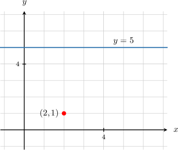
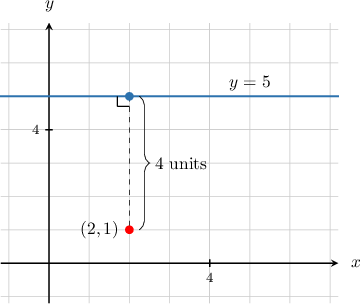
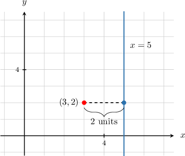
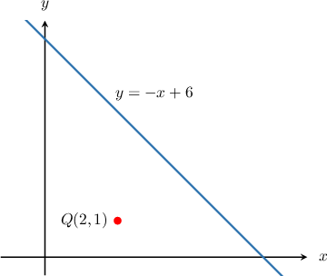
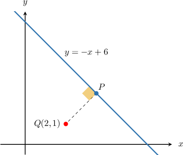
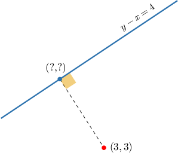
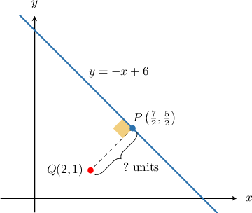
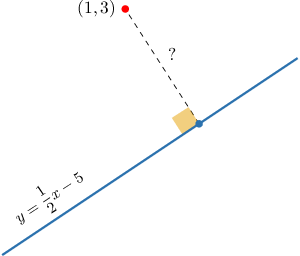

# The Shortest Distance Between a Point and a Line

Source: https://www.mathacademy.com/topics/526?courseId=126
Topic ID: 526

## Prerequisites

- [Calculating the Intersection of Two Lines](../algebra-i/408-calculating-the-intersection-of-two-lines.md)
- [The Distance Formula](./459-the-distance-formula.md)
- [Finding Equations of Perpendicular Lines](./3562-finding-equations-of-perpendicular-lines.md)

## Lesson

### Introduction

The shortest distance between a point and a line is the length of the line segment that connects the point to the line and is perpendicular to the line.

For example, consider the point and the horizontal line shown below:

To find the distance between the point and the line, we construct a segment with its endpoints on the point and the line, and which is perpendicular to the line

The distance between the point and the line is the length of this segment, which we compute as the absolute value of the difference in -coordinates of the point and the line:

### Example: Finding the Distance Between a Point and a Horizontal or Vertical Line

#### Question

Find the shortest distance between the point $(3,2)$ and the line $x=5.$

#### Explanation

Let's sketch the given situation.

Since the line $x = 5$ is vertical, the shortest distance between this line and the point $(3,2)$ is given by the absolute value of the difference between $x$-coordinate of the point and $5.$

So, the shortest distance is

$$

d = |3 - 5| = 2.

$$

### Finding the Point on a Line Closest to Another Point

Consider the line $l$ with the equation $y=-x + 6$ and the point $Q(2,1)$ that does not lie on $l.$

Suppose we wish to find the point $P$ that lies on $l$ that's closest to the point $(2,1).$

Now, here's the key idea: $P$ is the point that lies on $l$ *and* lies on the line *perpendicular* to $l$ that passes through $Q.$

So, to find $P,$ we proceed as follows:

- First, we find the line perpendicular to $l$ that passes through $Q.$

- Then, we find the intersection of the two lines.

The line $y=-x + 6$ has a slope of $-1,$ so our perpendicular line must have a slope of $1$ (the negative reciprocal). It also must pass through the point $(2,1).$ So, using point-slope form, we find that the equation of the perpendicular line is

$$

\begin{aligned}𝑦−𝑦_{1} & =𝑚(𝑥−𝑥_{1}) \\ 𝑦−1 & =1⋅(𝑥−2) \\ 𝑦−1 & =𝑥−2 \\ 𝑦 & =𝑥−1.\end{aligned}

$$

Now, to find where the lines $y=-x+6$ and $y=x-1$ intersect, we set the equations equal to each other and solve for $x\mathbin{:}$

$$

\begin{aligned}−𝑥+6 & =𝑥−1 \\ 6+1 & =𝑥+𝑥 \\ 7 & =2𝑥 \\ 𝑥 & =\frac{7}{2}\end{aligned}

$$

Substituting $x=\dfrac{7}{2}$ into either of the two equations gives $y=\dfrac{5}{2}.$ So, the coordinates of $P$ are $\left(\dfrac{7}{2}, \dfrac{5}{2} \right).$

### Example: Finding a Point on a Line That Is Closest to a Given Point

#### Question

Find the point on the line $y-x=4$ that is closest to the point $(3,3).$

#### Explanation

First, we rewrite the equation of the given line in slope-intercept form:

$$

\begin{aligned}𝑦−𝑥 & =4 \\ 𝑦 & =𝑥+4\end{aligned}

$$

Next, we find the equation of the line that is perpendicular to $y = x + 4$ and passes through the point $(3,3).$

The given line has a slope of $1,$ so our perpendicular line must have a slope of $-1.$

Using point-slope form and simplifying, we obtain the equation of the perpendicular line:

$$

\begin{aligned}𝑦−𝑦_{1} & =𝑚(𝑥−𝑥_{1}) \\ 𝑦−3 & =−1(𝑥−3) \\ 𝑦−3 & =−𝑥+3 \\ 𝑦 & =−𝑥+6\end{aligned}

$$

We now find the point where the two lines intersect. To do this, we solve the following system of equations:

$$

\begin{aligned}𝑦=𝑥+4 \\ 𝑦=−𝑥+6\end{aligned}

$$

We can solve this system by putting the two equations equal to one another and solving for $x.$ This gives

$$

\begin{aligned}𝑥+4 & =−𝑥+6 \\ 𝑥+𝑥 & =6−4 \\ 2𝑥 & =2 \\ 𝑥 & =1.\end{aligned}

$$

Substituting $x=1$ into either of the two equations gives $y=5.$ So, our solution is $x=1$ and $y=5.$ Consequently, the lines intersect at the point $(1,5).$

Therefore, we conclude that the point on the line $y-x= 4$ that is closest to the point $(3,3)$ is $(1,5).$

### The Shortest Distance Between a Point and a Line

Earlier, we found that the point $P\left(\dfrac72,\dfrac52\right)$ lies on the line $y=-x+6$ and is the closest point on this line to the point $Q(2,1).$

To calculate the shortest *distance* between $Q$ and the line, we compute the distance between $P$ and $Q$ using the distance formula:

$$

\begin{aligned}𝑑 & =\sqrt{(𝑥_{2}−𝑥_{1})^{2}+(𝑦_{2}−𝑦_{1})^{2}} \\ & =\sqrt{(\frac{7}{2}−2)^{2}+(\frac{5}{2}−1)^{2}} \\ & =\sqrt{(\frac{3}{2})^{2}+(\frac{3}{2})^{2}} \\ & =\sqrt{\frac{9}{4}+\frac{9}{4}} \\ & =\sqrt{\frac{9}{2}} \\ & =\frac{3}{\sqrt{2}}\end{aligned}

$$

Therefore, the shortest distance between the line $y=-x+6$ and $Q(2,1)$ is $\dfrac{3}{\sqrt{2}}.$

### Example: Finding the Distance Between a Point and a Line

#### Question

Find the shortest distance between the point $(1,3)$ and the line $y=\dfrac{1}{2}x -5.$

#### Explanation

Let's draw a diagram describing our situation.

First, we find the equation of the line that is perpendicular to $y=\dfrac{1}{2}x - 5$ and passes through the point $(1,3).$

The given line has a slope of $\dfrac{1}{2},$ so our perpendicular line must have a slope of $-2.$

Using point-slope form and simplifying, we obtain the equation of the perpendicular line:

$$

\begin{aligned}𝑦−𝑦_{1} & =𝑚(𝑥−𝑥_{1}) \\ 𝑦−3 & =−2(𝑥−1) \\ 𝑦−3 & =−2𝑥+2 \\ 𝑦 & =−2𝑥+5\end{aligned}

$$

We now find the point where the two lines intersect. To do this, we solve the following system of equations:

$$

\begin{aligned}𝑦=\frac{1}{2}𝑥−5 \\ 𝑦=−2𝑥+5\end{aligned}

$$

We can solve this system by setting the two equations equal and solving for $x.$ This gives

$$

\begin{aligned}\frac{1}{2}𝑥−5 & =−2𝑥+5 \\ \frac{1}{2}𝑥+2𝑥 & =5+5 \\ \frac{5}{2}𝑥 & =10 \\ 𝑥 & =10⋅\frac{2}{5} \\ 𝑥 & =4.\end{aligned}

$$

Substituting $x=4$ into either of the two equations gives $y=-3.$ So, our solution is $x=4$ and $y=-3.$ Consequently, the lines intersect at the point $\left(4,-3\right).$

Finally, we find the distance $d$ between the points $(1,3)$ and $\left(4, -3 \right)\mathbin{:}$

$$

\begin{aligned}𝑑 & =\sqrt{(𝑥_{2}−𝑥_{1})^{2}+(𝑦_{2}−𝑦_{1})^{2}} \\ & =\sqrt{(4−1)^{2}+(−3−3)^{2}} \\ & =\sqrt{9+36} \\ & =\sqrt{45} \\ & =\sqrt{9}\sqrt{5} \\ & =3\sqrt{5}\end{aligned}

$$

Therefore, we conclude that the shortest distance between the point $(1,3)$ and the line $y=\dfrac{1}{2}x -5$ is $3 \sqrt{5}.$
