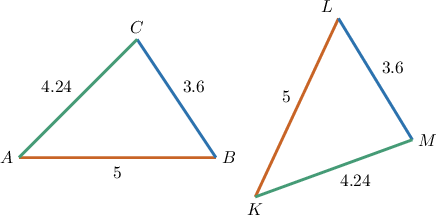
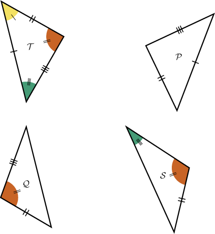
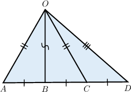
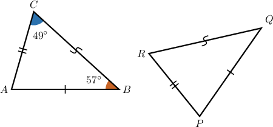
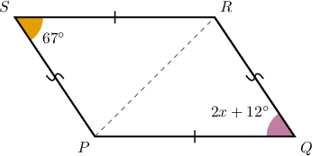

# The SSS Congruence Criterion

Source: https://www.mathacademy.com/topics/531?courseId=126
Topic ID: 531

## Prerequisites

- [Congruent Polygons](../../../../middle-school/lessons/prealgebra/1515-congruent-polygons.md)

## Lesson

### Introduction

In general, to prove that two polygons are congruent, we need to check that all pairs of corresponding sides are congruent and that all pairs of corresponding angles are congruent.

When it comes to triangles, however, we have a few shortcuts.

One such shortcut is the **side-side-side (SSS) congruence criterion**, which states the following:

*Two triangles are congruent if and only if three sides of one triangle are congruent to three sides of the other triangle.*

To demonstrate, consider the triangles below.

We can see that we have three pairs of congruent sides:

$$

\overline{AB}\cong \overline{KL}, \qquad \overline{AC}\cong \overline{KM},\qquad \overline{BC}\cong \overline{LM}.

$$

Therefore, the SSS congruence criterion guarantees that these triangles are congruent, and we can write

$$

\triangle ABC \cong \triangle KLM.

$$

The SSS criterion saves us a lot of work. We didn't even have to check the angles!

### Example: Identifying Congruent Triangles Using the SSS Criterion

#### Question

According to the SSS criterion only, which of the following triangles is congruent to $\mathcal{T}?$

#### Explanation

The SSS (side-side-side) congruence criterion states the following:

Two triangles are congruent if and only if three sides of one triangle are equal to three sides of the other triangle.

With that in mind, let's examine each of the given triangles.

- $\mathcal{P}$ is congruent to $\mathcal{T}$ by SSS since all the three sides of these two triangles are equal.

- $\mathcal{Q}$ is ** congruent to $\mathcal{T}$ by SSS since we have only two pairs of congruent sides.

- $\mathcal{S}$ is ** congruent to $\mathcal{T}$ by SSS since we have only one pair of congruent sides.

Therefore, the correct answer is "$\mathcal{P}$ only."

### Example: Identifying Congruent Triangles Within a Polygon Using the SSS Criterion

#### Question

According to the SSS criterion only, which of the following triangles is congruent to $\triangle OBC?$

#### Explanation

From the diagram, $\triangle OBC$ and $\triangle OBA$ are congruent by SSS (side-side-side).

Indeed, $\overline{OB}$ is the common side of the triangles, and we have the following additional congruent pairs of sides:

$$

\begin{aligned}\overset{𝐴𝐵}{} & ≅\overset{𝐵𝐶}{} \\ \overset{𝑂𝐴}{} & ≅\overset{𝑂𝐶}{}\end{aligned}

$$

### Example: Applying the SSS Criterion to Find Measures of Angles

#### Question

Given the triangles $\triangle ABC$ and $\triangle PQR$ shown below, find $m \angle P.$

#### Explanation

From the diagram, $\triangle ABC$ and $\triangle PQR$ are congruent by SSS (side-side-side). Therefore, we have

$$

\begin{aligned}∠𝐵 & ≅∠𝑄, \\ ∠𝐶 & ≅∠𝑅.\end{aligned}

$$

Since the sum of the measures of the angles in a triangle is $180^\circ,$ we have

$$

\begin{aligned}𝑚∠𝑃+𝑚∠𝑄+𝑚∠𝑅 & =180^{∘} \\ 𝑚∠𝑃+𝑚∠𝐵+𝑚∠𝐶 & =180^{∘} \\ 𝑚∠𝑃+57^{∘}+49^{∘} & =180^{∘} \\ 𝑚∠𝑃+106^{∘} & =180^{∘} \\ 𝑚∠𝑃 & =74^{∘}.\end{aligned}

$$

### Example: Applying the SSS Criterion in Isosceles Triangles and Parallelograms

#### Question

In the figure below, $\overline{SR} \cong \overline{QP}$ and $\overline{SP} \cong \overline{QR}.$ If $m \angle RSP = 67^\circ$ and $m \angle PQR = 2x+12^\circ,$ find the value of $x.$

#### Explanation

From the diagram, $\triangle RSP$ and $\triangle PQR$ are congruent by SSS (side-side-side) since $\overline{PR}$ is their common side and we have two more pairs of congruent sides:

$$

\overline{SR} \cong \overline{PQ}\quad \textrm{and} \quad\overline{SP} \cong \overline{QR}

$$

So, we obtain

$$

\angle RSP \cong \angle PQR.

$$

Therefore,

$$

\begin{aligned}𝑚∠𝑅𝑆𝑃 & =𝑚∠𝑃𝑄𝑅 \\ 67^{∘} & =2𝑥+12^{∘} \\ 2𝑥 & =55^{∘} \\ 𝑥 & =27.5^{∘}.\end{aligned}

$$
