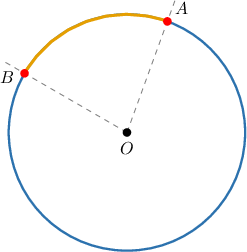
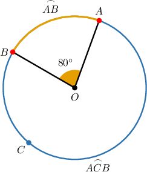
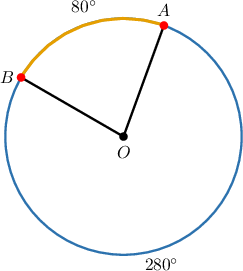
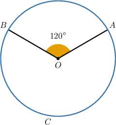
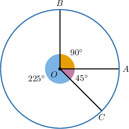
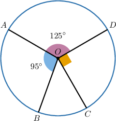
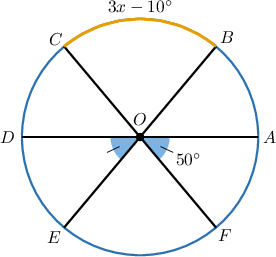

# Central Angles and Arcs

Source: https://www.mathacademy.com/topics/550?courseId=126
Topic ID: 550

## Prerequisites

- [Supplementary Angles](../../../../middle-school/lessons/prealgebra/1511-supplementary-angles.md)
- [Arcs, Segments, and Sectors of Circles](./3565-arcs-segments-and-sectors-of-circles.md)

## Lesson

### Introduction

Let's consider a circle with center $O$ and two distinct points $A$ and $B$ on the circumference.

Recall that the points $A$ and $B$ determine two distinct arcs on the circle:

- The **minor arc** $\overset{\frown}{AB}$ consists of $A,$ $B,$ and all points *on* the circle that lie *inside* $\angle AOB.$

- The **major arc** $\overset{\frown}{ACB}$ consists of $A,$ $B,$ and all points *on* the circle that lie *outside* $\angle AOB.$

Let's refer to the following diagram, where $m\angle AOB = 80^\circ.$

Here, $\angle AOB$ is called the **central angle** corresponding to the arc $\overset{\frown}{AB}.$

In general, a minor arc is said to have the same measure as its central angle. Here, the minor arc $\overset{\frown}{AB}$ has the central angle $\angle AOB.$ Therefore, the measure of the arc is

$$

\begin{aligned}𝑚\overset{𝐴𝐵}{⌢} & =𝑚∠𝐴𝑂𝐵=80^{∘}.\end{aligned}

$$

Now, since there are $360^\circ$ in a full circle, the major arc $\overset{\frown}{ACB}$ must have a measure of

$$

\begin{aligned}𝑚\overset{𝐴𝐶𝐵}{⌢} & =360^{∘}−𝑚∠𝐴𝑂𝐵 \\ & =360^{∘}−80^{∘} \\ & =280^{∘}.\end{aligned}

$$

Labeling the measures of the arcs without explicitly labeling the central angle is common. For example:

**Note**: When we use arc notation with only two letters (e.g., $\overset{\frown}{AB}$), this always refers to the *minor* arc.

### Example: Identifying True Statements About Central Angles

#### Question

Consider the diagram above. Which of the following statements are true?

1. The measure of $\overset{\frown}{AB}$ is equal to $100^\circ$

2. The measure of $\overset{\frown}{ACB}$ is equal to $240^\circ$

3. The measure of $\overset{\frown}{ACB}$ is equal to $120^\circ$

#### Explanation

Let's examine the statements one by one.

- Statement I is false. The measure of the minor arc $\overset{\frown}{AB}$ is equal to the measure of its central angle,

- Statement II is true, while statement III is false. The arc $\overset{\frown}{ACB}$ represents the major arc of the circle, so it has the measure

In conclusion, only statement II is true.

### Example: Determining Measures of Central Angles

#### Question

What is the measure, in degrees, of the central angle corresponding to the arc $\overset{\frown}{BC}?$

#### Explanation

When an arc notation contains only two letters, it is always assumed to be a minor arc.

So here, $\overset{\frown}{BC}$ represents the minor arc of the circle with the central angle $\angle{BOC}.$

Therefore, its measure is

$$

\begin{aligned}𝑚\overset{𝐵𝐶}{⌢} & =𝑚∠𝐵𝑂𝐶 \\ & =𝑚∠𝐴𝑂𝐵+𝑚∠𝐴𝑂𝐶 \\ & =90^{∘}+45^{∘} \\ & =135^{∘}.\end{aligned}

$$

### Example: Determining Measures of Central Angles When One is Missing

#### Question

Given that $m\angle{DOA}=125^\circ$, $m\angle{AOB} = 95^\circ$ and $m\angle{COD}=90^\circ,$ find the measure of $\angle{AOC}?$

#### Explanation

Notice that $m\angle COD = 90^\circ$ and $m\angle AOC = m\angle AOB + m\angle BOC.$

Since all the angles in the diagram together make a full circle of $360^\circ,$ we have

$$

\begin{aligned}𝑚∠𝐷𝑂𝐴+(𝑚∠𝐴𝑂𝐵+𝑚∠𝐵𝑂𝐶)+𝑚∠𝐶𝑂𝐷 & =360^{∘} \\ 125^{∘}+𝑚∠𝐴𝑂𝐶+90^{∘} & =360^{∘} \\ 215^{∘}+𝑚∠𝐴𝑂𝐶 & =360^{∘} \\ 𝑚∠𝐴𝑂𝐶 & =145^{∘}.\end{aligned}

$$

### Example: Finding an Unknown Using Central Angles

#### Question

In the diagram above, $\overline{AD},$ $\overline{BE},$ and $\overline{CF}$ are diameters. If $m\angle{AOF=50^\circ}$ and $m\overset{\frown}{BC}=3x-10^\circ,$ then what is the value of $x?$

#### Explanation

From the diagram,

$$

m\angle{EOD} = m\angle{AOF} = 50^\circ.

$$

Since the measures of $\angle{AOF},$ $\angle{FOE}$ and $\angle{EOD},$ add up to $180^\circ,$ we have

$$

\begin{aligned}𝑚∠𝐴𝑂𝐹+𝑚∠𝐹𝑂𝐸+𝑚∠𝐸𝑂𝐷 & =180^{∘} \\ 50^{∘}+𝑚∠𝐹𝑂𝐸+50^{∘} & =180^{∘} \\ 100^{∘}+𝑚∠𝐹𝑂𝐸 & =180^{∘} \\ 𝑚∠𝐹𝑂𝐸 & =80^{∘}.\end{aligned}

$$

Now, since the angles $\angle{FOE}$ and $\angle{BOC}$ are vertical, we obtain

$$

m\angle{BOC} = m\angle{FOE} = 80^\circ.

$$

Finally, since the measure of the arc $\overset{\frown}{BC}$ is equal to the measure of the central angle $\angle{BOC},$ we have

$$

\begin{aligned}\overset{𝐵𝐶}{⌢} & =𝑚∠𝐵𝑂𝐶 \\ 3𝑥−10^{∘} & =𝑚∠𝐵𝑂𝐶 \\ 3𝑥−10^{∘} & =80^{∘} \\ 3𝑥 & =90^{∘} \\ 𝑥 & =30^{∘}.\end{aligned}

$$
