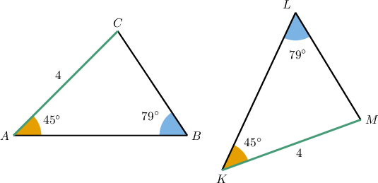
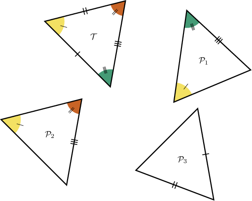
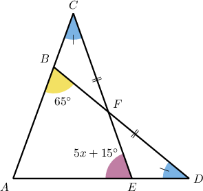
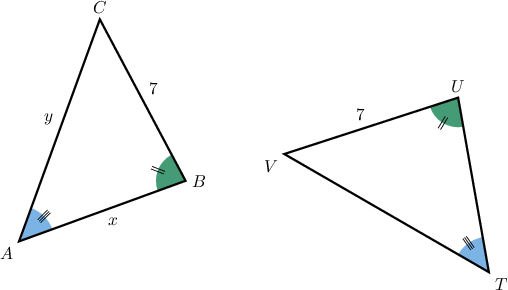
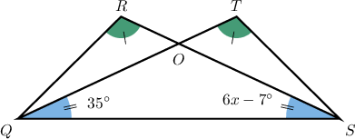

# The AAS Congruence Criterion

Source: https://www.mathacademy.com/topics/582?courseId=126
Topic ID: 582

## Prerequisites

- [Congruent Polygons](../../../../middle-school/lessons/prealgebra/1515-congruent-polygons.md)

## Lesson

### Introduction

The **angle-angle-side (AAS) congruence criterion** can be used as a shortcut to prove that two triangles are congruent. It states the following:

Two triangles are congruent if and only if two angles and a non-included side of one triangle are congruent to two angles and the corresponding non-included side of the other triangle.

To demonstrate, consider the triangles below.

We can see that two pairs of angles are congruent:

$$

\angle{B}\cong \angle{L}, \quad \angle{A}\cong \angle{K}. \quad

$$

We can also see that we have a congruent pair of non-included sides (a "non-included side" means that it does not connect the congruent angles):

$$

\overline{AC}\cong \overline{MK}

$$

Therefore, the AAS congruence criterion guarantees that these two triangles are congruent:

$$

\triangle ABC \cong \triangle KLM

$$

### Example: Finding the Value of an Unknown Using the AAS Criterion

#### Question

According to the AAS criterion only, which of the following triangles is congruent to $\mathcal{T}?$

#### Explanation

The AAS (angle-angle-side) congruence criterion states the following:

Two triangles are congruent if and only if two angles and a corresponding non-included side of one triangle are congruent to two angles and a corresponding non-included side of the other triangle.

With that in mind, let's examine each of the given triangles.

- $\mathcal{P}_1 \cong \mathcal{T}$ by AAS since two angles and a corresponding non-included side of one triangle are congruent to two angles and a corresponding non-included side of the other triangle.

- $\mathcal{P}_2 \cong \mathcal{T}$ by AAS since two angles and a corresponding non-included side of one triangle are congruent to two angles and a corresponding non-included side of the other triangle.

- $\mathcal{P}_3$ is ** congruent to $\mathcal{T}$ by AAS since we don't have two pairs of congruent angles.

Therefore, the correct answer is "$\mathcal{P}_1$ and $\mathcal{P}_2$ only."

### Example: Finding the Measure of an Angle Using the AAS Criterion

#### Question

In the figure below, $\overline{BD}=\overline{CE}.$ What is the value of $x?$

#### Explanation

Notice that $\triangle ABD$ and $\triangle AEC$ are congruent by AAS since we have the following pairs of congruent angles and corresponding non-included sides:

- $\overline{BD}=\overline{CE},$

- $\angle C \cong \angle D,$

- $\angle{A}$ is their common angle.

Therefore, all the corresponding angles of the triangles must be congruent. In particular, $\angle{ABD} \cong \angle{AEC}.$ So, we have

$$

\begin{aligned}𝑚∠𝐴𝐸𝐶 & =𝑚∠𝐴𝐵𝐷 \\ 5𝑥+15^{∘} & =65^{∘} \\ 5𝑥 & =50^{∘} \\ 𝑥 & =10^{∘}.\end{aligned}

$$

### Example: Calculating the Length of a Line Segment Using the AAS Criterion

#### Question

The perimeter of a triangle $\triangle TUV$ is $22.$ What is the value of $x+y?$

#### Explanation

Notice that $\triangle TUV$ and $\triangle ABC$ are congruent by AAS since we have the following pairs of congruent angles and corresponding non-included sides:

- $\overline{BC} \cong \overline{UV},$

- $\angle{A} \cong \angle{T},$

- $\angle{B} \cong \angle{U}.$

Therefore, all the corresponding sides of the triangles must be congruent. In particular, $UT=AB=x$ and $VT=AC=y.$

Since the perimeter of $\triangle TUV$ is $22$, we obtain

$$

\begin{aligned}𝑈𝑇+𝑈𝑉+𝑉𝑇 & =22 \\ 𝑈𝑇+7+𝑉𝑇 & =22 \\ 𝑈𝑇+𝑉𝑇 & =15 \\ 𝑥+𝑦 & =15.\end{aligned}

$$

### Example: Identifying Correct Statements Using the AAS Criterion

#### Question

From the diagram, which of the following statements are true?

1. $\triangle QST \cong \triangle SQR$ by AAS

2. $\overline{QR} \cong \overline{TS}$

3. $x=14^\circ$

#### Explanation

Let's examine each of the given statements in turn.

- Statement I is true. $\triangle QST$ and $\triangle SQR$ are congruent by AAS since we have the following pairs of congruent angles and corresponding non-included sides: $\overline{QS}$ is their common side, $\angle R \cong \angle T,$ $\angle TQS \cong \angle RSQ.$

- Statement II is true. Since the triangles are congruent, all the corresponding sides must be congruent. In particular, $\overline{QR} \cong \overline{TS}.$

- Statement III is false. From the diagram, $\angle{SQT} \cong \angle{QSR}.$ Hence,

Therefore, the correct answer is "I and II only."
